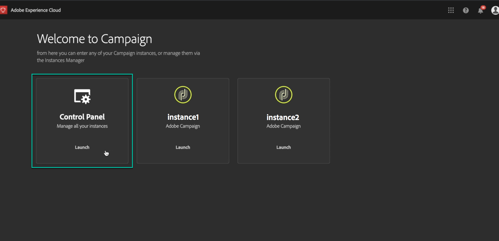

# Accesso al Pannello di controllo {#accessing-control-panel}

Il Pannello di controllo Campaign è disponibile direttamente dall’Experience Cloud o dal prodotto stesso.

È accessibile a **Utenti amministratori** solo. Per ulteriori informazioni su come assegnare gli utenti al gruppo Administrators, fare riferimento a [questa sezione](../../discover/using/managing-permissions.md).

## Accesso da Experience Cloud Platform {#access-experience-cloud-platform}

Per accedere al Pannello di controllo Campaign dalla piattaforma Adobe Experience Cloud, segui la procedura indicata di seguito.

1. Accedi a [Home page Experience Cloud](https://experiencecloud.adobe.com/){target="_blank"}.

1. Fai clic sul collegamento dedicato in **Accesso rapido** sezione.

   

Il Pannello di controllo Campaign è accessibile anche dalla piattaforma Experience Cloud **selettore soluzioni**:

1. Dalla sezione [Home page di Adobe Experience Cloud](https://experiencecloud.adobe.com/){target="_blank"}, seleziona **Campagna** dal **Accesso rapido** o nel menu superiore a destra.

   

1. Viene visualizzato l’elenco delle istanze di Campaign. Fai clic su **Pannello di controllo Campaign** per avviarlo.

   

## Accesso dal prodotto {#access-product}

>[!NOTE]
>
>L’accesso da è disponibile per [Campaign Standard](https://experienceleague.adobe.com/docs/campaign-standard/using/campaign-standard-home.html?lang=it){target="_blank"} solo.

1. Apri il prodotto Campaign Standard.

1. Seleziona la **[!UICONTROL Administration]** menu dal menu **Navigazione** riquadro.

   

1. Fai clic su **[!UICONTROL Control Panel]** icona.

   
