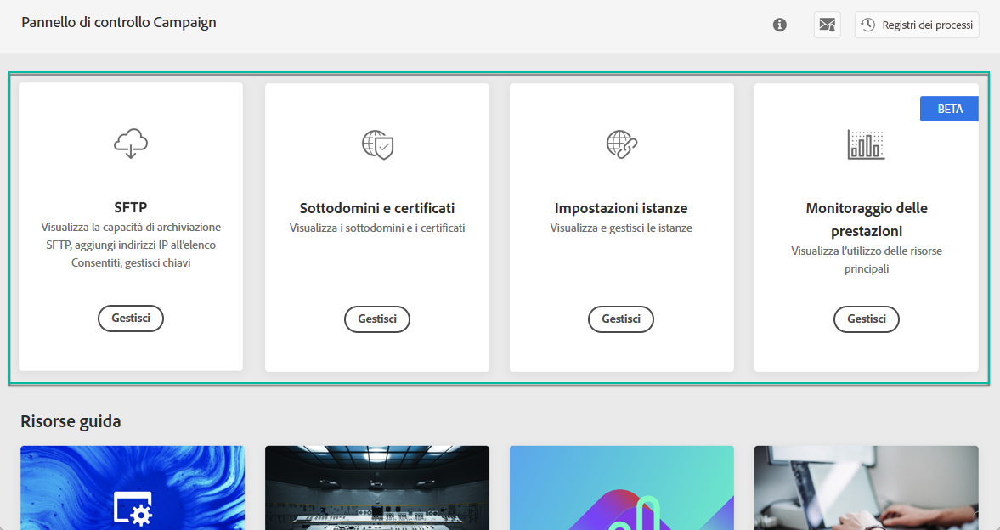
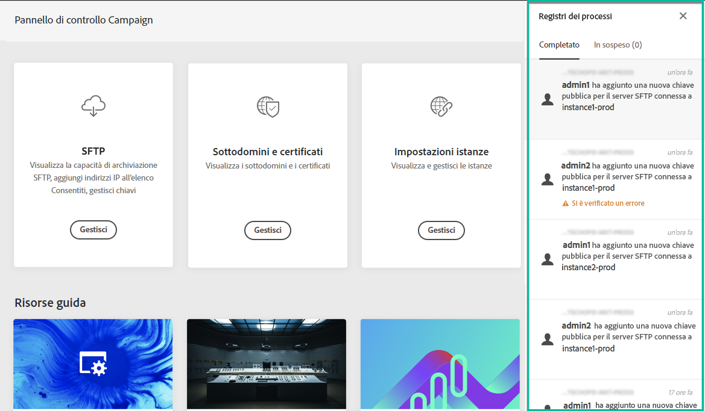
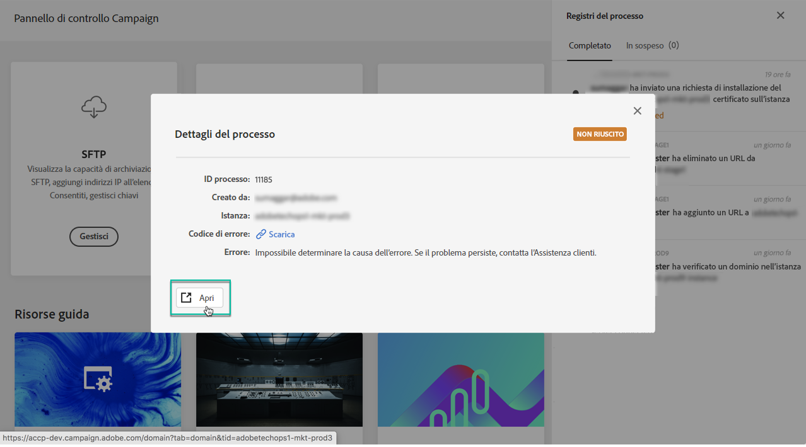
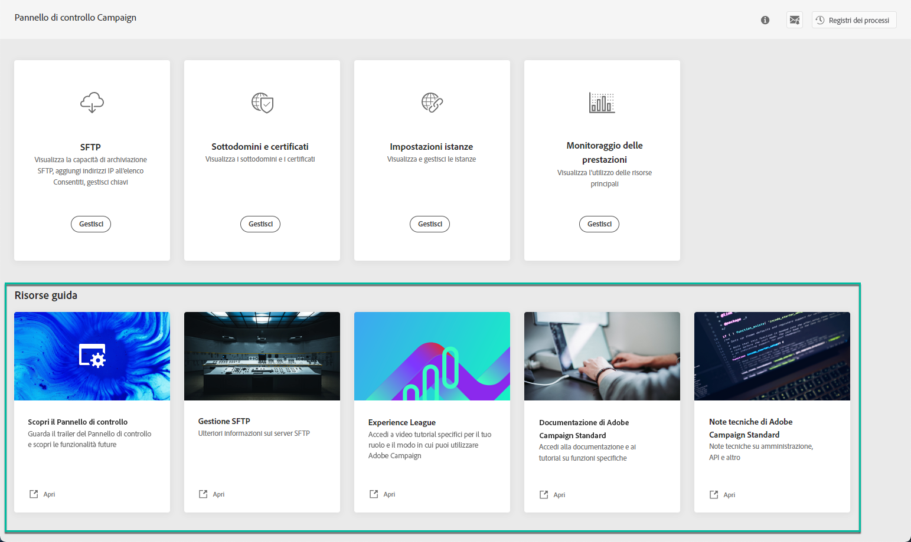

# Esplorazione dell’interfaccia del Pannello di controllo Campaign {#discovering-interface}

La home page del Pannello di controllo Campaign ti consente di accedere a tutte le azioni che possono essere eseguite sulle istanze Campaign.

Sono rappresentati da schede organizzate in argomenti, ad esempio **Storage &amp; Database Management**.

Con le prossime release di Campaign, saranno disponibili ulteriori argomenti e schede.

## Registri di processo {#job-logs}

Il pulsante **[!UICONTROL Job Logs]** nell&#39;angolo superiore destro consente di controllare tutte le modifiche apportate dagli utenti dell&#39;organizzazione.

Fate clic su un elemento dell’elenco per ottenere ulteriori dettagli.

Il pulsante **[!UICONTROL Open]** (Apri) consente di accedere direttamente alla scheda del pannello di controllo in cui è stata apportata la modifica.

## Risorse della Guida {#help-resources}

La sezione **[!UICONTROL Help Resources]** fornisce una documentazione utile per aiutarti nell&#39;utilizzo dei prodotti Pannello di controllo Campaign e Campaign. Non esitate a esplorarle.

