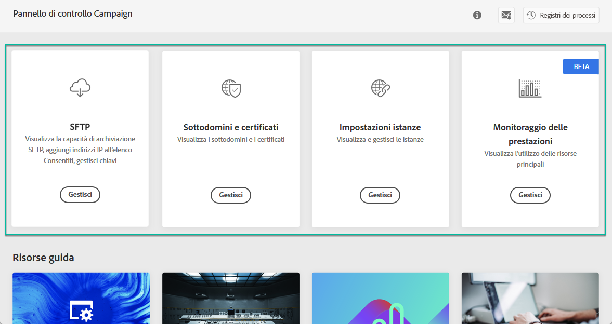
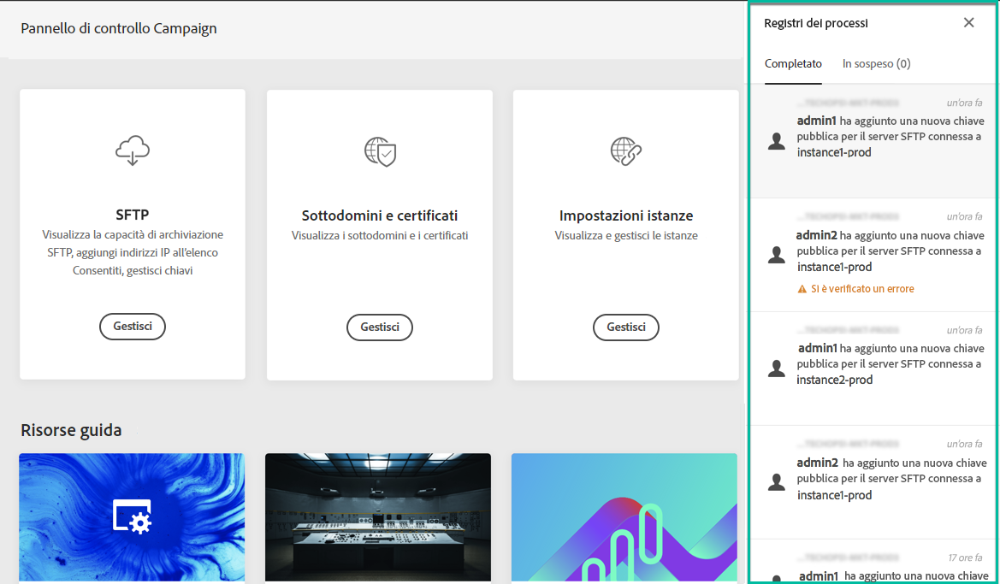
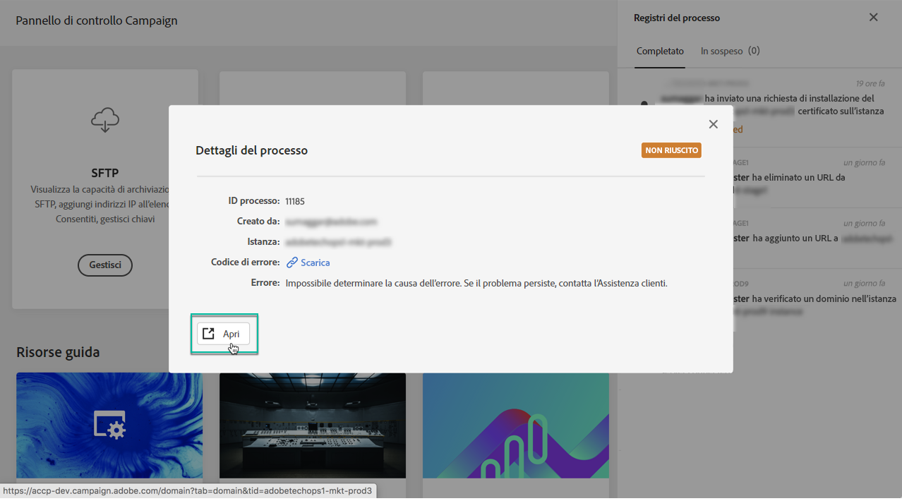
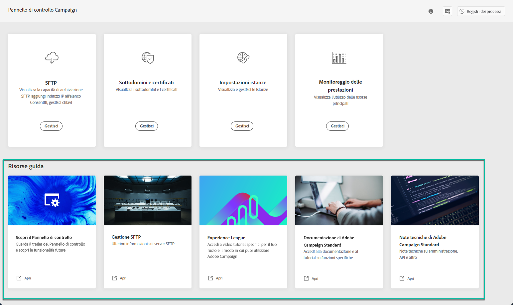

# Esplorazione dell’interfaccia del Pannello di controllo {#discovering-interface}

La home page del Pannello di controllo ti consente di accedere a tutte le azioni che possono essere eseguite sulle istanze Campaign.

Sono rappresentate da schede organizzate in argomenti, ad esempio **Monitoraggio delle prestazioni**.

<!--With upcoming Campaign releases, more topics and cards will be made available.-->

## Registri dei lavori {#job-logs}

Il pulsante **[!UICONTROL Registri dei processi]** in alto a destra consente di controllare tutte le modifiche che sono state apportate dagli utenti dell’organizzazione.

Fai clic su un elemento dell’elenco per ottenere ulteriori dettagli.

Il pulsante **[!UICONTROL Apri]** consente di accedere direttamente alla scheda Pannello di controllo in cui è stata apportata la modifica.

## Risorse di assistenza {#help-resources}

La sezione **[!UICONTROL Risorse di assistenza]** fornisce documentazione utile per aiutarti a utilizzare i prodotti Campaign e Pannello di controllo. Non esitare ad esplorarle.

## Lingue supportate {#languages}

L’interfaccia utente del Pannello di controllo è progettata per essere visualizzata nella lingua che corrisponde alla configurazione del browser.

Se il browser è impostato su una lingua non supportata, il Pannello di controllo verifica le prime tre lingue nell’elenco delle lingue del browser fino a trovare una lingua supportata. Se nessuna delle prime tre lingue è supportata dal Pannello di controllo, per impostazione predefinita verrà utilizzato l’inglese (Stati Uniti).

Di seguito è riportato un elenco delle lingue attualmente supportate dal Pannello di controllo:

* Inglese (Stati Uniti)
* Tedesco
* Francese
* Giapponese
* Italiano (Italia)
* Spagnolo (Spagna)
* Coreano
* Portoghese (Brasile)
* Cinese (semplificato)
* Cinese (tradizionale)
