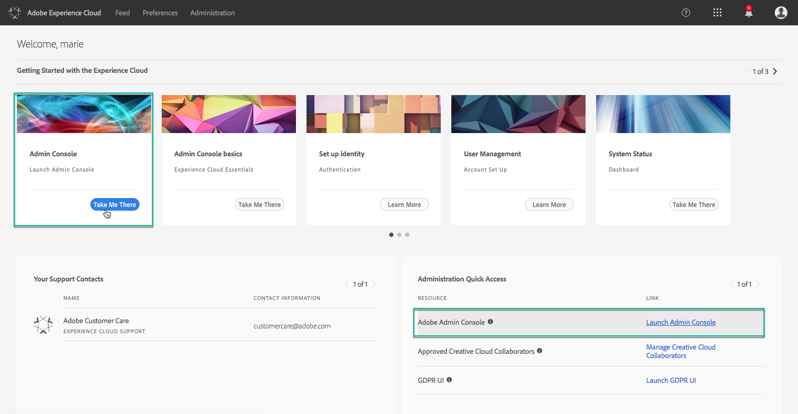

# Gestione delle autorizzazioni di accesso al Pannello di controllo Campaign {#managing-permissions-control-panel}

L&#39;Pannello di controllo Campaign è disponibile per tutti gli utenti Admin di un&#39;istanza Campaign. Seguite i passaggi riportati di seguito per assegnare gli utenti al gruppo Amministratori e concedere loro l’accesso al Pannello di controllo Campaign.

[ Scopri questa funzione nel video](#video)

1. Andate su [Adobe Experience Cloud](https://experiencecloud.adobe.com/), quindi selezionate la **[!UICONTROL Administration]** scheda.

   

   >[!NOTE]
   >
   >Se la scheda <b>Amministrazione</b> non è visibile, significa che non disponete dei diritti di amministratore per la vostra organizzazione. Contattate gli amministratori dell&#39;organizzazione per eseguire i passaggi necessari.

1. Avviate l’Admin Console **** facendo clic sui collegamenti disponibili.

   

1. Selezionate il prodotto Campaign desiderato.

   

   >[!NOTE]
   >
   >Se il prodotto non è visualizzato, contattate gli amministratori dell&#39;organizzazione in modo da consentirvi di accedervi.

1. Viene visualizzato l&#39;elenco delle istanze del prodotto Campaign. Selezionate l&#39;istanza alla quale desiderate aggiungere un utente Amministratore.

   

   >[!NOTE]
   >
   >Puoi aggiungere diversi utenti Admin per ogni istanza di Campaign. In tal caso, gli utenti Admin accederanno al Pannello di controllo Campaign dell&#39;istanza a cui appartengono solo.

1. Viene visualizzato l&#39;elenco Profili prodotto per l&#39;istanza selezionata. Fai clic sul profilo di **[!UICONTROL Administrators]** prodotto per accedere all&#39;elenco degli utenti Admin.

   

   >[!NOTE]
   >
   >Per impostazione predefinita, gli utenti amministratore appartengono al profilo di prodotto &quot;Amministratori&quot;. In base alla configurazione aziendale, il profilo di prodotto può essere denominato in modo diverso (&quot;admin&quot;, &quot;admins&quot;, ecc.).

1. Viene visualizzato l’elenco degli utenti Admin. Fate clic sul **[!UICONTROL Add User]** pulsante per aggiungere l’utente desiderato.

   

>[!NOTE]
>
>Una volta configurato l&#39;accesso, l&#39;utente dovrà disconnettersi da Adobe Experience Cloud ed effettuare nuovamente l&#39;accesso, per accedere al Pannello di controllo.

## Video di esercitazione {#video}

>[!VIDEO](https://video.tv.adobe.com/v/27147?quality=12)
