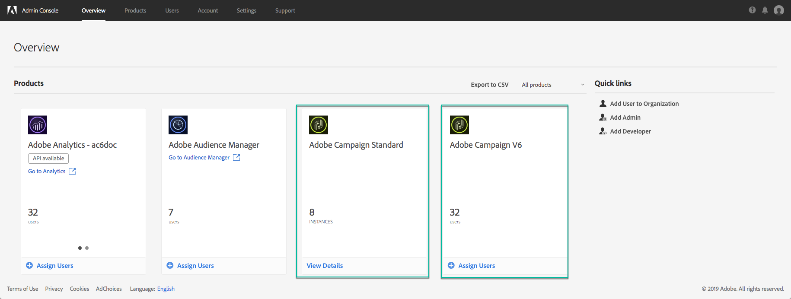
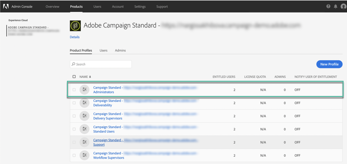

# Gestione delle autorizzazioni al Pannello di controllo {#managing-permissions-control-panel}

Il Pannello di controllo è disponibile per tutti gli utenti Admin di un&#39;istanza Campaign. Attenetevi alla procedura seguente per assegnare gli utenti al gruppo Amministratori e concedere loro l’accesso al Pannello di controllo.

1. Passa ad [Adobe Experience Cloud](https://amc.experiencecloud.adobe.com/exc-content/login.html), quindi seleziona la **[!UICONTROL Administration]**scheda.

   

   >[!NOTE]
   >
   >Se la scheda <b>Amministrazione</b> non è visibile, significa che non disponete dei diritti di amministratore per la vostra organizzazione. Contattate gli amministratori dell&#39;organizzazione per eseguire i passaggi necessari.

1. Avvia **Admin Console** facendo clic sui collegamenti disponibili.

   

1. Selezionate il prodotto Campaign desiderato.

   

   >[!NOTE]
   >
   >Se il prodotto non è visualizzato, contattate gli amministratori dell&#39;organizzazione in modo da consentirvi di accedervi.

1. Viene visualizzato l&#39;elenco delle istanze del prodotto Campaign. Selezionate l&#39;istanza alla quale desiderate aggiungere un utente Amministratore.

   

   >[!NOTE]
   >
   >Puoi aggiungere diversi utenti Admin per ogni istanza di Campaign. In tal caso, gli utenti Admin accederanno al Pannello di controllo dell&#39;istanza a cui appartengono solo.

1. Viene visualizzato l&#39;elenco Profili prodotto per l&#39;istanza selezionata. Fai clic sul profilo di **[!UICONTROL Administrators]**prodotto per accedere all&#39;elenco degli utenti Admin.

   

   >[!NOTE]
   >
   >Per impostazione predefinita, gli utenti amministratore appartengono al profilo di prodotto &quot;Amministratori&quot;. In base alla configurazione aziendale, il profilo di prodotto può essere denominato in modo diverso (&quot;admin&quot;, &quot;admins&quot;, ecc.).

1. Viene visualizzato l’elenco degli utenti Admin. Fate clic sul **[!UICONTROL Add User]**pulsante per aggiungere l’utente desiderato.

   
