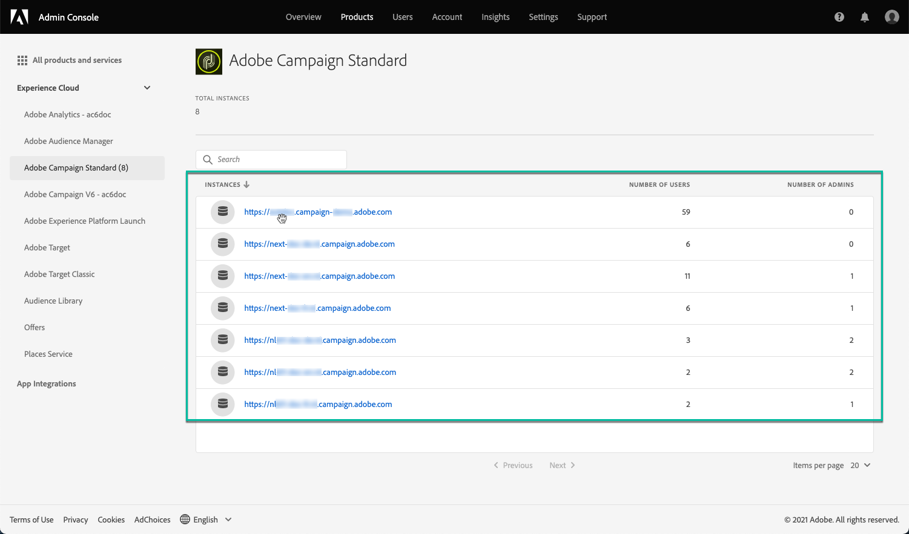
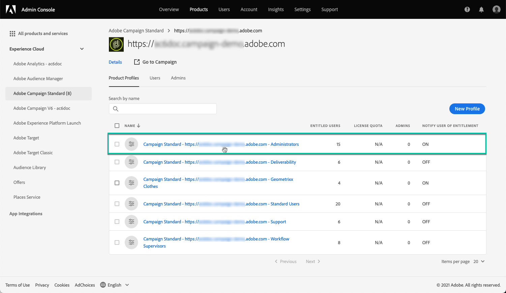

# Gestione delle autorizzazioni di accesso al Pannello di controllo  {#managing-permissions-control-panel}

Il Pannello di controllo è disponibile per tutti gli utenti amministratori di un’istanza di Campaign. Per assegnare utenti al gruppo Amministratori e concedere loro l’accesso al Pannello di controllo, segui i passaggi seguenti.

 Guarda il [video su questa funzione](../../discover/using/managing-permissions.md#video)

1. Passare alla [home page di Adobe Experience Cloud](https://experiencecloud.adobe.com/){target="_blank"}.

1. Avvia **Admin Console** facendo clic sul collegamento disponibile nella sezione **Accesso rapido** o dal menu in alto a destra.

   

   >[!NOTE]
   >
   >Se il collegamento **Admin Console** non è visibile, significa che non disponi dei diritti di amministratore per la tua organizzazione. Contatta gli amministratori della tua organizzazione per eseguire insieme i passaggi necessari.

1. In **Admin Console**, seleziona il prodotto Campaign desiderato dall’elenco **[!UICONTROL Prodotti e servizi]** .

   

   >[!NOTE]
   >
   >Se il prodotto non è visualizzato, contatta gli amministratori della tua organizzazione per richiederne l’accesso.

1. Viene visualizzato l’elenco delle istanze del tuo prodotto Campaign. Seleziona l’istanza a cui desideri aggiungere un utente amministratore.

   

   >[!NOTE]
   >
   >Puoi aggiungere diversi utenti amministratori per ogni istanza di Campaign. Gli utenti amministratori accederanno solo al Pannello di controllo dell’istanza a cui appartengono.

1. Viene visualizzato l’elenco dei **[!UICONTROL Profili di prodotto]** per l’istanza selezionata. Fai clic sul profilo di prodotto **[!UICONTROL Amministratori]** per accedere all’elenco degli utenti amministratori.

   

   >[!IMPORTANT]
   >
   >Per impostazione predefinita, il Pannello di controllo Campaign è accessibile agli utenti amministratori che appartengono al profilo di prodotto &quot;Amministratori&quot;. In base alla configurazione dell’organizzazione, il profilo di prodotto può essere denominato in modo diverso (&quot;admin&quot;, &quot;admins&quot;, &quot;approval admin&quot;, ecc.). **Qualsiasi profilo di prodotto che contiene la parola &quot;admin&quot; nel suo nome concederà automaticamente l&#39;accesso al Pannello di controllo Campaign.**
   >
   >Esamina attentamente le convenzioni di denominazione dei profili di prodotto in Admin Console per garantire che solo gli utenti autorizzati abbiano accesso al Pannello di controllo Campaign, in quanto consente di apportare modifiche significative alle istanze di Campaign.

1. Viene visualizzato l’elenco degli utenti amministratori. Fai clic sul pulsante **[!UICONTROL Aggiungi utente]** per aggiungere l’utente desiderato.

   

>[!NOTE]
>
>Una volta configurato l’accesso, per accedere al Pannello di controllo l’utente dovrà disconnettersi da Adobe Experience Cloud ed effettuare nuovamente l’accesso.

## Video tutorial {#video}

>[!VIDEO](https://video.tv.adobe.com/v/328147?captions=ita&quality=12)
