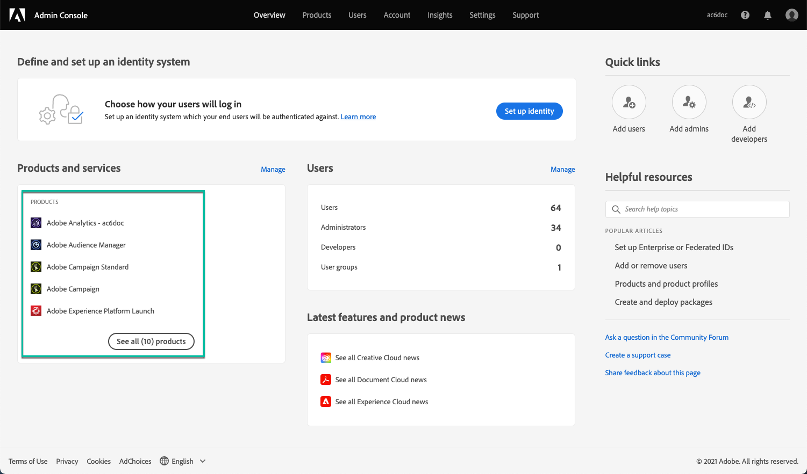

# Gestione delle autorizzazioni di accesso al Pannello di controllo  {#managing-permissions-control-panel}

Il Pannello di controllo Campaign è disponibile per tutti gli utenti amministratori di un’istanza Campaign. Segui i passaggi riportati di seguito per assegnare gli utenti al gruppo Amministratori e concedere loro un accesso al Pannello di controllo Campaign.

[ Scopri questa funzione nel video](../../discover/using/managing-permissions.md#video)

1. Passa a [Homepage Adobe Experience Cloud](https://experiencecloud.adobe.com/){target="_blank"}.

1. Avvia **Admin Console** facendo clic sul collegamento disponibile dal **Accesso rapido** o il menu in alto a destra.

   

   >[!NOTE]
   >
   >Se la **Admin Console** Il collegamento non è visibile, significa che non disponi dei diritti di amministratore per la tua organizzazione. Contatta gli amministratori dell’organizzazione per eseguire i passaggi necessari.

1. Da **Admin Console**, seleziona il prodotto Campaign desiderato dal **[!UICONTROL Products and services]** elenco.

   

   >[!NOTE]
   >
   >Se il prodotto non viene visualizzato, contatta gli amministratori dell’organizzazione in modo che possano accedervi.

1. Viene visualizzato l’elenco delle istanze del prodotto Campaign. Seleziona l’istanza a cui desideri aggiungere un utente amministratore.

   

   >[!NOTE]
   >
   >Puoi aggiungere diversi utenti amministratori per ogni istanza di Campaign. Gli utenti amministratori accederanno al Pannello di controllo Campaign dell’istanza a cui appartengono solo.

1. L&#39;elenco di **[!UICONTROL Product Profiles]** viene visualizzata l’istanza selezionata. Fai clic sul pulsante **[!UICONTROL Administrators]** profilo di prodotto per accedere all’elenco degli utenti amministratori.

   

   >[!NOTE]
   >
   >Per impostazione predefinita, gli utenti amministratori appartengono al profilo di prodotto &quot;Amministratori&quot;. In base alla configurazione dell’organizzazione, il profilo di prodotto può essere denominato in modo diverso (&quot;amministratore&quot;, &quot;amministratori&quot;, ecc.).

1. Viene visualizzato l’elenco degli utenti amministratori. Fai clic sul pulsante **[!UICONTROL Add User]** per aggiungere l’utente desiderato.

   

>[!NOTE]
>
>Una volta configurato l’accesso, l’utente dovrà disconnettersi da Adobe Experience Cloud ed effettuare nuovamente l’accesso, per accedere al Pannello di controllo Campaign.

## Video tutorial {#video}

>[!VIDEO](https://video.tv.adobe.com/v/27147?quality=12)
