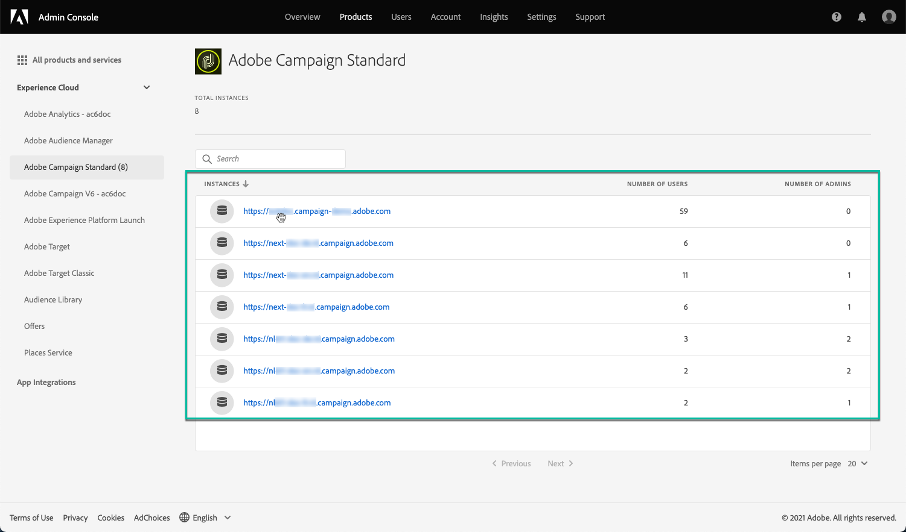

# Gestione delle autorizzazioni di accesso al Pannello di controllo  {#managing-permissions-control-panel}

Il Pannello di controllo Campaign è disponibile per tutti gli utenti amministratori di un’istanza Campaign. Per assegnare utenti al gruppo Administrators e concedere loro l&#39;accesso al Pannello di controllo Campaign, eseguire la procedura seguente.

[ Scopri questa funzione nel video](../../discover/using/managing-permissions.md#video)

1. Accedi a [Home page di Adobe Experience Cloud](https://experiencecloud.adobe.com/){target="_blank"}.

1. Avvia il **Admin Console** facendo clic sul collegamento disponibile nella sezione **Accesso rapido** o dal menu in alto a destra.

   

   >[!NOTE]
   >
   >Se il **Admin Console** non è visibile, significa che non disponi dei diritti di amministratore per la tua organizzazione. Contatta gli amministratori dell’organizzazione per eseguire i passaggi necessari.

1. Dalla sezione **Admin Console**, seleziona il prodotto Campaign desiderato dalla sezione **[!UICONTROL Products and services]** elenco.

   

   >[!NOTE]
   >
   >Se il prodotto non viene visualizzato, contattare gli amministratori dell&#39;organizzazione per consentire l&#39;accesso.

1. Viene visualizzato l’elenco delle istanze del prodotto Campaign. Seleziona l’istanza a cui desideri aggiungere un utente amministratore.

   

   >[!NOTE]
   >
   >Puoi aggiungere diversi utenti Admin per ogni istanza di Campaign. Gli utenti amministratori accederanno solo al Pannello di controllo Campaign dell’istanza a cui appartengono.

1. L’elenco di **[!UICONTROL Product Profiles]** per l’istanza selezionata. Fai clic su **[!UICONTROL Administrators]** profilo di prodotto per accedere all’elenco degli utenti amministratore.

   

   >[!NOTE]
   >
   >Per impostazione predefinita, gli utenti amministratore appartengono al profilo di prodotto &quot;Amministratori&quot;. In base alla configurazione dell’organizzazione, il profilo di prodotto può essere denominato in modo diverso (&quot;amministratore&quot;, &quot;amministratori&quot;, ecc.).

1. Viene visualizzato l’elenco degli utenti Admin. Fai clic su **[!UICONTROL Add User]** per aggiungere l&#39;utente desiderato.

   

>[!NOTE]
>
>Una volta configurato l’accesso, per accedere al Pannello di controllo Campaign l’utente dovrà disconnettersi da Adobe Experience Cloud e accedere nuovamente.

## Video tutorial {#video}

>[!VIDEO](https://video.tv.adobe.com/v/27147?quality=12)
