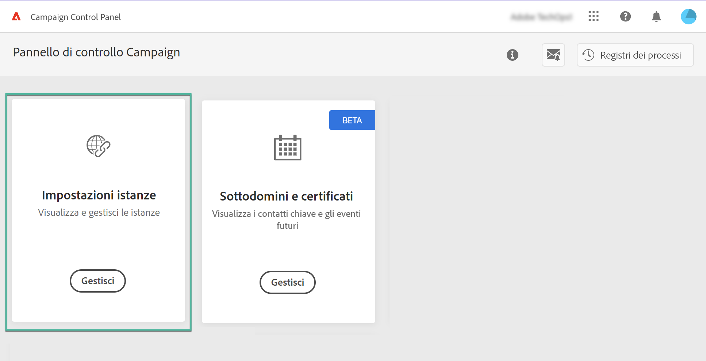
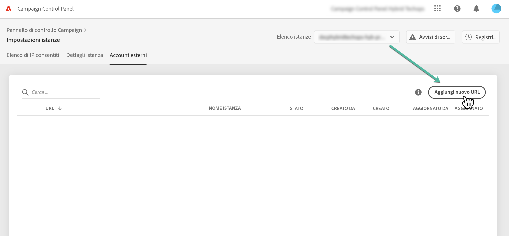
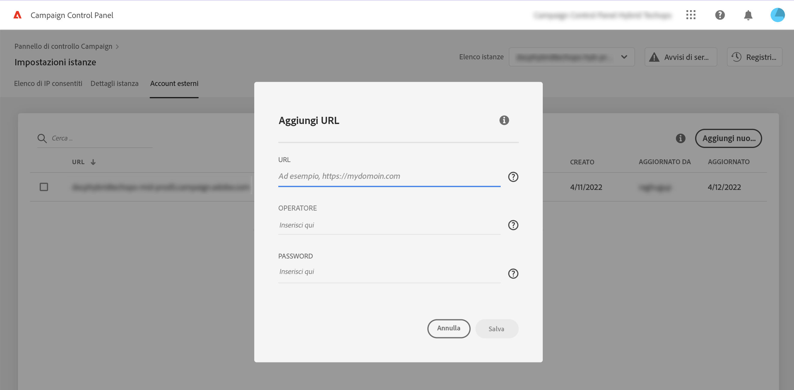
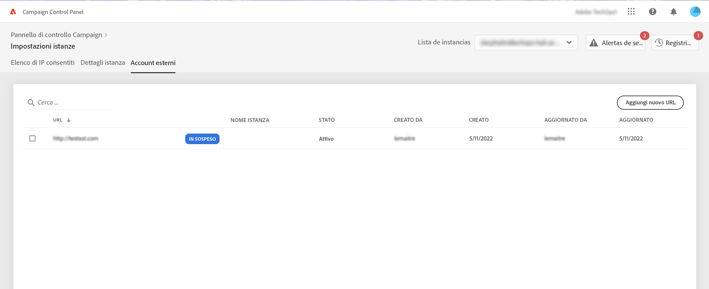
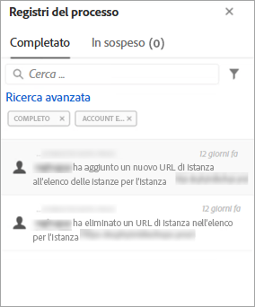

# Aggiungere istanze MID/RT (modello ibrido){#add-mid-rt-instances-hybrid-model}

>[!CONTEXTUALHELP]
>id="cp_externalaccounts"
>title="Account esterni"
>abstract="In questa schermata, i clienti con modello di hosting ibrido possono fornire l’URL dell’istanza MID/RT configurato nell’istanza marketing del Pannello di controllo, al fine di sfruttarne le funzionalità."

Il Pannello di controllo consente ai clienti con un modello di hosting ibrido di sfruttarne le funzionalità specifiche. A questo scopo, è necessario fornire l’URL dell’istanza MID/RT configurato nell’istanza marketing nel Pannello di controllo.

Per ulteriori informazioni sui modelli di hosting, consulta la [documentazione di Campaign Classic](https://experienceleague.adobe.com/docs/campaign-classic/using/installing-campaign-classic/architecture-and-hosting-models/hosting-models-lp/hosting-models.html?lang=it).

## Aggiungere un’istanza MID/RT {#add}

>[!CONTEXTUALHELP]
>id="cp_externalaccounts_url"
>title="URL"
>abstract="URL dell’istanza, accessibile nella console client di Campaign dal menu Administration > Platform > External Accounts (Amministrazione > Platform > Account esterni)."

>[!CONTEXTUALHELP]
>id="cp_externalaccounts_operator"
>title="Operatore"
>abstract="ID dell’operatore fornito dopo il provisioning iniziale da Adobe Admin."

>[!CONTEXTUALHELP]
>id="cp_externalaccounts_password"
>title="Password"
>abstract="Password dell’operatore fornita dopo il provisioning iniziale da Adobe Admin."

I clienti ibridi devono connettersi al Pannello di controllo tramite Experience Cloud. Quando si accede al Pannello di controllo per la prima volta, nella pagina home vengono visualizzate solo due schede.

>[!NOTE]
>
>Nel caso riscontrassi problemi durante l’accesso al Pannello di controllo, è probabile che l’istanza marketing non sia ancora stata mappata con il tuo [ID organizzazione](https://experienceleague.adobe.com/docs/core-services/interface/administration/organizations.html?lang=it). Contatta l’Assistenza clienti per completare la configurazione e procedere. Una volta stabilita la connessione, verrà visualizzata la pagina home del Pannello di controllo.

Per poter accedere alle funzionalità del Pannello di controllo, devi fornire le informazioni sull’istanza MID/RT nella scheda **[!UICONTROL Instances Settings]**. A tale scopo, segui la procedura indicata di seguito.

1. Nella scheda **[!UICONTROL Instances Settings]**, seleziona la scheda **[!UICONTROL External Accounts]**.

1. Seleziona l’istanza marketing desiderata dall’elenco a discesa, quindi fai clic su **[!UICONTROL Add new URL]**.

   

1. Fornisci le informazioni relative all’istanza MID/RT da aggiungere.

   

   * **[!UICONTROL URL]**: URL dell’istanza, accessibile nella console client di Campaign dal menu **[!UICONTROL Administration]** > **[!UICONTROL Platform]** > **[!UICONTROL External Accounts]**.

      

   * **[!UICONTROL Operator]** / **[!UICONTROL Password]**: credenziali dell’operatore fornite dopo il provisioning iniziale da Adobe Admin.

      >[!NOTE]
      >
      >Se tali dettagli non sono disponibili, contatta l’Assistenza clienti.

1. Fai clic su **[!UICONTROL Save]** per confermare.

Quando si aggiunge un URL MID/RT, viene attivato un processo asincrono per convalidare la correttezza degli URL. Questo processo potrebbe richiedere alcuni minuti. Fino a quando l’URL dell’istanza MID/RT non viene convalidato, il lavoro risulterà in sospeso. Al completamento della convalida, potrai accedere alle funzionalità principali del Pannello di controllo.

Puoi rimuovere o disattivare l’URL di un’istanza MID/RT in qualsiasi momento selezionandolo dall’elenco.

Inoltre puoi monitorare qualsiasi azione eseguita nella scheda **[!UICONTROL External Accounts]** sull’URL di un’istanza MID/RT da **[!UICONTROL Job Logs]**:

## Funzionalità disponibili per i clienti ibridi {#capabilities}

Una volta aggiunta un’istanza MID/RT al Pannello di controllo, puoi sfruttare le funzionalità elencate di seguito:

* [Monitorare eventi e contatti chiave](../../service-events/service-events.md)
* [Visualizzare i dettagli dell’istanza](../../instances-settings/using/instance-details.md)
* [Aggiungere indirizzi IP all’elenco Consentiti](../../instances-settings/using/ip-allow-listing-instance-access.md),
* [Configurare nuovi sottodomini](../../subdomains-certificates/using/setting-up-new-subdomain.md)
* [Rinnovare i certificati SSL dei sottodomini](../../subdomains-certificates/using/renewing-subdomain-certificate.md)
