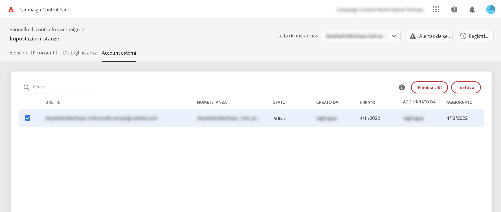

# Collegare le istanze MID/RT

>[!CONTEXTUALHELP]
>id="cp_externalaccounts_url"
>title="Dettagli del sottodominio"
>abstract="In questa schermata, i clienti con un modello di hosting ibrido possono fornire le loro istanze MID/RT presenti nella loro istanza di marketing per eseguire azioni specifiche nel Pannello di controllo Campaign."

Il Pannello di controllo Campaign consente ai clienti con un modello di hosting ibrido di eseguire azioni specifiche nel Pannello di controllo Campaign fornendo le istanze MID/RT presenti nella loro istanza di marketing. Per ulteriori informazioni sui modelli di hosting, consulta [Documentazione di Campaign Classic](https://experienceleague.adobe.com/docs/campaign-classic/using/installing-campaign-classic/architecture-and-hosting-models/hosting-models-lp/hosting-models.html).

## Collegare un’istanza MID/RT {#connect}

>[!CONTEXTUALHELP]
>id="cp_externalaccounts_operator"
>title="Dettagli del sottodominio"
>abstract="ID dell’operatore utilizzato nella console client per aggiungere l’istanza MID/RT nell’istanza di marketing."

>[!CONTEXTUALHELP]
>id="cp_externalaccounts_password"
>title="Dettagli del sottodominio"
>abstract="Password dell’operatore utilizzato nella console client per aggiungere l’istanza MID/RT nell’istanza di marketing."

Per fornire un’istanza MID/RT nel Pannello di controllo Campaign, segui questi passaggi:

1. In **[!UICONTROL Instances Settings]** scheda , seleziona **[!UICONTROL External Accounts]** scheda .

1. Seleziona l’istanza di marketing dall’elenco a discesa, quindi fai clic su **[!UICONTROL Add new URL]**.

   

1. Fornisci informazioni sull’istanza MID/RT per connetterti:
   * **[!UICONTROL URL]**: URL dell’istanza,
   * **[!UICONTROL Operator]** / **[!UICONTROL Password]**: Credenziali dell’operatore utilizzato nella console client per aggiungere l’istanza MID/RT nell’istanza di marketing.

   

1. Fai clic su **[!UICONTROL Save]** per confermare.

L&#39;istanza è ora connessa al Pannello di controllo Campaign. È possibile rimuovere o disattivare una connessione in qualsiasi momento selezionandola dall’elenco.

## Funzionalità disponibili per le istanze MID/RT {#capabilities}

Una volta che un&#39;istanza MID/RT è connessa al Pannello di controllo Campaign, puoi sfruttare le funzionalità elencate di seguito per monitorarla:

* [Visualizza i dettagli dell’istanza](../../instances-settings/using/instance-details.md),
* [Aggiungi indirizzi IP all’elenco Consentiti per accedere alle istanze](../../instances-settings/using/ip-allow-listing-instance-access.md),
* [Visualizzare informazioni sui sottodomini delegati](../../subdomains-certificates/using/setting-up-new-subdomain.md),
* [Visualizza informazioni sui certificati SSL](../../subdomains-certificates/using/monitoring-ssl-certificates.md).
