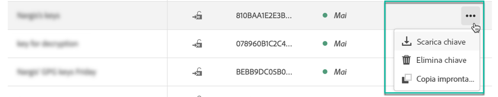
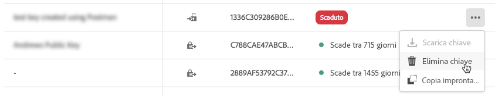

# Gestione chiavi GPG {#gpg-keys-management}

## Informazioni sulla crittografia GPG {#about-gpg-encryption}

La crittografia GPG consente di proteggere i dati utilizzando un sistema di coppie di chiavi pubblica-privata che seguono la specifica [OpenPGP](https://www.openpgp.org/about/standard/).

Una volta implementati, è possibile crittografare i dati in arrivo decrittografati e in uscita prima del trasferimento, per garantire che nessuno li acceda senza una coppia di chiavi corrispondente valida.

Per implementare la crittografia GPG con Campaign, un utente amministratore deve installare e/o generare le chiavi GPG in un’istanza di marketing direttamente dal Pannello di controllo Campaign.

Potrai quindi:

* **Cifra dati** inviati: Adobe Campaign invia i dati dopo averlo crittografato con la chiave pubblica installata.

* **Decrittografare i dati** in arrivo: Adobe Campaign riceve i dati crittografati da un sistema esterno utilizzando una chiave pubblica scaricata dal Pannello di controllo Campaign. Adobe Campaign decrittografa i dati utilizzando una chiave privata generata dal Pannello di controllo Campaign.

## Cifratura dati {#encrypting-data}

Il Pannello di controllo Campaign consente di crittografare i dati provenienti dall’istanza Adobe Campaign.

A questo scopo, devi generare una coppia di chiavi GPG da uno strumento di crittografia PGP, quindi installare la chiave pubblica nel Pannello di controllo Campaign. Potrai quindi crittografare i dati prima di inviarli dall’istanza. Per farlo, segui la procedura indicata di seguito.

[ Scopri questa funzione nel video](#video)

1. Genera una coppia di chiavi pubblica/privata utilizzando uno strumento di crittografia PGP seguendo la [specifica OpenPGP](https://www.openpgp.org/about/standard/). A questo scopo, installare un&#39;utility GPG o un software GNuGP.

   >[!NOTE]
   >
   >È disponibile un software libero open source per generare chiavi. Tuttavia, assicurati di seguire le linee guida della tua organizzazione e utilizza l&#39;utility GPG consigliata dalla tua organizzazione IT/Security.

1. Una volta installata l&#39;utility, esegui il comando sottostante, nel comando Mac Terminal o Windows.

   `gpg --full-generate-key`

1. Quando richiesto, specifica i parametri desiderati per la chiave. I parametri richiesti sono:

   * **tipo** chiave: RSA
   * **lunghezza** chiave: 1024 - 4096 bit
   * **nome reale** e indirizzo **e-** mail: Consente di tenere traccia di chi ha creato la coppia di chiavi. Immetti un nome e un indirizzo e-mail collegati alla tua organizzazione o reparto.
   * **commento**: l’aggiunta di un’etichetta al campo commento consente di identificare facilmente la chiave da utilizzare per crittografare i dati.
   * **scadenza**: Data o &quot;0&quot; per nessuna data di scadenza.
   * **passphrase**

   

1. Una volta confermato, lo script genera una chiave con l’impronta digitale associata, che può essere esportata in un file o incollata direttamente nel Pannello di controllo Campaign. Per esportare il file, esegui questo comando seguito dall’impronta digitale della chiave generata.

   `gpg -a --export <fingerprint>`

1. Per installare la chiave pubblica nel Pannello di controllo Campaign, apri la scheda **[!UICONTROL Instance settings]** , quindi seleziona la scheda **[!UICONTROL GPG keys]** e l’istanza desiderata.

1. Fai clic sul pulsante **[!UICONTROL Install Key]**.

   

1. Incolla la chiave pubblica generata dal tuo strumento di crittografia PGP. Puoi anche trascinare direttamente il file della chiave pubblica esportato.

   >[!NOTE]
   >
   >La chiave pubblica deve essere in formato OpenPGP.

   

1. Fai clic sul pulsante **[!UICONTROL Install Key]**.

Una volta installata la chiave pubblica, questa viene visualizzata nell’elenco. È possibile utilizzare il **...Pulsante** per scaricarlo o copiarne l&#39;impronta digitale.

La chiave è quindi disponibile per l’utilizzo nei flussi di lavoro Adobe Campaign. Puoi utilizzarlo per crittografare i dati quando utilizzi le attività di estrazione dati.

[ Scopri questa funzione nel video](#video)

Per ulteriori informazioni su questo argomento, consulta la documentazione di Adobe Campaign:

**Campaign Classic:**

* [ZIP o cifratura di un file](https://docs.adobe.com/content/help/en/campaign-classic/using/automating-with-workflows/general-operation/how-to-use-workflow-data.html#zipping-or-encrypting-a-file)
* [Caso di utilizzo: Crittografia ed esportazione di dati utilizzando una chiave installata sul Pannello di controllo Campaign](https://docs.adobe.com/content/help/en/campaign-classic/using/automating-with-workflows/general-operation/how-to-use-workflow-data.html#use-case-gpg-encrypt)

**Campaign Standard:**

* [Gestione dei dati crittografati](https://docs.adobe.com/content/help/en/campaign-standard/using/managing-processes-and-data/importing-and-exporting-data/managing-encrypted-data.html)
* [Caso di utilizzo: Crittografia ed esportazione di dati utilizzando una chiave installata sul Pannello di controllo Campaign](https://docs.adobe.com/content/help/en/campaign-standard/using/managing-processes-and-data/importing-and-exporting-data/managing-encrypted-data.html#use-case-gpg-encrypt)

## Decrittografia dei dati {#decrypting-data}

Il Pannello di controllo Campaign consente di decrittografare i dati esterni che entrano nelle istanze Adobe Campaign.

A questo scopo, devi generare una coppia di chiavi GPG direttamente dal Pannello di controllo Campaign.

* La **chiave pubblica** verrà condivisa con il sistema esterno, che lo utilizzerà per crittografare i dati da inviare a Campaign.
* La **chiave privata** verrà utilizzata da Campaign per decrittografare i dati crittografati in arrivo.

[ Scopri questa funzione nel video](#video)

Per generare una coppia di chiavi nel Pannello di controllo Campaign, effettua le seguenti operazioni:

1. Apri la scheda **[!UICONTROL Instance settings]** , quindi seleziona la scheda **[!UICONTROL GPG keys]** e l’istanza Adobe Campaign desiderata.

1. Fai clic sul pulsante **[!UICONTROL Generate Key]**.

   

1. Specifica il nome della chiave, quindi fai clic su **[!UICONTROL Generate Key]**. Questo nome ti aiuterà a identificare la chiave da utilizzare per la decrittografia nei flussi di lavoro di Campaign

   

Una volta generata la coppia di chiavi, la chiave pubblica viene visualizzata nell’elenco. Tieni presente che le coppie chiave di decrittografia vengono generate senza data di scadenza.

È possibile utilizzare il **...Pulsante** per scaricare la chiave pubblica o copiarne l&#39;impronta digitale.

La chiave pubblica è quindi disponibile per essere condivisa con qualsiasi sistema esterno. Adobe Campaign sarà in grado di utilizzare la chiave privata nelle attività di caricamento dei dati per decrittografare i dati crittografati con la chiave pubblica.

Per ulteriori informazioni, consulta la documentazione di Adobe Campaign:

**Campaign Classic:**

* [Estrazione o decrittografia di un file prima dell’elaborazione](https://docs.adobe.com/content/help/en/campaign-classic/using/automating-with-workflows/general-operation/importing-data.html#unzipping-or-decrypting-a-file-before-processing)
* [Caso di utilizzo: Importazione di dati crittografati utilizzando una chiave generata dal Pannello di controllo Campaign](https://docs.adobe.com/content/help/en/campaign-classic/using/automating-with-workflows/general-operation/importing-data.html#use-case-gpg-decrypt)

**Campaign Standard:**

* [Gestione dei dati crittografati](https://docs.adobe.com/content/help/en/campaign-standard/using/managing-processes-and-data/importing-and-exporting-data/managing-encrypted-data.html)
* [Caso di utilizzo: Importazione di dati crittografati utilizzando una chiave generata dal Pannello di controllo Campaign](https://docs.adobe.com/content/help/en/campaign-standard/using/managing-processes-and-data/importing-and-exporting-data/managing-encrypted-data.html#use-case-gpg-decrypt)

## Monitoraggio delle chiavi GPG

Per accedere alle chiavi GPG installate e generate per le istanze, apri la scheda **[!UICONTROL Instance settings]** , quindi seleziona la scheda **[!UICONTROL GPG keys]** .

L’elenco visualizza tutte le chiavi GPG di crittografia e decrittografia installate e generate per le istanze con informazioni dettagliate su ciascuna chiave:

* **[!UICONTROL Name]**: Nome definito durante l’installazione o la generazione della chiave.
* **[!UICONTROL Use case]**: Questa colonna specifica il caso d’uso della chiave:

   : La chiave è stata installata per la crittografia dei dati.

   : La chiave è stata generata per consentire la decrittografia dei dati.

* **[!UICONTROL Fingerprint]**: l&#39;impronta digitale della chiave.
* **[!UICONTROL Expires]**: Data di scadenza della chiave. Tieni presente che il Pannello di controllo Campaign fornirà indicazioni visive man mano che la chiave si avvicina alla data di scadenza:

   * Urgente (rosso) viene mostrato 30 giorni prima.
   * L&#39;avviso (giallo) viene visualizzato 60 giorni prima.
   * Alla scadenza di una chiave viene visualizzato un banner rosso &quot;Scaduto&quot;.

   >[!NOTE]
   >
   >Nota che non verrà inviata alcuna notifica e-mail dal Pannello di controllo Campaign.

Come best practice, si consiglia di rimuovere qualsiasi chiave non più necessaria. A questo scopo, fai clic su **...** quindi selezionare **[!UICONTROL Delete Key].**.

>[!IMPORTANT]
>
>Prima di rimuovere una chiave, accertati che non sia utilizzata in alcun flusso di lavoro Adobe Campaign per evitare che si verifichino errori.

## Video tutorial {#video}

Il video seguente mostra come generare e installare le chiavi GPG per la crittografia dei dati.

Nelle pagine delle esercitazioni [Campaign Classic](https://experienceleague.adobe.com/docs/campaign-standard-learn/control-panel/instance-settings/gpg-key-management/gpg-key-management-overview.html?lang=en#instance-settings) e [Campaign Standard](https://experienceleague.adobe.com/docs/campaign-classic-learn/control-panel/instance-settings/gpg-key-management/gpg-key-management-overview.html?lang=en#instance-settings) sono disponibili ulteriori video dimostrativi relativi alla gestione delle chiavi GPG.

>[!VIDEO](https://video.tv.adobe.com/v/36386?quality=12)

