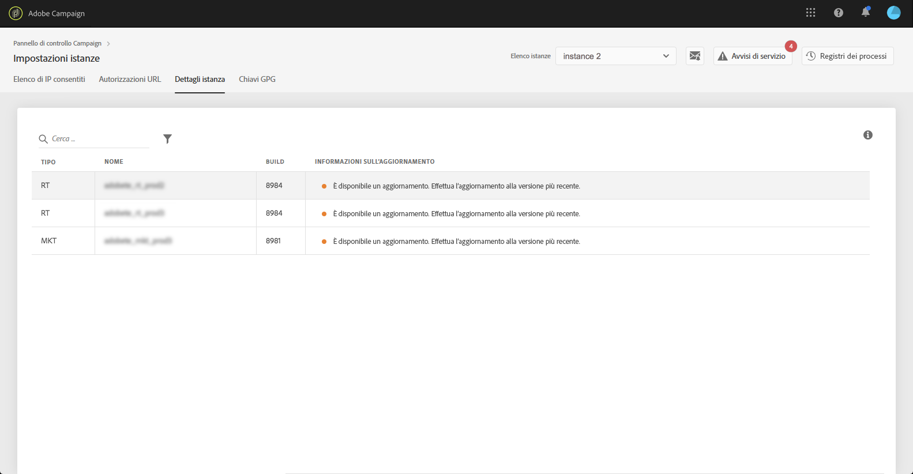

# Instance details (Dettagli istanza) {#instance-details}

>[!CONTEXTUALHELP]
>id="cp_instancesettings_instancedetails"
>title="Informazioni su Instance details (Dettagli istanza)"
>abstract="Visualizza i dettagli delle istanze di Adobe Campaign: tipi, nomi, informazioni sulla build e possibili raccomandazioni di aggiornamenti."
>additional-url="https://docs.adobe.com/content/help/it-IT/campaign-classic/using/release-notes/latest-release.html" text="Note sulla versione di Campaign Classic"
>additional-url="https://docs.adobe.com/content/help/it-IT/campaign-standard/using/release-notes/release-notes.html" text="Note sulla versione di Campaign Standard"

>[!IMPORTANT]
>
>Questa funzione è disponibile solo per le istanze di Campaign Classic.

## Informazioni su Instance details (Dettagli istanza) {#about-instance-details}

L’architettura dell’istanza di Adobe Campaign Classic può contenere diversi server per consentire la flessibilità delle attività di marketing. Ad esempio, possono supportare l’istanza i server Marketing, Real Time (In tempo reale) (o Message Center [Centro messaggi]) e Mid Sourcing.

La funzionalità Instance Details (Dettagli istanza) consente di visualizzare l’architettura semplice dell’istanza. Oltre alle informazioni sul server, ti consente anche di sapere se la build dell’istanza è corrente o meno e consiglia gli aggiornamenti quando necessario.

>[!NOTE]
>
>È consigliabile aggiornare le istanze almeno una volta all’anno al fine di evitare il calo delle prestazioni e poter sfruttare le funzionalità più recenti e le correzioni offerte da Adobe Campaign Classic.

**Argomenti correlati:**

* [Esecuzione di un aggiornamento della build](https://docs.campaign.adobe.com/doc/AC/getting_started/EN/buildUpgrade.html)
* [Aggiornamento di Adobe Campaign](https://docs.adobe.com/content/help/it-IT/campaign-classic/using/monitoring-campaign-classic/updating-adobe-campaign/introduction.html)

## Recupero di informazioni sulle istanze {#retrieving-information-about-instances}

Per ottenere informazioni sui server connessi alle istanze, procedi come segue:

1. Apri la scheda **[!UICONTROL Instances Settings]** (Impostazioni istanze) per accedere alla scheda **[!UICONTROL Instance Details]** (Dettagli istanza).

   >[!NOTE]
   >
   >Se la scheda Instance Settings (Impostazioni istanze) non è visibile nella home page del Pannello di controllo Campaign, significa che il tuo ID organizzazione IMS non è associato ad alcuna istanza di Adobe Campaign Classic

1. Seleziona nel riquadro a sinistra l’istanza Campaign Classic desiderata.

   >[!NOTE]
   >
   >Tutte le istanze Campaign vengono visualizzate nell’elenco del riquadro a sinistra. Poiché la funzione Instance Details (Dettagli istanza) è dedicata solo alle istanze Campaign Classic, se selezioni un’istanza Campaign Standard viene visualizzato il messaggio “Non-Applicable Instance” (“Istanza non applicabile”).

1. Vengono visualizzati i server connessi all’istanza.

   

Le informazioni disponibili sono:

* **[!UICONTROL Type]**: il tipo di server. I valori possibili sono MKT (Marketing), MID (Mid sourcing) e RT (Message Center / Real-time messaging [Centro messaggi/Messaggistica in tempo reale]).
* **[!UICONTROL Name]**: il nome del server.
* **[!UICONTROL Build:]** la versione di build installata sul server.
* **[!UICONTROL Upgrade info]**: questa colonna indica se è necessario aggiornare il server.
   * Verde: il server è aggiornato, non è richiesto alcun aggiornamento.
   * Giallo: è consigliabile effettuare l’aggiornamento. Non disponi delle funzioni e delle correzioni più recenti.
   * Rosso: esegui l’aggiornamento il prima possibile. Non disponi di nuove funzioni e le prestazioni del server potrebbero non essere ottimali.

Se uno dei server richiede l’aggiornamento, consulta [questa documentazione](https://docs.campaign.adobe.com/doc/AC/getting_started/EN/buildUpgrade.html) per ulteriori informazioni su come procedere.

## Domande comuni {#common-questions}

**Non visualizzo il server MID nell’architettura delle mie istanze, significa che le mie istanze non funzionano correttamente? È necessaria l’istanza RT per qualcosa che non posso fare attualmente?**

La tua istanza può avere un aspetto molto diverso e può non disporre di tutti i tipi di server, o può disporre di più server uguali. Se non disponi di un tipo di server o di un altro, non vuol dire che non puoi inviare un messaggio in tempo reale o eseguire altri tipi di attività. Puoi richiedere una capacità server aggiuntiva. Saranno applicati costi aggiuntivi.

Se ritieni che alcuni server non siano visualizzati nella pagina “Instance Details” (“Dettagli istanza”), contatta l’Assistenza clienti. Ricorda di indicare l’URL specifico dell’istanza nel messaggio.
