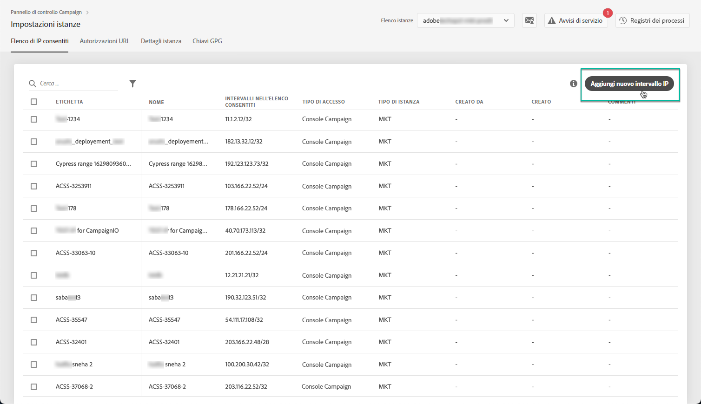
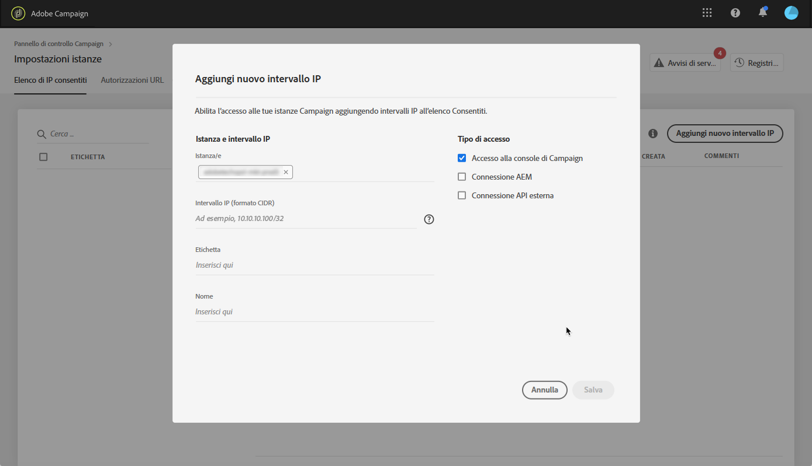
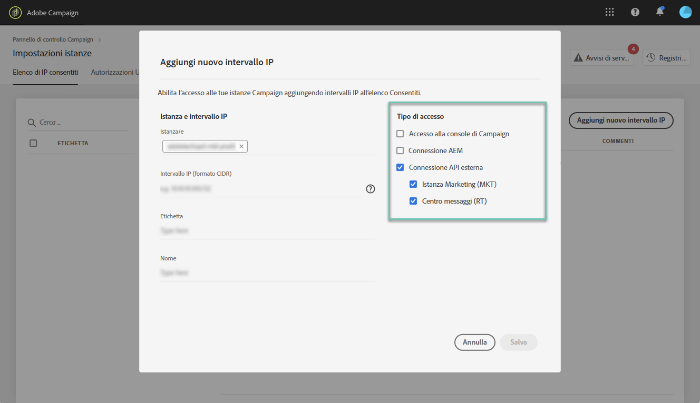
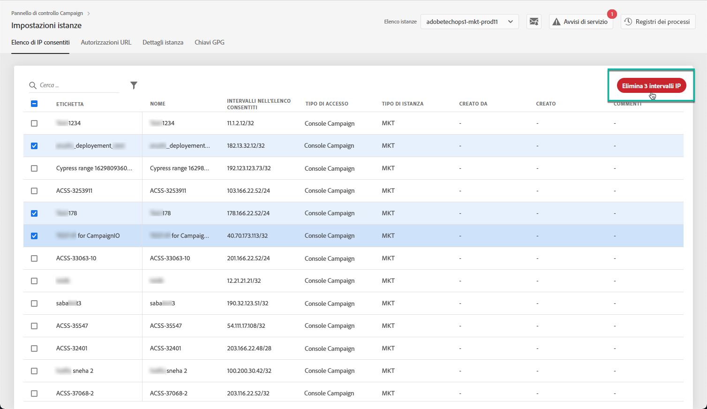

# Inserimento di IP nell’elenco Consentiti {#ip-allow-listing}

>[!CONTEXTUALHELP]
>id="cp_instancesettings_iprange"
>title="Informazioni sull’inserimento di IP nell’elenco Consentiti"
>abstract="Aggiungi indirizzi IP all’elenco Consentiti per accedere alle istanze."
>additional-url="https://images-tv.adobe.com/mpcv3/045cac99-f948-478e-ae04-f8c161dcb9e2_1568132508.1920x1080at3000_h264.mp4" text="Guarda il video dimostrativo"

## Informazioni sull’inserimento di IP nell’elenco Consentiti {#about-ip-allow-listing}

>[!IMPORTANT]
>
>Questa funzione è disponibile solo per le istanze Campaign v7/v8 .

Per impostazione predefinita, l’istanza di Adobe Campaign non è accessibile da vari indirizzi IP.

Se il tuo indirizzo IP non è stato inserito nell’elenco Consentiti non potrai accedere all’istanza da tale indirizzo. Allo stesso modo, potresti non riuscire a collegare un’API al Message Center (Centro messaggi) o all’istanza Marketing se l’indirizzo IP non è stato inserito nell’elenco Consentiti insieme all’istanza in modo esplicito.

Il Pannello di controllo ti consente di impostare nuove connessioni alle istanze tramite l’inserimento di intervalli IP nell’elenco Consentiti. Per farlo, attieniti alla procedura descritta di seguito.

Una volta inseriti gli indirizzi IP nell’elenco Consentiti, puoi creare e collegare ad essi gli operatori Campaign per consentire agli utenti di accedere all’istanza.

 [Scopri questa funzione nel video](https://experienceleague.adobe.com/docs/campaign-classic-learn/control-panel/instance-settings/ip-allow-listing.html#instance-settings)

## Best practice {#best-practices}

Accertati di seguire le raccomandazioni e le limitazioni riportate di seguito quando inserisci gli indirizzi IP nell’elenco Consentiti dal Pannello di controllo.

* **Non abilitare l’accesso IP per tutti i tipi di accesso** se non vuoi che l’indirizzo IP si connetta ai tuoi server RT o all’area di sicurezza AEM.
* **Se hai temporaneamente attivato l’accesso all’istanza per un indirizzo IP**, assicurati di rimuoverlo dall’elenco Consentiti una volta che non è più necessario per connettersi all’istanza.
* **Si sconsiglia di aggiungere all’elenco Consentiti gli indirizzi IP di luoghi pubblici** (aeroporti, alberghi, ecc.). Utilizza l’indirizzo VPN dell’azienda per proteggere sempre la tua istanza.

## Aggiunta di indirizzi IP all’elenco consentiti per l’accesso alle istanze {#adding-ip-addresses-allow-list}

>[!CONTEXTUALHELP]
>id="cp_instancesettings_iprange_add"
>title="Configurazione dell’intervallo IP"
>abstract="Definisci l’intervallo IP da aggiungere all’elenco Consentiti per collegarti all’istanza."

>[!NOTE]
>
>Se la **[!UICONTROL Instance Settings]** la scheda non è visibile sulla home page del Pannello di controllo Campaign, questo significa che il tuo [ID organizzazione](https://experienceleague.adobe.com/docs/core-services/interface/administration/organizations.html?lang=it) non è associato ad alcuna istanza di Adobe Campaign v7/v8.

Per aggiungere indirizzi IP all’elenco Consentiti, esegui i seguenti passaggi:

1. Apri **[!UICONTROL Instances Settings card]** per accedere alla scheda dell’inserimento di IP nell’elenco Consentiti, quindi fai clic su **[!UICONTROL Add new IP Range]**.

   

1. Immetti le informazioni dell’intervallo IP da inserire nell’elenco Consentiti come descritto di seguito.

   

   * **[!UICONTROL Instance(s)]**: le istanze a cui gli indirizzi IP saranno in grado di connettersi. È possibile operare su più istanze contemporaneamente. Ad esempio, l’inserimento di IP nell’elenco Consentiti può essere eseguito sia sulle istanze Production che Stage nello stesso passaggio.
   * **[!UICONTROL IP Range]**: l’intervallo IP che desideri aggiungere all’elenco Consentiti, in formato CIDR. Ricorda che un intervallo IP non può sovrapporsi a un intervallo esistente nell’elenco Consentiti. In tal caso, elimina prima l’intervallo che contiene l’IP sovrapposto.

   >[!NOTE]
   >
   >CIDR (Classless Inter-Domain Routing) è il formato supportato per l’aggiunta di intervalli IP tramite l’interfaccia del Pannello di controllo. La sintassi è composta da un indirizzo IP seguito da un carattere “/” e da un numero decimale. Il formato e la sintassi sono descritti dettagliatamente in [questo articolo](https://whatismyipaddress.com/cidr).
   >
   >Puoi cercare su Internet strumenti online gratuiti che ti aiuteranno a convertire gli intervalli IP che hai a disposizione in formato CIDR.

   * **[!UICONTROL Label]**: l’etichetta che verrà visualizzata nell’elenco Consentiti.
   * **[!UICONTROL Name]**: il nome deve essere univoco per Access Type (Tipo di accesso), Instance (Istanza) (in caso di connessione API esterna) e per l’indirizzo IP.

1. Specifica il tipo di accesso che desideri concedere agli indirizzi IP:

   * **[!UICONTROL Campaign Console Access]**: Gli indirizzi IP saranno autorizzati a connettersi alla console client di Campaign. L’accesso alla console è abilitato solo per le istanze Marketing. L’accesso all’istanza MID e RT non è consentito e pertanto non è abilitato.
   * **[!UICONTROL AEM connection]**: gli indirizzi IP AEM specificati saranno autorizzati a connettersi all’istanza Marketing.
   * **[!UICONTROL External API connection]**: le API esterne con gli indirizzi IP specificati saranno autorizzate a connettersi all’istanza Marketing e/o Message Center (Centro messaggi) (RT). La connessione delle istanze RT alla console non è abilitata.

   >[!NOTE]
   >
   >Se utilizzi un’istanza con un modello di hosting ibrido, potrai aggiungere solo indirizzi IP in &quot;Connessione API esterna&quot; per le istanze MID e RT.

   

1. Fai clic sul pulsante **[!UICONTROL Save]**. L’intervallo IP viene aggiunto all’elenco Consentiti.

   <!---->

Per impostazione predefinita, l’istanza di Adobe Campaign non è accessibile da vari indirizzi IP.

Per eliminare uno o più intervalli IP dall’elenco consentiti, selezionali, quindi fai clic sul pulsante **[!UICONTROL Delete IP range]** pulsante .

**Argomento correlato:**

* [Collegamento di un’area di sicurezza a un operatore](https://experienceleague.adobe.com/docs/campaign-classic/using/installing-campaign-classic/additional-configurations/security-zones.html#linking-a-security-zone-to-an-operator)
