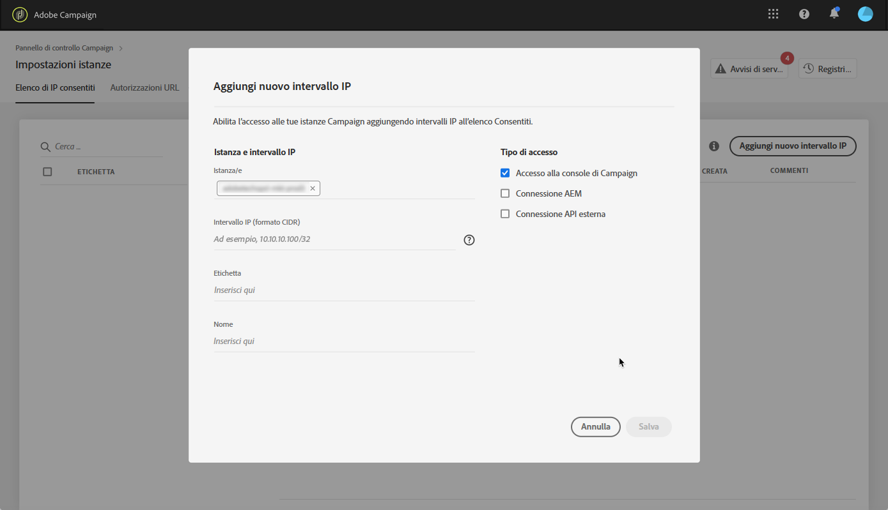
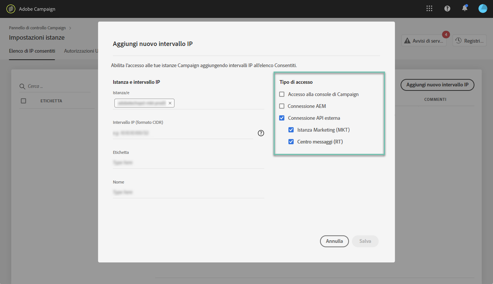

# Inserimento di IP nella whitelist {#ip-whitelisting}

>[!CONTEXTUALHELP]
>id="cp_instancesettings_iprange"
>title="Informazioni sull’inserimento di IP nella whitelist"
>abstract="Gestisci l’inserimento di IP nella whitelist per accedere alle istanze."
>additional-url="https://images-tv.adobe.com/mpcv3/045cac99-f948-478e-ae04-f8c161dcb9e2_1568132508.1920x1080at3000_h264.mp4" text="Guarda il video dimostrativo"

>[!IMPORTANT]
>
>Questa funzione è disponibile solo per le istanze di Campaign Classic.

## Informazioni sull’inserimento di IP nella whitelist {#about-ip-whitelisting}

Per impostazione predefinita, l’istanza di Adobe Campaign Classic non è accessibile da vari indirizzi IP.

Se il tuo indirizzo IP non è stato inserito nella whitelist, non puoi accedere all’istanza da tale indirizzo. Allo stesso modo, potresti non riuscire a collegare un’API al Message Center (Centro messaggi) o all’istanza Marketing se l’indirizzo IP non è stato inserito nella whitelist dell’istanza in modo esplicito.

Il Pannello di controllo Campaign ti consente di impostare nuove connessioni alle istanze tramite l’inserimento di intervalli IP nella whitelist. Per farlo, attieniti alla procedura descritta di seguito.

Una volta inseriti gli indirizzi IP nella whitelist, puoi creare e collegare ad essi gli operatori Campaign per consentire agli utenti di accedere all’istanza.

## Best practice {#best-practices}

Accertati di seguire le raccomandazioni e le limitazioni riportate di seguito quando inserisci gli indirizzi IP nella whitelist dal Pannello di controllo Campaign.

* **Non abilitare l’accesso IP per tutti i tipi di accesso** se non vuoi che l’indirizzo IP si connetta ai tuoi server RT o all’area di sicurezza AEM.
* **Se hai temporaneamente attivato l’accesso all’istanza per un indirizzo IP**, assicurati di rimuoverlo dagli indirizzi IP inseriti nella whitelist una volta che non è più necessario per connettersi all’istanza.
* **Sconsigliamo di inserire nella whitelist gli indirizzi IP di luoghi pubblici** (aeroporti, alberghi, ecc.). Utilizza l’indirizzo VPN dell’azienda per proteggere sempre la tua istanza.

## Inserimento di indirizzi IP nella whitelist per l’accesso alle istanze {#whistelisting-ip-addresses}

>[!CONTEXTUALHELP]
>id="cp_instancesettings_iprange_add"
>title="Aggiungere un nuovo intervallo IP"
>abstract="Definisci l’intervallo IP da inserire nella whitelist per collegarti all’istanza."

Per inserire gli indirizzi IP nella whitelist , effettua le seguenti operazioni:

1. Apri la scheda **[!UICONTROL Instances Settings card]** per accedere all’inserimento di IP nella whitelist, quindi fai clic su **[!UICONTROL Add new IP Range]**.

   >[!NOTE]
   >
   >Se la scheda Instance Settings (Impostazioni istanze) non è visibile nella home page del Pannello di controllo Campaign, significa che il tuo ID organizzazione IMS non è associato ad alcuna istanza di Adobe Campaign Classic

   

1. Immetti le informazioni dell’intervallo IP da inserire nella whitelist come descritto di seguito.

   

   * **[!UICONTROL Instance(s)]**: le istanze a cui gli indirizzi IP saranno in grado di connettersi. È possibile operare su più istanze contemporaneamente. Ad esempio, l’inserimento di IP nella whitelist può essere eseguito sia sulle istanze Production (Produzione) che Stage nello stesso passaggio.
   * **[!UICONTROL IP Range]**: l’intervallo IP che si desidera inserire nella whitelist, in formato CIDR. Tieni presente che un intervallo IP non può sovrapporsi a un intervallo esistente nella whitelist. In tal caso, elimina prima l’intervallo che contiene l’IP sovrapposto.
   >[!NOTE]
   >
   >CIDR (Classless Inter-Domain Routing) è il formato supportato per l’aggiunta di intervalli IP tramite l’interfaccia del Pannello di controllo Campaign. La sintassi è composta da un indirizzo IP seguito da un carattere “/” e da un numero decimale. Il formato e la sintassi sono descritti dettagliatamente in [questo articolo](https://whatismyipaddress.com/cidr).
   >
   >Puoi cercare su Internet strumenti online gratuiti che ti aiuteranno a convertire gli intervalli IP che hai a disposizione in formato CIDR.

   * **[!UICONTROL Label]**: l’etichetta che verrà visualizzata nell’elenco degli indirizzi IP inseriti nella whitelist.
   * **[!UICONTROL Name]**: il nome deve essere univoco per Access Type (Tipo di accesso), Instance (Istanza) (in caso di connessione API esterna) e per l’indirizzo IP.

1. Specifica il tipo di accesso che desideri concedere agli indirizzi IP:

   * **[!UICONTROL Campaign Console Access]**: gli indirizzi IP saranno autorizzati a connettersi alla console Campaign Classic. L’accesso alla console è abilitato solo per le istanze Marketing. L’accesso all’istanza MID e RT non è consentito e pertanto non è abilitato.
   * **[!UICONTROL AEM connection]**: gli indirizzi IP AEM specificati saranno autorizzati a connettersi all’istanza Marketing.
   * **[!UICONTROL External API connection]**: le API esterne con gli indirizzi IP specificati saranno autorizzate a connettersi all’istanza Marketing e/o Message Center (Centro messaggi) (RT). La connessione delle istanze RT alla console non è abilitata.
   

1. Fai clic sul pulsante **[!UICONTROL Save]**. L’intervallo IP viene aggiunto all’elenco degli indirizzi IP inseriti nella whitelist.

   

Per eliminare gli intervalli IP inseriti nella whitelist, selezionali e fai clic sul pulsante **[!UICONTROL Delete IP range]**.

**Argomenti correlati:**
* [Inserimento di IP nella whitelist (video tutorial)](https://docs.adobe.com/content/help/en/campaign-learn/campaign-classic-tutorials/administrating/control-panel-acc/ip-whitelisting.html)
* [Collegamento di un’area di sicurezza a un operatore](https://docs.adobe.com/content/help/it-IT/campaign-classic/using/installing-campaign-classic/additional-configurations/configuring-campaign-server.html#Linking_a_security_zone_to_an_operator)
