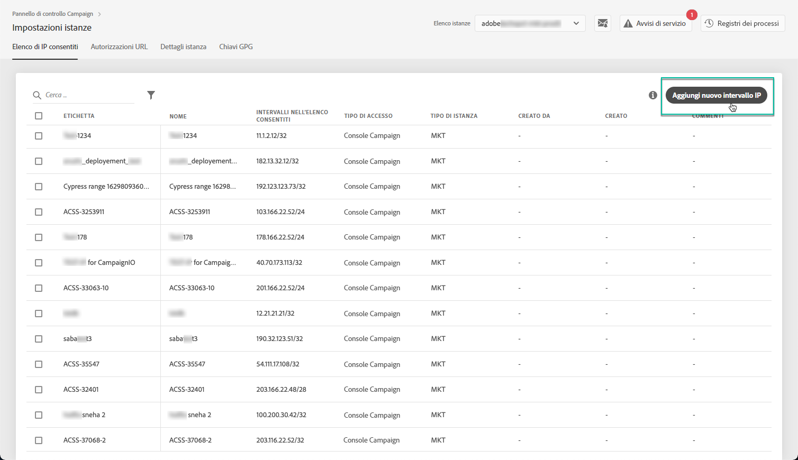

# whitelist IP {#ip-whitelisting}

>[!CAUTION]
>
>Questa funzione è disponibile solo per le istanze di Campaign Classic.

## Informazioni sulla whitelist IP {#about-ip-whitelisting}

Per impostazione predefinita, l'istanza di Adobe Campaign Classic non è accessibile da vari indirizzi IP.

Se l'indirizzo IP non è stato inserito nella white list, non potrete accedere all'istanza da questo indirizzo. Allo stesso modo, potrebbe non essere possibile collegare un'API al Centro messaggi o all'istanza Marketing se l'indirizzo IP non è stato inserito esplicitamente nella white list con l'istanza.

Il Pannello di controllo consente di impostare nuove connessioni alle istanze tramite la whitelist degli intervalli di indirizzi IP. A questo scopo, attenetevi alla procedura descritta di seguito.

Una volta inseriti gli indirizzi IP nella white list, potete creare e collegare gli operatori Campaign per consentire agli utenti di accedere all'istanza.

## Best practice {#best-practices}

Accertatevi di seguire le raccomandazioni e le limitazioni riportate di seguito quando inserite gli indirizzi IP nella white list del Pannello di controllo.

* **Non abilitate l'accesso IP a tutti i tipi** di accesso se non intendete che l'indirizzo IP si connetta ai server RT o all'area di protezione AEM.
* **Se avete temporaneamente attivato l'accesso all'istanza per un indirizzo** IP, accertatevi di rimuovere gli indirizzi IP dagli indirizzi IP nella white list una volta che non è più necessario connettersi all'istanza.
* **Non consigliamo di inserire in una whitelist gli indirizzi IP dei luoghi** pubblici (aeroporti, alberghi, ecc.). Utilizzate l'indirizzo VPN della società per mantenere l'istanza al sicuro in ogni momento.

## Whitelist di indirizzi IP per l'accesso a Instance {#whistelisting-ip-addresses}

Per inserire in una whitelist gli indirizzi IP, effettuate le seguenti operazioni:

1. Aprite la scheda **[!UICONTROL Instances Settings card]** per accedere alla whitelist IP, quindi fate clic su **[!UICONTROL Add new IP Range]**.

   >[!NOTE]
   >
   >Se la scheda Instance Settings (Impostazioni istanza) non è visibile nella home page del Pannello di controllo, significa che il tuo ID ORG IMS non è associato ad alcuna istanza di Adobe Campaign Classic

   

1. Compila le informazioni per l’intervallo IP da inserire nella whitelist come descritto di seguito.

   

   * **[!UICONTROL Instance(s)]**: Le istanze a cui gli indirizzi IP saranno in grado di connettersi. È possibile modificare più istanze contemporaneamente. Ad esempio, la whitelist IP può essere eseguita sia sulle istanze Produzione che Stage nello stesso passaggio.
   * **[!UICONTROL IP Range]**: La gamma IP che si desidera inserire nella whitelist, in formato CIDR. Tenete presente che un intervallo IP non può sovrapporsi a un intervallo esistente nella white list. In tal caso, eliminate prima l’intervallo che contiene l’IP sovrapposto.
   >[!NOTE]
   >
   >CIDR (Classless Inter-Domain Routing) è il formato supportato quando si aggiungono intervalli IP con l'interfaccia del Pannello di controllo. La sintassi è composta da un indirizzo IP seguito da un carattere "/" e da un numero decimale. Il formato e la sintassi sono descritti dettagliatamente in [questo articolo](https://whatismyipaddress.com/cidr).
   >
   >È possibile ricercare su Internet strumenti online gratuiti che aiuteranno a convertire la gamma IP che si ha a portata di mano in formato CIDR.

   * **!UICONTROL Label]**: Etichetta che verrà visualizzata nell'elenco degli indirizzi IP consentiti.
   * **[!UICONTROL Name]**: Il nome deve essere univoco per Tipo di accesso, Istanza (in caso di connessione API esterna) e per l'indirizzo IP.

1. Specificate il tipo di accesso che desiderate concedere agli indirizzi IP:

   * **[!UICONTROL Campaign Console Access]**: Gli indirizzi IP potranno connettersi alla console Campaign Classic. L'accesso alla console è abilitato solo per le istanze Marketing. L'accesso all'istanza MID e RT non è consentito e pertanto non è abilitato.
   * **[!UICONTROL AEM connection]**: Gli indirizzi IP AEM specificati saranno autorizzati a connettersi all'istanza Marketing.
   * **[!UICONTROL External API connection]**: Le API esterne con gli indirizzi IP specificati saranno autorizzate a connettersi all'istanza Marketing and/o Message Center (RT). La connessione alla console delle istanze RT non è abilitata.
   

1. Fate clic sul **[!UICONTROL Save]** pulsante. L'intervallo IP viene aggiunto all'elenco degli indirizzi IP consentiti.

   

Per eliminare gli intervalli IP consentiti, selezionateli e fate clic sul **[!UICONTROL Delete IP range]** pulsante .

**Argomenti correlati:**
* [Whitelist IP (video di esercitazione)](https://docs.adobe.com/content/help/en/campaign-learn/campaign-classic-tutorials/administrating/control-panel-acc/ip-whitelisting.html)
* [Collegamento di una zona di protezione a un operatore](https://docs.campaign.adobe.com/doc/AC/en/INS_Additional_configurations_Configuring_Campaign_server.html#Linking_a_security_zone_to_an_operator)
