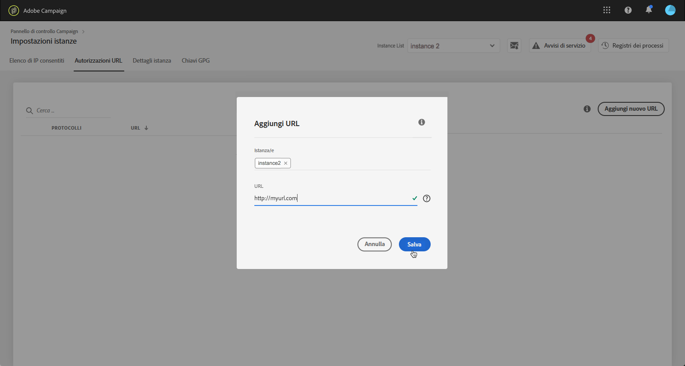

# Autorizzazioni URL {#url-permissions}

>[!CONTEXTUALHELP]
>id="cp_instancesettings_urlpermissions"
>title="Informazioni sulle autorizzazioni URL"
>abstract="Gestisci gli URL a cui le istanze di Adobe Campaign possono connettersi."
>additional-url="https://images-tv.adobe.com/mpcv3/91206a19-d9af-4b6a-8197-0d2810a78941_1563488165.1920x1080at3000_h264.mp4" text="Guarda il video dimostrativo"

## Informazioni sulle autorizzazioni URL {#about-url-permissions}

>[!IMPORTANT]
>
>Questa funzione è disponibile solo per le istanze di Campaign v7/v8, a partire dalla build 8850. Se utilizzi una build precedente, dovrai eseguire l’aggiornamento per utilizzare questa funzione.

L’elenco predefinito di URL che possono essere richiamati tramite codici JavaScript (flussi di lavoro, ecc.) dalle istanze di Campaign è limitato. Si tratta di URL che consentono il corretto funzionamento delle istanze.

Per impostazione predefinita, le istanze non possono connettersi a URL esterni. Il Pannello di controllo consente di aggiungere degli URL esterni all’elenco degli URL autorizzati, in modo che l’istanza possa connettersi a tali URL. Questo consente di connettere le istanze Campaign a sistemi esterni, ad esempio server SFTP o siti Web, per abilitare il trasferimento di file e/o dati.

Una volta aggiunto l’URL, viene inserito un suo riferimento nel file di configurazione dell’istanza (serverConf.xml).

 [Guarda il video su questa funzione](https://experienceleague.adobe.com/docs/campaign-classic-learn/control-panel/instance-settings/adding-url-permissions.html?lang=it#instance-settings)

**Argomenti correlati:**

* [Configurazione del server Campaign](https://experienceleague.adobe.com/docs/campaign-classic/using/installing-campaign-classic/additional-configurations/configuring-campaign-server.html?lang=it)
* [Protezione delle connessioni in uscita](https://experienceleague.adobe.com/docs/campaign-classic/using/installing-campaign-classic/security-privacy/server-configuration.html?lang=it#outgoing-connection-protection)

## Best practice {#best-practices}

* Non collegare l’istanza Campaign a siti web/server ai quali non intendi connetterti.
* Elimina gli URL con i quali non lavori più. Tuttavia, tieni presente che, se un’altra sezione della tua azienda continua a collegarsi all’URL eliminato, nessuno potrà più utilizzarlo.
* Il Pannello di controllo supporta protocolli **http**, **https** e **sftp**. L’immissione di URL o protocolli non validi causa errori.

## Gestione delle autorizzazioni URL {#managing-url-permissions}

>[!CONTEXTUALHELP]
>id="cp_instancesettings_url_add"
>title="Definizione degli URL"
>abstract="Aggiungi URL per consentire connessioni all’istanza Campaign."

Per aggiungere un URL a cui l’istanza può connettersi, effettua le seguenti operazioni:

1. Apri la scheda **[!UICONTROL Impostazioni istanze]** per accedere alla scheda **[!UICONTROL Autorizzazioni URL]**.

   >[!NOTE]
   >
   >Se la scheda Impostazioni istanze non è visibile nella home page del Pannello di controllo, significa che il tuo [ID organizzazione](https://experienceleague.adobe.com/docs/core-services/interface/administration/organizations.html?lang=it) non è associato ad alcuna istanza di Adobe Campaign.
   >
   >La scheda <b>URL permissions (Autorizzazioni URL)</b> elenca tutti gli URL esterni a cui l’istanza può connettersi. Questo elenco non include gli URL necessari per il funzionamento di Campaign (ad esempio, le connessioni tra parti dell’infrastruttura).

1. Seleziona l’istanza desiderata nel riquadro di sinistra, quindi fai clic sul pulsante **[!UICONTROL Aggiungi nuovo URL]**.

   

   >[!NOTE]
   >
   >Tutte le istanze di Campaign vengono visualizzate nell’elenco del riquadro a sinistra.
   >
   >Poiché la gestione delle autorizzazioni URL è dedicata solo alle istanze di Campaign v7/v8, se selezioni un’istanza di Campaign Standard, viene visualizzato il messaggio “Istanza non applicabile”.

1. Digita l’URL da autorizzare, con il relativo protocollo associato (http, https o sftp).

   >[!NOTE]
   >
   >È possibile autorizzare più istanze a connettersi all’URL. Per farlo, aggiungile direttamente dal campo Instance(s) (Istanza) digitando la prima lettera.

   

1. L’URL viene aggiunto all’elenco, ora è possibile connettersi ad esso.

   >[!NOTE]
   >
   >I caratteri &quot;/.*&quot; vengono aggiunti automaticamente alla fine dell’URL immesso dopo la convalida, in modo da includere tutte le sottopagine della pagina immessa.

   

Puoi eliminare un URL in qualsiasi momento selezionandolo e facendo clic sul pulsante **[!UICONTROL Elimina URL]**.

Tieni presente che, se elimini un URL, l’istanza non sarà più in grado di richiamarlo.

## Domande comuni {#common-questions}

**Ho aggiunto un nuovo URL, ma la mia istanza non è ancora in grado di connettersi a esso. Perché?**

In alcuni casi, gli URL a cui tenti di connetterti richiedono l’inserimento nell’elenco Consentiti, l’accesso tramite password o un altro tipo di autenticazione. Il Pannello di controllo non gestisce l’autenticazione aggiuntiva.
