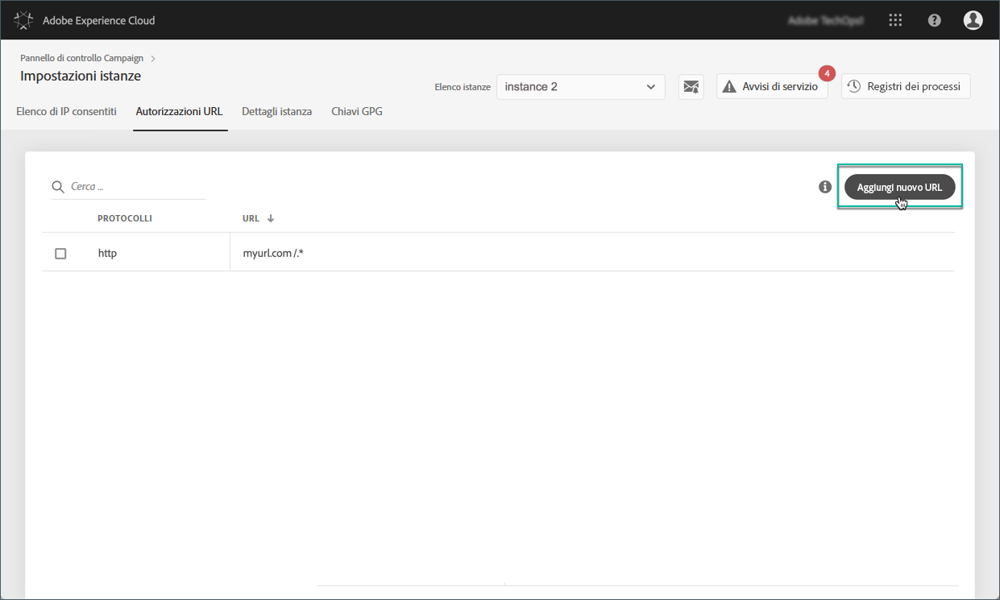

# Autorizzazioni URL {#url-permissions}

>[!CAUTION]
>
>Questa funzione è disponibile solo per le istanze di Campaign Classic.

## Informazioni sulle autorizzazioni URL {#about-url-permissions}

Elenco predefinito di URL che possono essere richiamati dai codici JavaScript (flussi di lavoro, ecc.) le istanze Campaign Classic sono limitate. Si tratta di URL che consentono il corretto funzionamento delle istanze.

Per impostazione predefinita, le istanze non possono connettersi agli URL esterni. Il Pannello di controllo consente di aggiungere alcuni URL esterni all’elenco degli URL autorizzati, in modo che l’istanza possa connettersi ad essi. Questo consente di collegare le istanze Campaign a sistemi esterni come, ad esempio, server SFTP o siti Web per abilitare il trasferimento di file e/o dati.

Una volta aggiunto l’URL, viene fatto riferimento al file di configurazione dell’istanza (serverConf.xml).

**Argomenti correlati:**

* [Configurazione del server Campaign](https://docs.campaign.adobe.com/doc/AC/en/INS_Additional_configurations_Configuring_Campaign_server.html)
* [Protezione connessione in uscita](https://docs.campaign.adobe.com/doc/AC/en/INS_Additional_configurations_Configuring_Campaign_server.html#Outgoing_connection_protection)
* [Aggiunta di autorizzazioni URL (video di esercitazione)](https://docs.adobe.com/content/help/en/campaign-learn/campaign-classic-tutorials/administrating/control-panel-acc/adding-url-permissions.html)

## Best practice {#best-practices}

* Non collegare l'istanza Campaign ai siti Web/server ai quali non si intende connettersi.
* Eliminate gli URL con cui non state più lavorando. Tuttavia, tenete presente che, se un’altra sezione della società continua a collegarsi all’URL eliminato, nessuno potrà usarlo di nuovo.
* Il Pannello di controllo supporta **protocolli http**, **https** e **sftp** . L'immissione di URL o protocolli non validi causerà errori.

## Gestione delle autorizzazioni URL {#managing-url-permissions}

Per aggiungere un URL a cui l’istanza può connettersi, effettuate le seguenti operazioni:

1. Open the **[!UICONTROL Instances Settings]** card to access the **[!UICONTROL URL Permissions]** tab.

   >[!NOTE]
   >
   >Se la scheda Instance Settings (Impostazioni istanza) non è visibile nella home page del Pannello di controllo, significa che il tuo ID ORG IMS non è associato ad alcuna istanza di Adobe Campaign Classic
   >
   >La scheda Autorizzazioni <b></b> URL elenca tutti gli URL esterni a cui l’istanza può connettersi. Questo elenco non include gli URL necessari per il funzionamento di Campaign (ad esempio, connessioni tra parti dell'infrastruttura).

1. Selezionare nel riquadro di sinistra l'istanza desiderata, quindi fare clic sul **[!UICONTROL Add new URL]** pulsante.

   

   >[!NOTE]
   >
   >Tutte le istanze Campaign vengono visualizzate nell'elenco del riquadro a sinistra.
   >
   >Poiché la gestione delle autorizzazioni URL è dedicata solo alle istanze Campaign Classic, se selezionate un'istanza Campaign Standard viene visualizzato il messaggio "Istanza non applicabile".

1. Digitate l'URL da autorizzare, con il relativo protocollo associato (http, https o sftp).

   >[!NOTE]
   >
   >È possibile autorizzare più istanze per la connessione all’URL. A questo scopo, aggiungeteli direttamente dal campo Istanza (Instance) digitando la prima lettera.

   

1. L'URL viene aggiunto all'elenco e ora è possibile connettersi ad esso.

   >[!NOTE]
   >
   >Il simbolo "/.*" i caratteri vengono aggiunti automaticamente alla fine dell'URL immesso dopo la convalida, per coprire tutte le sottopagine della pagina inserita.

   

Potete eliminare un URL in qualsiasi momento selezionandolo e facendo clic sul **[!UICONTROL Delete URL]** pulsante.

Tenete presente che, se eliminate un URL, l’istanza non potrà richiamarlo di nuovo.

## Domande frequenti {#common-questions}

**Ho aggiunto un nuovo URL, ma la mia istanza non è ancora in grado di connettersi a tale URL. Perché?**

In alcuni casi, gli URL che si tenta di connettere richiedono la whitelist, la password entry o un altro tipo di autenticazione. Il Pannello di controllo non gestisce l'autenticazione aggiuntiva.
