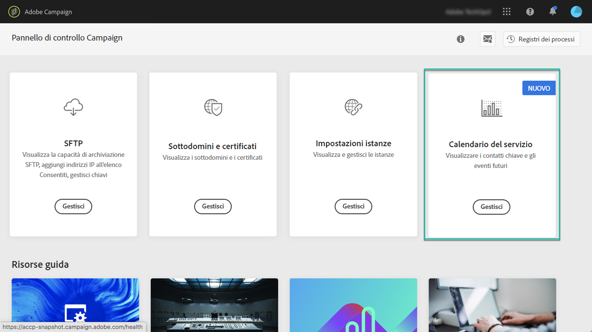

# Informazioni sul monitoraggio delle prestazioni {#about-performance-monitoring}

Il Pannello di controllo Campaign offre diverse funzionalità per monitorare le istanze e garantire prestazioni ottimali.

La **[!UICONTROL Performance monitoring]** scheda nella home page del Pannello di controllo Campaign consente di monitorare l&#39;utilizzo delle istanze Campaign come, ad esempio, la capacità del database. Per ulteriori informazioni al riguardo, consulta [questa sezione](../../performance-monitoring/using/database-monitoring.md).

>[!NOTE]
>
>Con le prossime release di Pannello di controllo Campaign, in questa scheda saranno disponibili ulteriori funzionalità di monitoraggio.

Inoltre, il Pannello di controllo Campaign consente di registrarsi per ricevere notifiche e-mail ogni volta che viene rilevato un problema in una delle istanze della campagna. Per ulteriori informazioni al riguardo, consulta [questa sezione](../../performance-monitoring/using/email-alerting.md).

