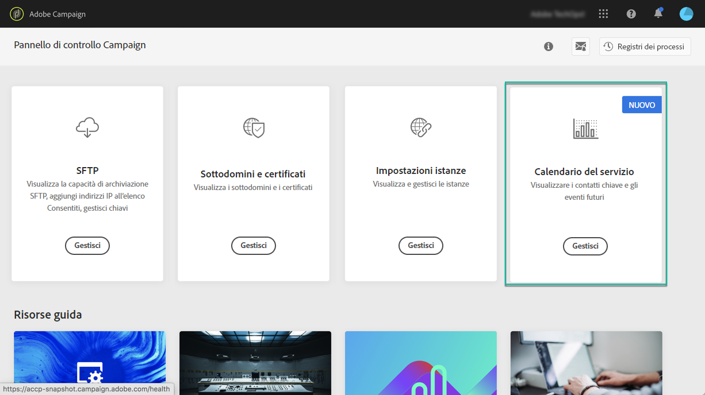

# Informazioni sul monitoraggio delle prestazioni {#about-performance-monitoring}

Il Pannello di controllo offre diverse funzionalità per monitorare le istanze e garantire prestazioni ottimali.

La scheda **[!UICONTROL Monitoraggio delle prestazioni]** nella pagina Home del Pannello di controllo consente di monitorare l’utilizzo delle istanze di Campaign come, ad esempio, la capacità del database. Per ulteriori informazioni al riguardo, consulta [questa sezione](../../performance-monitoring/using/database-monitoring.md).

>[!NOTE]
>
>Con le prossime versioni del Pannello di controllo, in questa scheda saranno disponibili ulteriori funzionalità di monitoraggio.

