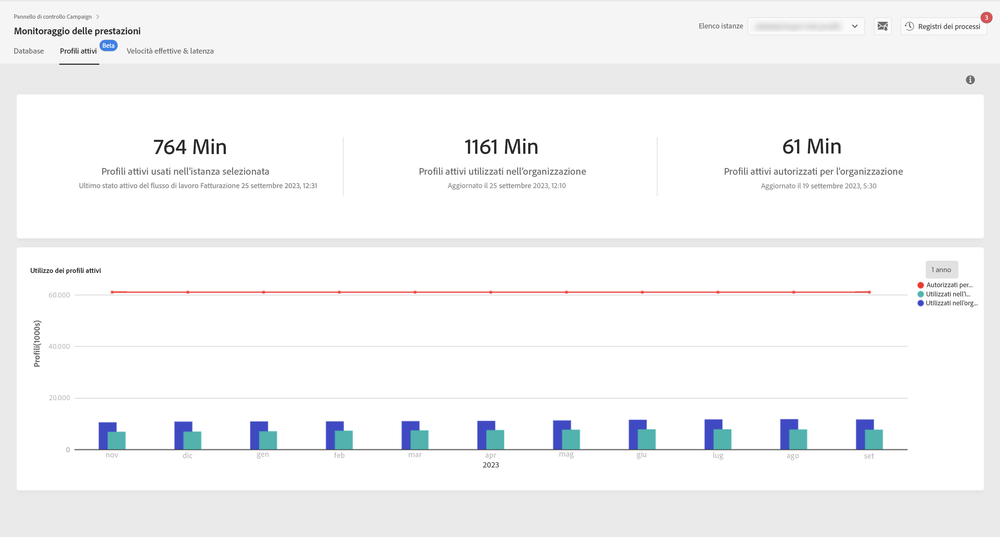

# Monitoraggio profili attivi {#active-profiles-monitoring}

## Informazioni sui profili attivi {#about-active-profiles}

>[!IMPORTANT]
>
>Il monitoraggio profili attivi dal Pannello di controllo Campaign è disponibile in versione beta e soggetto a frequenti aggiornamenti e modifiche senza preavviso.
>
>Questa funzione è disponibile per i clienti ospitati su AWS dalla build Campaign Standard 10368 e dalla build Campaign Classic 8931. Se utilizzi una build precedente, dovrai eseguire l’aggiornamento per utilizzare questa funzione.

In base al contratto, a ciascuna istanza di Campaign viene fornito un numero specifico di profili attivi conteggiati a scopo di fatturazione. Per informazioni sul numero di profili attivi acquistati, fai riferimento al contratto più recente.

Per “profilo” si intende un registro di informazioni (ad esempio un record nella tabella nmsRecipient o una tabella esterna contenente un ID cookie, un ID cliente, un identificatore mobile o altre informazioni pertinenti a un canale specifico) che rappresenta un cliente finale, potenziale o un lead.

I profili sono considerati attivi se sono stati targetizzati o se è avvenuta una comunicazione con essi negli ultimi 12 mesi tramite qualsiasi canale.

>[!NOTE]
>
>I canali Facebook e Twitter non vengono presi in considerazione.

Per ulteriori informazioni sui profili attivi, consulta la documentazione [Campaign Standard](https://docs.adobe.com/content/help/it-IT/campaign-standard/using/profiles-and-audiences/managing-profiles/active-profiles.html) e [Campaign Classic](https://docs.adobe.com/content/help/it-IT/campaign-classic/using/getting-started/profile-management/about-profiles.html#active-profiles).

## Monitorare i profili attivi {#monitoring-active-profiles}

Il Pannello di controllo Campaign consente di monitorare l’utilizzo dei profili attivi per ciascuna istanza di Campaign.

Per farlo, esegui questi passaggi:

1. Apri la scheda **[!UICONTROL Performance Monitoring]**, quindi seleziona la scheda **[!UICONTROL Active Profiles]**.

1. Seleziona l’istanza desiderata da **[!UICONTROL Instance List]**.

1. Viene visualizzato il numero di profili attivi utilizzati dall’istanza e l’ultima volta che il flusso di lavoro di fatturazione è stato eseguito sull’istanza.

>[!NOTE]
>
>I profili attivi vengono conteggiati in base ai flussi di lavoro tecnici dedicati che vengono eseguiti quotidianamente sulle istanze:
>
>* Il flusso di lavoro [“Billing”](https://docs.adobe.com/help/it-IT/campaign-standard/using/administrating/application-settings/technical-workflows.html) (Fatturazione) per Campaign Standard,
>* Il flusso di lavoro [“Number of active billing profiles”](https://experienceleague.adobe.com/docs/campaign-classic/using/automating-with-workflows/advanced-management/about-technical-workflows.html) (Numero di profili di fatturazione attivi) per Campaign Classic.

L’area inferiore fornisce una rappresentazione grafica dell’utilizzo dei profili attivi negli ultimi 30 giorni. Puoi impostare il periodo di tempo visualizzato a 1 anno utilizzando i filtri disponibili nell’angolo in alto a destra.

Passando il puntatore del mouse su una delle barre del grafico è possibile ottenere il numero esatto di profili attivi utilizzati durante il periodo selezionato.
