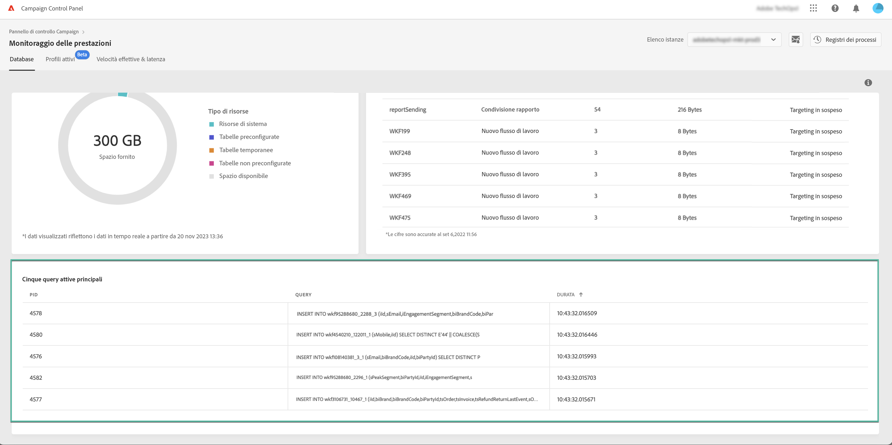

# Monitoraggio delle query attive {#long-running-queries}

Il **[!UICONTROL Query attive]** area da **[!UICONTROL Database]** scheda elenca le cinque query in esecuzione da più tempo nell’istanza selezionata.

Il **[!UICONTROL Durata]** columns specifica per quanto tempo una query è in esecuzione sull&#39;istanza. La durata viene visualizzata in questo formato: `hh:mm:ss.ms`.

>[!IMPORTANT]
>
>Se una delle query è attiva da più di 24 ore, contatta l’Assistenza clienti per identificare e risolvere il problema. Dovrai fornire loro la **[!UICONTROL PID]** valore di colonna, che è un identificatore univoco per la query.
