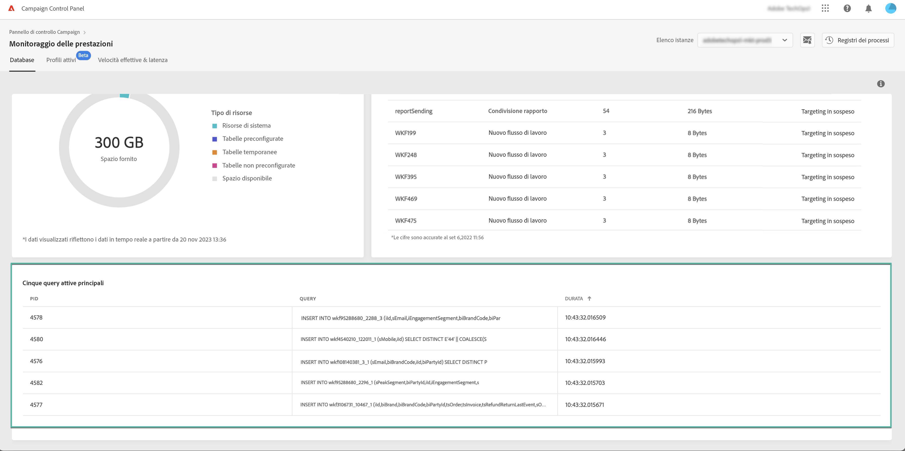

# Monitoraggio delle query attive {#long-running-queries}

L’area **[!UICONTROL Query attive]** nella scheda **[!UICONTROL Database]** elenca le cinque query in esecuzione da più tempo nell’istanza selezionata.

Le colonne **[!UICONTROL Durata]** specificano da quanto tempo una query è in esecuzione sull’istanza. La durata viene visualizzata in questo formato: `hh:mm:ss.ms`.

>[!IMPORTANT]
>
>Se una delle query è attiva da più di 24 ore, contatta l’Assistenza clienti per identificare e risolvere il problema. Dovrai fornire il valore della colonna **[!UICONTROL PID]**, che è un identificatore univoco per la query.
