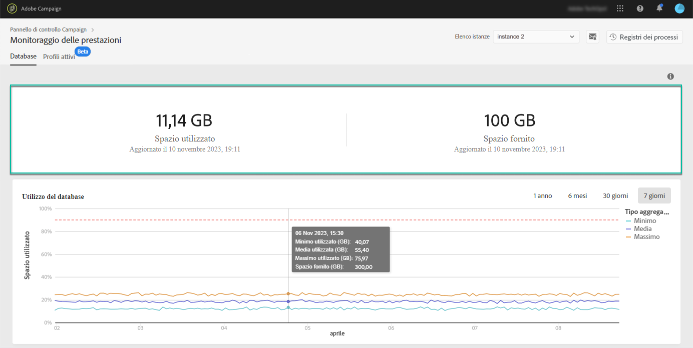
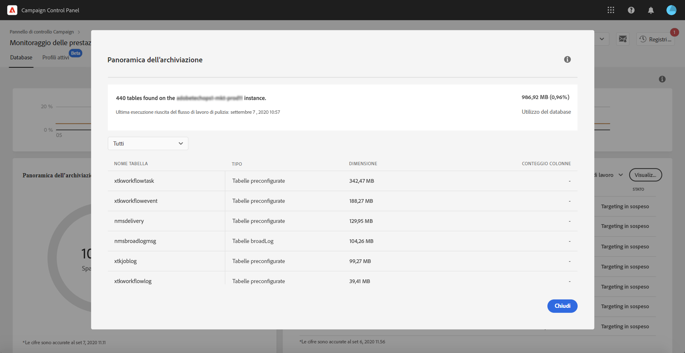
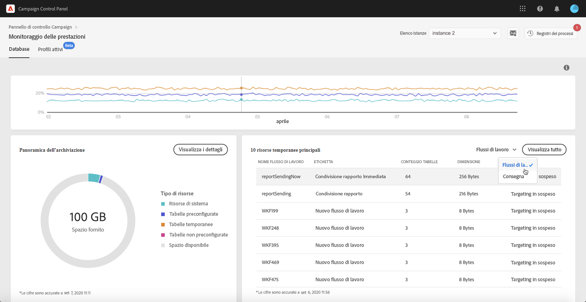

# Monitoraggio del database {#database-monitoring}

## Informazioni sui database delle istanze {#about-instances-databases}

In base al contratto, a ciascuna istanza di Campaign viene fornito uno spazio di database specifico.

I database includono tutte le **risorse**, i **flussi di lavoro** e i **dati** memorizzati in Adobe Campaign.

Nel tempo, i database possono raggiungere la loro capacità massima, soprattutto se le risorse memorizzate non vengono mai eliminate dall’istanza o se sono presenti molti flussi di lavoro in stato di pausa.

L’overflow del database di un’istanza può causare diversi problemi (impossibilità di accedere, inviare e-mail, ecc.). Il monitoraggio dei database delle istanze è quindi essenziale per garantire prestazioni ottimali.

>[!NOTE]
>
>Se lo spazio del database disponibile riportata nel Pannello di controllo Campaign non corrisponde alla quantità specificata nel contratto, contatta l’Assistenza clienti.

## Monitoraggio dell’utilizzo del database {#monitoring-instances-database}

>[!CONTEXTUALHELP]
>id="cp_performancemonitoring_database"
>title="Informazioni sul monitoraggio del database"
>abstract="In questa scheda, puoi ottenere informazioni in tempo reale dati attuali e storici sull’utilizzo e l’evoluzione del database per ciascuna istanza di Campaign."
>additional-url="https://experienceleague.adobe.com/docs/control-panel/using/performance-monitoring/about-performance-monitoring.html?lang=it" text="Informazioni sul monitoraggio delle prestazioni"

 Scopri questa funzione nel video per [Campaign Classic](https://experienceleague.adobe.com/docs/campaign-classic-learn/control-panel/performance-monitoring/monitoring-databases.html?lang=it#performance-monitoring) o [Campaign Standard](https://experienceleague.adobe.com/docs/campaign-standard-learn/control-panel/performance-monitoring/monitoring-databases.html?lang=it#performance-monitoring)

Il Pannello di controllo Campaign consente di monitorare l’utilizzo del database per ciascuna istanza di Campaign. Per fare questo, apri la scheda **[!UICONTROL Performance Monitoring]**, quindi seleziona la scheda **[!UICONTROL Databases]**.

Seleziona l’istanza desiderata da **[!UICONTROL Instance List]** per visualizzare informazioni sulla capacità del database dell’istanza e sullo spazio utilizzato.

>[!NOTE]
>
>I dati di questo dashboard vengono aggiornati in base al **[!UICONTROL Database cleanup technical workflow]** in esecuzione nell’istanza Campaign (consulta la documentazione di [Campaign Standard](https://experienceleague.adobe.com/docs/campaign-standard/using/administrating/application-settings/technical-workflows.html?lang=it#list-of-technical-workflows) e [Campaign Classic](https://experienceleague.adobe.com/docs/campaign-classic/using/monitoring-campaign-classic/data-processing/database-cleanup-workflow.html?lang=it)).
>
>Inoltre, puoi ricevere notifiche quando uno dei tuoi database raggiunge la capacità massima e controllare l’ultima volta che un flusso di lavoro è stato eseguito, sotto le metriche **[!UICONTROL Used Space]** e **[!UICONTROL Provided Space]**. Tieni presente che, se il flusso di lavoro non è stato eseguito da almeno 3 giorni, ti consigliamo di contattare l’Assistenza clienti di Adobe in modo che possa indagare il motivo per cui il flusso di lavoro si è interrotto.

Il dashboard contiene anche altre metriche, descritte di seguito, che consentono di analizzare l’utilizzo del database dell’istanza.

### Utilizzo del database {#database-utilization}

L’area **[!UICONTROL Database utilization]** fornisce una rappresentazione grafica dell’utilizzo minimo, medio e massimo del database negli ultimi 7 giorni; la soglia di utilizzo del database del 90% è rappresentata da una curva punteggiata rossa.

Per modificare il periodo di tempo, utilizza i filtri disponibili nell’angolo superiore destro del grafico.

Per una migliore leggibilità, puoi anche evidenziare una o più curve nel grafico. A questo scopo, selezionali dalla legenda **[!UICONTROL Aggregation Type]**.

Per ulteriori dettagli su un periodo di tempo specifico, passa il cursore del mouse sul grafico per visualizzare le informazioni sull’utilizzo del database in quel momento.

### Panoramica sull’archiviazione {#storage-overview}

>[!CONTEXTUALHELP]
>id="cp_dbdetails_storagedetails"
>title="Panoramica sull’archiviazione"
>abstract="In questa scheda puoi ottenere informazioni dettagliate sulle diverse risorse di Campaign che occupano spazio nel database."

L’area **[!UICONTROL Storage overview]** fornisce una rappresentazione grafica dello spazio occupato da:

* **[!UICONTROL System resources]**

   Tieni presente che, se le risorse di sistema occupano gran parte dello spazio del database, è consigliabile contattare l’Assistenza clienti.

* **[!UICONTROL Out-of-the-box tables]** fornite per impostazione predefinita con le istanze Campaign,
* **[!UICONTROL Temporary tables]** create da flussi di lavoro e consegne,
* **[!UICONTROL Non-out of the box tables]** generate dopo la creazione di risorse personalizzate.

Fai clic sul pulsante **[!UICONTROL View details]** per ottenere ulteriori dettagli sulle diverse risorse che occupano spazio nel database.

Usa il filtro per perfezionare le ricerche e per visualizzare solo le tabelle con un tipo specifico di risorsa.

### Le 10 risorse temporanee principali {#top-10}

Nell’area **[!UICONTROL Top 10 temporary resources]** sono elencate le 10 risorse temporanee più grandi generate dai flussi di lavoro e dalle consegne.

Il monitoraggio dei flussi di lavoro e delle consegne che creano grandi risorse temporanee è un passaggio chiave per monitorare il database. Se una risorsa temporanea occupa troppo spazio nel database, assicurati che il flusso di lavoro o la consegna sia effettivamente indispensabile e, nel caso non lo sia, accedi all’istanza per interromperla.

>[!IMPORTANT]
>
>Si consiglia di evitare di avere **più di 40 colonne** in risorse non fornite con il prodotto.

>[!NOTE]
>
>Se un flusso di lavoro ha un numero elevato di voci di tabella o dimensioni eccessive nel database, è consigliabile rivedere il flusso di lavoro per scoprire perché genera così tanti dati.
>
>Alla fine di questa pagina trovi alcune risorse di Campaign Standard e Classic utili per evitare il sovraccarico del database.

Il pulsante **[!UICONTROL View all]** consente di accedere a informazioni dettagliate su queste risorse temporanee.

Il valore nella colonna **[!UICONTROL Keep interim results]** indica se l’opzione è abilitata (&quot;1&quot;) o disabilitata (&quot;0&quot;) in Campaign. Questa opzione consente di salvare i risultati delle transizioni tra le varie attività di un flusso di lavoro (consulta la documentazione di [Campaign Standard](https://experienceleague.adobe.com/docs/campaign-standard/using/managing-processes-and-data/executing-a-workflow/managing-execution-options.html?lang=it) e [Campaign Classic](https://experienceleague.adobe.com/docs/campaign-classic/using/automating-with-workflows/introduction/workflow-best-practices.html?lang=it#logs)).

>[!IMPORTANT]
>
>Questa opzione non deve mai essere selezionata in un flusso di lavoro di produzione. Viene utilizzata per analizzare i risultati ed è progettata solo a scopo di test e quindi deve essere utilizzata solo in ambienti di sviluppo o di staging.
>
>Se il valore in Pannello di controllo Campaign indica che l’opzione è abilitata per uno dei flussi di lavoro, si consiglia vivamente di disattivarla.

## Prevenzione del sovraccarico del database {#preventing-database-overload}

Campaign Standard e Classic offrono diversi modi per evitare un eccessivo consumo di spazio su disco del database.

La sezione seguente fornisce utili riferimenti dalla documentazione di Campaign per ottimizzare l’utilizzo dei database:

**Monitoraggio dei flussi di lavoro**

* [Best practice per i flussi di lavoro](https://experienceleague.adobe.com/docs/campaign-standard/using/managing-processes-and-data/workflow-general-operation/best-practices-workflows.html?lang=it) (Campaign Standard)
* [Monitoraggio dell’esecuzione dei flussi di lavoro](https://experienceleague.adobe.com/docs/campaign-classic/using/automating-with-workflows/monitoring-workflows/monitoring-workflow-execution.html?lang=it) (Campaign Classic)

**Manutenzione del database**

* Flusso di lavoro tecnico per la pulizia del database: [Campaign Standard](https://experienceleague.adobe.com/docs/campaign-standard/using/administrating/application-settings/technical-workflows.html#list-of-technical-workflows) - [Campaign Classic](https://experienceleague.adobe.com/docs/campaign-classic/using/monitoring-campaign-classic/data-processing/database-cleanup-workflow.html)
* [Guida alla manutenzione del database](https://experienceleague.adobe.com/docs/campaign-classic/using/monitoring-campaign-classic/database-maintenance/recommendations.html?lang=it) (Campaign Classic)
* [Risoluzione dei problemi di prestazioni del database](https://experienceleague.adobe.com/docs/campaign-classic/using/monitoring-campaign-classic/troubleshooting-toc/database-issues-toc/database-performances.html?lang=it) (Campaign Classic)
* [Opzioni relative al database](https://experienceleague.adobe.com/docs/campaign-classic/using/installing-campaign-classic/appendices/configuring-campaign-options.html?lang=it#database) (Campaign Classic)
* Conservazione dei dati: [Campaign Standard](https://experienceleague.adobe.com/docs/campaign-standard/using/administrating/application-settings/data-retention.html?lang=it) - [Campaign Classic](https://experienceleague.adobe.com/docs/campaign-classic/using/configuring-campaign-classic/data-model/data-model-best-practices.html?lang=it#data-retention)

>[!NOTE]
>
>Inoltre, puoi ricevere notifiche quando uno dei database raggiunge la sua capacità massima. A questo scopo, abbonati agli [avvisi e-mail](../../performance-monitoring/using/email-alerting.md).
