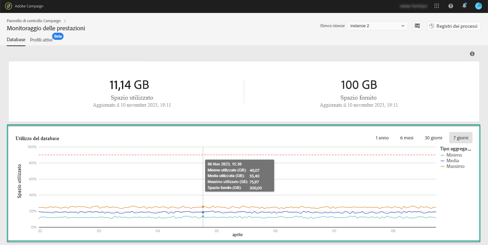

# Monitoraggio del database {#database-monitoring}

## Informazioni sui database delle istanze {#about-instances-databases}

In base al contratto, a ciascuna istanza di Campaign viene fornito uno spazio di database specifico.

I database includono tutte **le risorse**, i **flussi di lavoro** e **i dati** memorizzati in Adobe Campaign.

Nel tempo, i database possono raggiungere la capacità massima, soprattutto se le risorse memorizzate non vengono mai eliminate dall&#39;istanza, o se sono presenti molti flussi di lavoro in stato di pausa.

Un overflow di un database di istanza può causare diversi problemi (impossibilità di effettuare il login, di inviare e-mail ecc.). Il monitoraggio dei database delle istanze è pertanto essenziale per garantire prestazioni ottimali.

>[!NOTE]
>
>Si noti che potrebbero verificarsi delle discrepanze tra la capacità di spazio del database corrente e la quantità specificata nel contratto per periodi di tempo distinti per garantire prestazioni più elevate.

## Monitoraggio dell&#39;utilizzo del database {#monitoring-instances-database}

1. Open the **[!UICONTROL Health Monitoring]** card, then select the **[!UICONTROL Databases]** tab.

1. Selezionate l’istanza desiderata dall’ **[!UICONTROL Instance List]**.

   L&#39;area superiore fornisce informazioni sulla capacità del database dell&#39;istanza e sullo spazio utilizzato.

   

   L&#39;area inferiore fornisce una rappresentazione grafica dell&#39;utilizzo del database negli ultimi 7 giorni. Potete modificare il periodo di tempo visualizzato utilizzando i filtri disponibili nell&#39;angolo superiore destro.

   Passando il mouse sul grafico potete ottenere informazioni dettagliate sul periodo di tempo selezionato.

   

## Prevenzione del sovraccarico del database {#preventing-database-overload}

Campaign Standard e Classic offrono diversi modi per evitare il sovraccarico di spazio su disco del database.

La sezione seguente fornisce utili risorse dalla documentazione relativa a Campaign per ottimizzare l’utilizzo dei database:

**Monitoraggio dei flussi di lavoro**

* [Best practice](https://docs.adobe.com/content/help/en/campaign-standard/using/managing-processes-and-data/workflow-general-operation/best-practices-workflows.html) sui flussi di lavoro (Campaign Standard)
* [Esecuzione](https://docs.adobe.com/help/en/campaign-classic/using/automating-with-workflows/monitoring-workflows/monitoring-workflow-execution.html) del flusso di lavoro di monitoraggio (Campaign Classic)

**Manutenzione del database**

* Flusso di lavoro tecnico per la pulizia del database ([Campaign Standard](https://docs.adobe.com/help/en/campaign-standard/using/administrating/application-settings/technical-workflowshtml#list-of-technical-workflows) / [Campaign Classic](https://docs.adobe.com/help/en/campaign-classic/using/monitoring-campaign-classic/data-processing/database-cleanup-workflow.html))
* [Guida](https://docs.adobe.com/content/help/en/campaign-classic/using/monitoring-campaign-classic/database-maintenance/recommendations.html) alla manutenzione del database (Campaign Classic)
* [Risoluzione dei problemi](https://docs.adobe.com/content/help/en/campaign-classic/using/monitoring-campaign-classic/troubleshooting/database-performances.html) di prestazioni del database (Campaign Classic)
* [Opzioni](https://docs.adobe.com/help/en/campaign-classic/using/installing-campaign-classic/appendices/configuring-campaign-options.html#database) relative al database (Campaign Classic)
