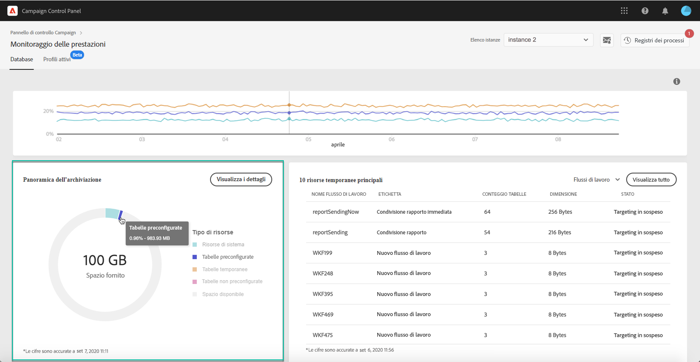

# Panoramica sull’archiviazione {#storage-overview}

>[!CONTEXTUALHELP]
>id="cp_dbdetails_storagedetails"
>title="Panoramica sull’archiviazione"
>abstract="In questa scheda puoi ottenere informazioni dettagliate sulle diverse risorse di Campaign che occupano spazio nel database."

L’area **[!UICONTROL Panoramica dell’archiviazione]** fornisce una rappresentazione grafica dello spazio occupato da:

* **[!UICONTROL Risorse di sistema]**

  Tieni presente che, se le risorse di sistema occupano gran parte dello spazio del database, è consigliabile contattare l’Assistenza clienti.

* **[!UICONTROL Tabelle preconfigurate]** fornite per impostazione predefinita con le istanze di Campaign
* **[!UICONTROL Tabelle temporanee]** create da flussi di lavoro e consegne
* **[!UICONTROL Tabelle non preconfigurate]** generate dopo la creazione di risorse personalizzate

Fai clic sul pulsante **[!UICONTROL Visualizza dettagli]** per ottenere ulteriori dettagli sulle diverse risorse che occupano spazio nel database.

Puoi utilizzare l’elenco a discesa per perfezionare le tabelle di ricerca e visualizzarle solo per uno specifico tipo di risorsa (flussi di lavoro, consegne, destinatari).

Questa schermata consente inoltre di monitorare i parametri dei flussi di lavoro che possono richiedere un’attenzione specifica per evitare problemi nelle istanze. Per ulteriori informazioni, consulta [questa pagina](workflow-monitoring.md).
