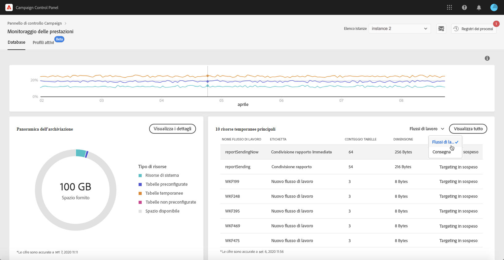

# Le 10 risorse temporanee principali {#top-10}

Nell’area **[!UICONTROL 10 risorse temporanee principali]** sono elencate le 10 risorse temporanee più grandi generate dai flussi di lavoro e dalle consegne.

Il monitoraggio dei flussi di lavoro e delle consegne che creano grandi risorse temporanee è un passaggio chiave per monitorare il database. Se una risorsa temporanea occupa troppo spazio nel database, assicurati che il flusso di lavoro o la consegna sia effettivamente indispensabile e, nel caso non lo sia, accedi all’istanza per interromperla.

>[!IMPORTANT]
>
>Si consiglia di evitare di avere **più di 40 colonne** in risorse non fornite con il prodotto. Se un flusso di lavoro ha un numero elevato di voci di tabella o dimensioni eccessive nel database, è consigliabile rivedere il flusso di lavoro per scoprire perché genera così tanti dati.
>
>In [questa pagina](database-preventing-overload.md) sono disponibili linee guida utili per evitare il sovraccarico del database in Campaign Standard e Classic.

Il pulsante **[!UICONTROL Visualizza tutto]** consente di accedere ai dettagli della **[!UICONTROL Panoramica dell’archiviazione]** per ottenere informazioni dettagliate su queste risorse temporanee. Per ulteriori informazioni, consulta [questa pagina](database-storage-overview.md).
