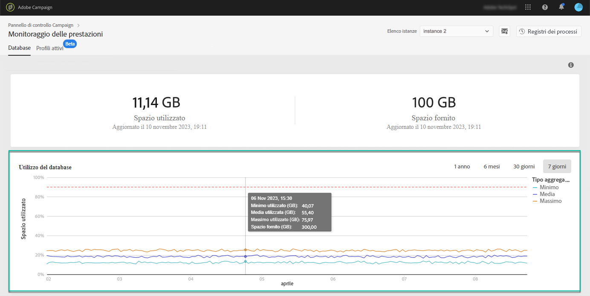

# Utilizzo del database {#database-utilization}

L’area **[!UICONTROL Utilizzo del database]** fornisce una rappresentazione grafica dell’utilizzo minimo, medio e massimo del database negli ultimi 7 giorni; la soglia di utilizzo del database del 90% è rappresentata da una curva punteggiata rossa.

Per modificare il periodo di tempo, utilizza i filtri disponibili nell’angolo superiore destro del grafico.

Per una migliore leggibilità, puoi anche evidenziare una o più curve nel grafico. A questo scopo, selezionali dalla legenda **[!UICONTROL Tipo di aggregazione]**.

Per ulteriori dettagli su un periodo di tempo specifico, passa il puntatore sul grafico per visualizzare le informazioni sull’utilizzo del database in quel momento.

