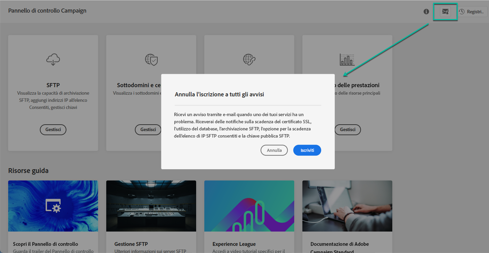

# Avvisi e-mail {#email-alerting}

Per offrire una maggiore flessibilità al tuo lavoro, il Pannello di controllo Campaign è dotato di funzionalità di avviso e-mail in tempo reale.

Per abbonarti a questi avvisi segui questi passaggi:

1. Fai clic sul pulsante **[!UICONTROL Alerting notifications]** disponibile in qualsiasi posizione del Pannello di controllo Campaign, quindi fai clic su **[!UICONTROL Subscribe]**.

   

1. Viene inviata un’e-mail per confermare l’abbonamento.

   

1. Dopo l&#39;iscrizione, il Pannello di controllo Campaign invierà una notifica dei problemi di sistema e raccomanderà le azioni da intraprendere. Gli avvisi e-mail vengono inviati a tutti gli utenti che si sono registrati per **tutte le istanze** di cui sono amministratori.

   

L&#39;elenco degli avvisi è il seguente:

* **Utilizzo** dell’archiviazione SFTP: Uno dei server SFTP ha raggiunto l’80% o più della sua capacità. Consulta [Gestione dell&#39;archiviazione SFTP](../../sftp/using/sftp-storage-management.md).

* **Utilizzo** database: Uno dei database delle istanze ha raggiunto l&#39;80% o più della sua capacità. Vedere [Monitoraggio del database](../../performance-monitoring/using/database-monitoring.md).

* **Scadenza** certificato SSL: Uno dei certificati SSL di uno dei sottodomini è scaduto o scadrà tra 60 giorni o meno. Consulta [Monitoraggio dei certificati SSL dei sottodomini](../../subdomains-certificates/using/monitoring-ssl-certificates.md).

