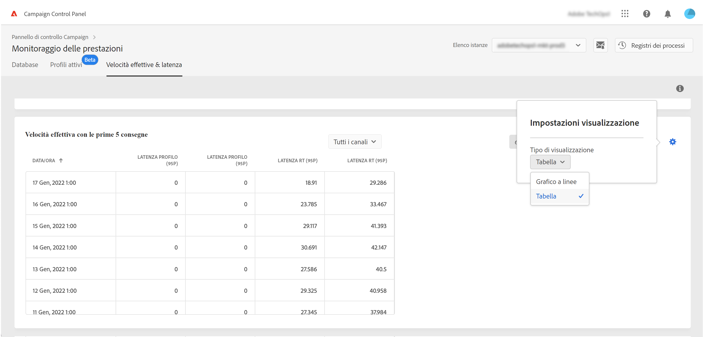

# Trasmissione e monitoraggio della latenza {#throughputs-latency-monitoring}

>[!CONTEXTUALHELP]
>id="cp_performancemonitoring_throughputslatencies"
>title="Informazioni sulle uscite e sul monitoraggio della latenza "
>abstract="In questa scheda, puoi monitorare la tendenza delle consegne e della latenza in un periodo di tempo sulle istanze."

Per comprendere l’utilizzo delle istanze e garantirne le prestazioni, è essenziale monitorare la tendenza degli output di consegna e della latenza in un determinato periodo di tempo.

Queste informazioni sono rese disponibili in Pannello di controllo Campaign per ciascuna istanza di Campaign nel **[!UICONTROL Performance Monitoring]** scheda, **[!UICONTROL Throughputs & Latency]** scheda (nota che il Pannello di controllo Campaign può richiedere fino a 1 ora per visualizzare le cifre).

* L’area **[!UICONTROL Throughput]** fornisce informazioni sul numero di messaggi inviati all’ora dall’istanza Campaign selezionata per tutti i canali di comunicazione a cui hai diritto.

* L’area **[!UICONTROL Latency]** fornisce informazioni sulla latenza riscontrata nell’istanza selezionata durante l’invio di comunicazioni transazionali in tempo reale. Le latenze vengono acquisite e visualizzate al 95 e 99 percentile, il che significa che il 95% e il 99% delle richieste dovrebbero essere più veloci della latenza specificata.

>[!NOTE]
>
>Tutte le cifre presentate in questo settore sono approssimative e solo a scopo informativo.

Per impostazione predefinita, i dati vengono visualizzati per il giorno corrente. È possibile modificare il periodo di tempo visualizzato utilizzando i pulsanti **[!UICONTROL 6 months]**, **[!UICONTROL 30 days]** e **[!UICONTROL 7 days]**.

È inoltre possibile visualizzare le informazioni in formato tabulare con colonne ordinabili anziché con un grafico. A tale scopo, fai clic sul pulsante **[!UICONTROL Visualization settings]**, quindi seleziona **[!UICONTROL Table]**.

