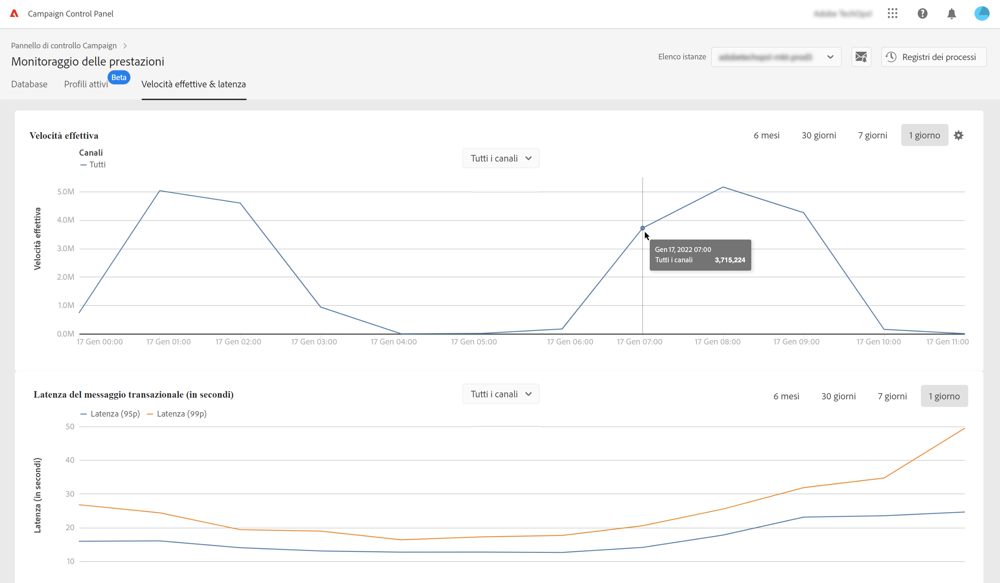

# Monitoraggio delle velocità effettive e della latenza {#throughputs-latency-monitoring}

>[!CONTEXTUALHELP]
>id="cp_performancemonitoring_throughputslatencies"
>title="Informazioni sul monitoraggio delle velocità effettive e della latenza "
>abstract="In questa scheda, puoi monitorare la tendenza nel tempo delle velocità effettive di consegna e della latenza per le tue istanze. Per informazioni sulle consegne che contribuiscono alla velocità effettiva, passa alla vista a tabella."

Il Pannello di controllo consente di monitorare le prestazione di consegna e la latenza di ciascuna istanza.

>[!IMPORTANT]
>
>Questa funzione è disponibile per tutti i clienti di Campaign Standard e Campaign v8, nonché per i clienti di Campaign v7 con build 9032 e successive, incluse le [implementazioni autonome](https://experienceleague.adobe.com/docs/campaign-classic/using/installing-campaign-classic/deployment-types-/standalone-deployment.html?lang=it) (senza alcuna istanza MID).

Per comprendere l’utilizzo delle istanze e garantirne le prestazioni, è essenziale monitorare la tendenza degli output di consegna e della latenza in un determinato periodo di tempo.

Queste informazioni sono disponibili nel Pannello di controllo per ciascuna istanza di Campaign nella sezione **[!UICONTROL Performance Monitoring]**, all’interno della scheda **[!UICONTROL Throughputs & Latency]**. Tieni presente che il Pannello di controllo può richiedere fino a 1 ora prima di visualizzare i dati.

>[!NOTE]
>
>Tutte le cifre presentate in questo settore sono approssimative e solo a scopo informativo.

Per impostazione predefinita, i dati vengono visualizzati per il giorno corrente. È possibile modificare il periodo di tempo visualizzato utilizzando i pulsanti **[!UICONTROL 6 months]**, **[!UICONTROL 30 days]** e **[!UICONTROL 7 days]**. I dati verranno presentati come segue:
* Su base oraria per le visualizzazioni a 1 giorno e 7 giorni
* Su base di 6 ore per la visualizzazione a 30 giorni
* Su base giornaliera per la visualizzazione a 6 mesi

Puoi anche visualizzare queste informazioni in formato tabulare con colonne ordinabili, anziché con un grafico. Per farlo, fai clic sul pulsante **[!UICONTROL Visualization settings]**, quindi seleziona **[!UICONTROL Table]**.

## Monitorare la velocità effettiva {#throughput}

L’area **[!UICONTROL Throughput]** fornisce informazioni sul numero di messaggi inviati all’ora dall’istanza di Campaign selezionata, per tutti i canali di comunicazione a cui hai diritto.

>[!NOTE]
>
>Per Campaign v7/v8, il valore di velocità effettiva visualizzato è quello ottenuto dalle istanze MID (mid sourcing). Per le distribuzioni di marketing (MKT) autonome (senza alcuna istanza MID), viene mostrata invece la velocità effettiva dall’istanza MKT.

Il Pannello di controllo consente inoltre di identificare gli ID delle prime 5 consegne che contribuiscono alla velocità effettiva relativamente al periodo di tempo selezionato. Queste informazioni sono disponibili solo nella vista a tabella:

## Monitorare la latenza {#latency}

L’area **[!UICONTROL Latency]** fornisce informazioni sulla latenza riscontrata nell’istanza selezionata durante l’invio di comunicazioni transazionali in tempo reale.

>[!NOTE]
>
>Inoltre, sono disponibili informazioni relative alla **latenza profilo** per le sole istanze di [!DNL Campaign Standard].

Le latenze vengono acquisite e visualizzate al 95 e 99 percentile, il che significa che il 95% e il 99% delle richieste dovrebbero essere più veloci della latenza specificata.

Per impostazione predefinita, la latenza viene visualizzata per tutti i canali. Puoi visualizzare la latenza per un canale specifico utilizzando l’elenco a discesa.

>[!NOTE]
>
>Il filtro dei canali è disponibile solo per le istanze di Campaign Classic v7/v8.
