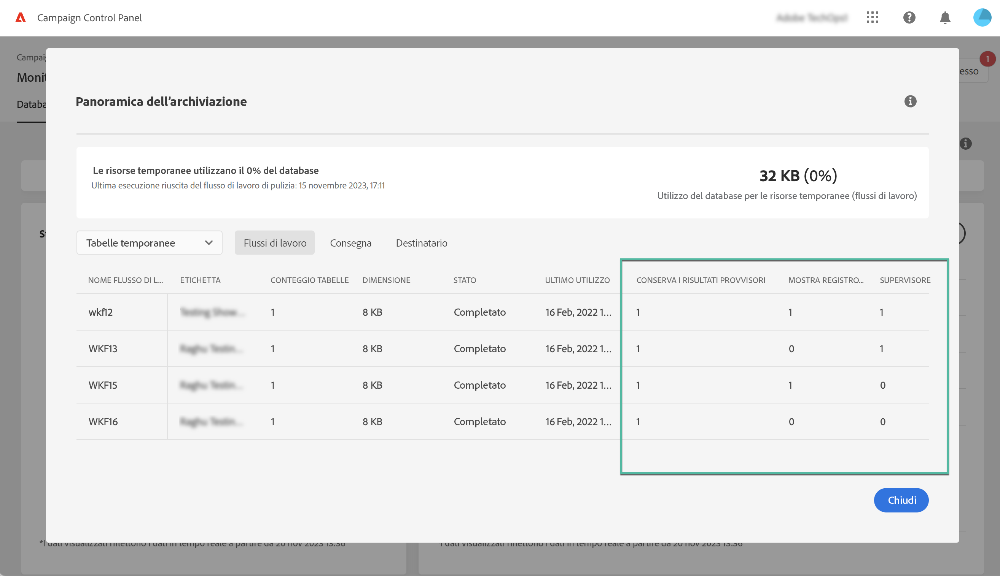

# Monitorare i flussi di lavoro {#monitor-workflows}

<!-- Clean paused and completed workflows

When [!DNL Adobe Campaign] workflows are paused or completed, they leave temporary tables on your instances database that consume space and can lead to performance issues.

Control Panel allows you to identify those workflows and clean the temporary resources generated on your instances.

>[!NOTE]
>
>Technically, this operation executes the **[!UICONTROL Database cleanup technical workflow]** that runs on your Campaign instance everyday (see [Campaign Standard](https://experienceleague.adobe.com/docs/campaign-standard/using/administrating/application-settings/technical-workflows.html#list-of-technical-workflows) and [Campaign Classic](https://experienceleague.adobe.com/docs/campaign-classic/using/monitoring-campaign-classic/data-processing/database-cleanup-workflow.html) documentation). 

To clean paused and completed workflows, follow these steps:

1. Navigate to the **[!UICONTROL Performance monitoring]** card.

1. In the **[!UICONTROL Databases]** tab, select the instance where you want to perform the operation.

1. Access the **[!UICONTROL Storage overview]** details, then filter the list on **[!UICONTROL Temporary tables]**. Learn more on **[!UICONTROL Storage overview]** in [this page](database-storage-overview.md).

    

1. All temporary tables generated on your instances by workflows and deliveries display. Click the **[!UICONTROL Clean now]** button to delete the resources generated by paused and completed workflows.

    

1. Once the operation is confirmed, you can track the estimated remaining time in the **[!UICONTROL Storage overview]** list.

    

Monitor workflow parameters -->

In Adobe Campaign, alcuni parametri del flusso di lavoro possono richiedere un’attenzione specifica per evitare problemi alle istanze. Il Pannello di controllo Campaign **[!UICONTROL Storage overview]** i dettagli ti consentono di verificare se una di queste opzioni è abilitata per i flussi di lavoro.

## **[!UICONTROL Keep interim results]** {#keep-results}

Quando abilitata (valore &quot;1&quot;), questa opzione salva i risultati delle transizioni tra le varie attività di un flusso di lavoro. Ulteriori informazioni in [Campaign Standard](https://experienceleague.adobe.com/docs/campaign-standard/using/managing-processes-and-data/executing-a-workflow/managing-execution-options.html?lang=it) e [Campaign Classic](https://experienceleague.adobe.com/docs/campaign-classic/using/automating-with-workflows/introduction/workflow-best-practices.html?lang=it#logs) documentazione.

>[!IMPORTANT]
>
>Questa opzione non deve mai essere selezionata in un flusso di lavoro di produzione. Viene utilizzato a scopo di analisi e test e deve pertanto essere utilizzato solo in ambienti di sviluppo o di staging. È consigliabile disattivarlo in Campaign.

## **[!UICONTROL Show SQL log]** {#sql}

Quando questa opzione è abilitata, le query SQL inviate al database durante l’esecuzione del flusso di lavoro vengono visualizzate in Adobe Campaign. Ulteriori informazioni in [Campaign Standard](https://experienceleague.corp.adobe.com/docs/campaign-standard/using/managing-processes-and-data/executing-a-workflow/managing-execution-options.html?lang=en) e [Campaign Classic](https://experienceleague.adobe.com/docs/campaign-classic/using/automating-with-workflows/advanced-management/workflow-properties.html?lang=en#execution) documentazione.

Il valore &quot;1&quot; indica che il flusso di lavoro ha **Gravità** campo impostato su &quot;Produzione&quot; e che l&#39;opzione del registro query SQL sia abilitata.

>[!IMPORTANT]
>
>L’attivazione di questa opzione può influire sulle prestazioni e compilare i file di registro sul server. Deve essere utilizzato esclusivamente a fini di analisi e di diagnosi.

## **[!UICONTROL Supervisors]** {#supervisors}

Questo campo ti consente di assegnare un operatore a un flusso di lavoro. Se il flusso di lavoro non riesce, viene avvisato l’operatore associato. Ulteriori informazioni in [Campaign Standard](https://experienceleague.corp.adobe.com/docs/campaign-standard/using/managing-processes-and-data/executing-a-workflow/monitoring-workflow-execution.html?lang=en#error-management) e [Campaign Classic](https://experienceleague.adobe.com/docs/campaign-classic/using/automating-with-workflows/advanced-management/workflow-properties.html?lang=en#error-management) documentazione.

Il valore &quot;1&quot; indica che il flusso di lavoro ha **Gravità** campo impostato su &quot;Produzione&quot; e che nessun gruppo di supervisori è stato assegnato al flusso di lavoro.

