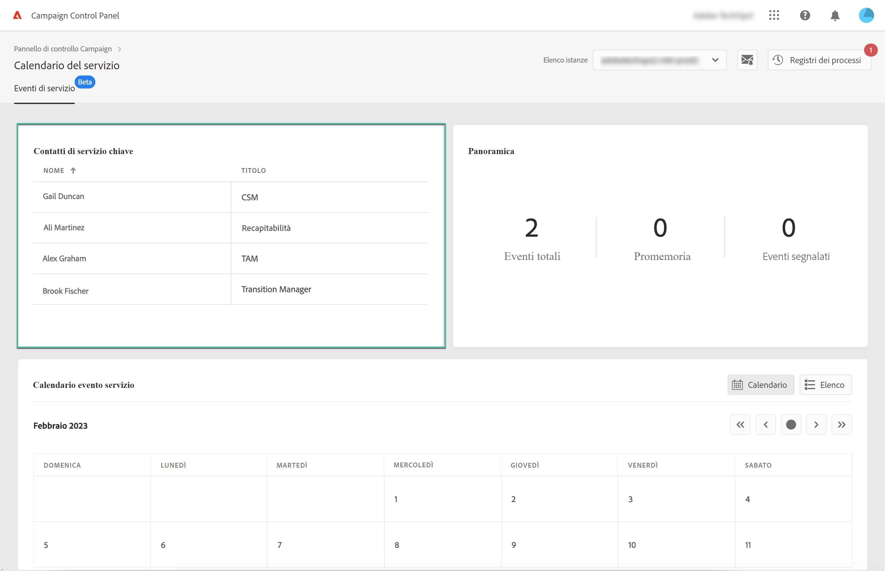
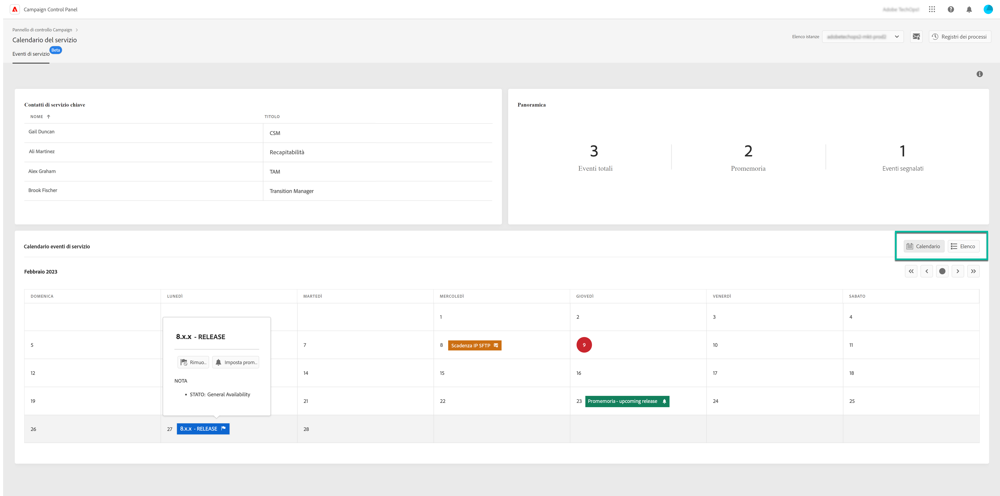
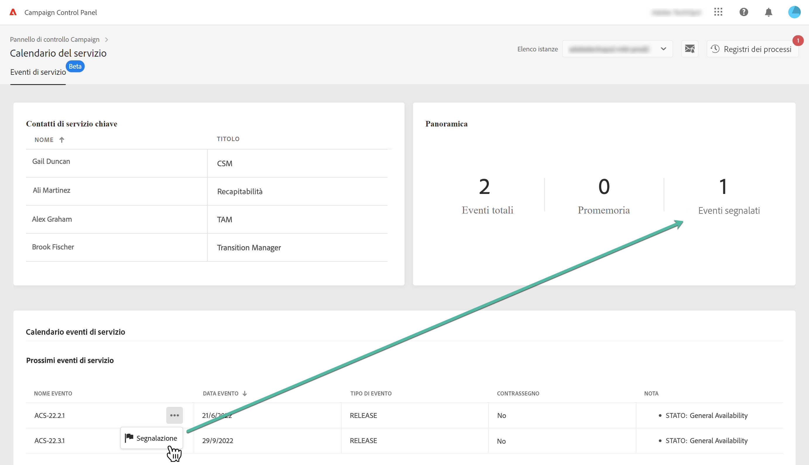
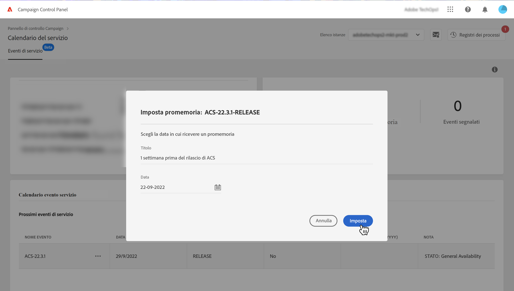
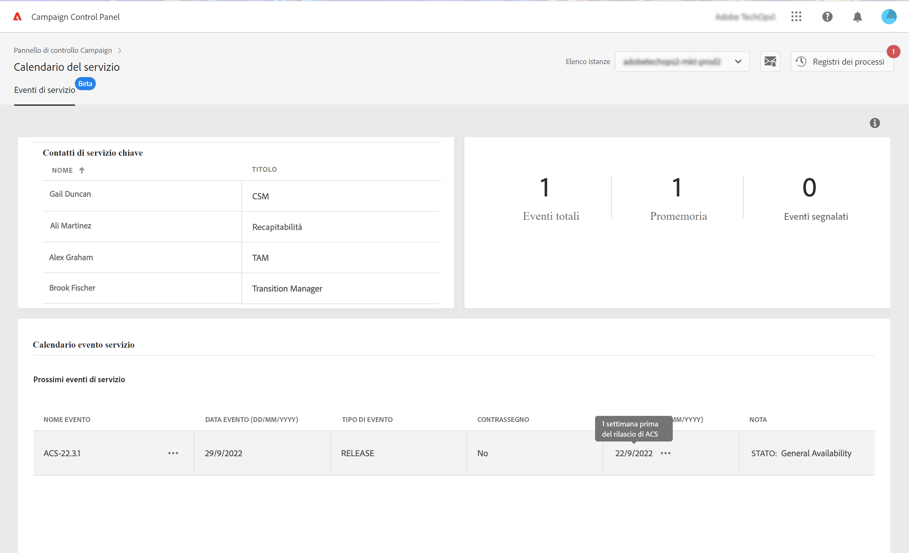

# Monitorare eventi e contatti chiave {#keycontacts-events}

>[!CONTEXTUALHELP]
>id="cp_servicecalendar_serviceevents"
>title="Calendario dei servizi"
>abstract="Nella sezione dei contatti chiave sono elencate le persone in Adobe da contattare per eventuali richieste o problemi relativi alle istanze. Nella sezione Calendario eventi del servizio è possibile identificare le versioni e le revisioni del servizio per l&#39;istanza selezionata e impostare promemoria per i prossimi eventi."

>[!IMPORTANT]
>
>La funzionalità Service Calendar (Calendario dei servizi) è disponibile in versione beta e soggetta a frequenti aggiornamenti e modifiche senza preavviso.

È importante essere a conoscenza degli eventi pianificati sulle tue istanze di Campaign.

Con il Pannello di controllo Campaign, puoi monitorare le versioni e le revisioni dei servizi che si verificano sulle tue istanze e accedere a un elenco di contatti chiave in Adobe per eventuali richieste o problemi.

Queste informazioni sono accessibili dalla scheda **[!UICONTROL Service Calendar]** sulla pagina home del Pannello di controllo Campaign.

## Contatti chiave {#key-contacts}

Nella sezione **[!UICONTROL Key contacts]** sono elencate le persone in Adobe che puoi contattare per eventuali richieste o problemi relativi alle tue istanze.

>[!NOTE]
>
>In questa sezione vengono visualizzate informazioni solo per gli account Managed Services.

I contatti chiave includono i seguenti ruoli:

* **[!UICONTROL TAM]**: Technical Account Manager,
* **[!UICONTROL CSM]**: Customer Success Manager,
* **[!UICONTROL Deliverability]**: punto di contatto per le operazioni di consegna,
* **[!UICONTROL Transition Manager]**: Managed Services Transition Manager (solo per account Managed Services),
* **[!UICONTROL On-boarding Specialist]**: specialista assegnato all’account per aiutarti a iniziare con Campaign Classic (solo per account Managed Services).

## Eventi {#events}

### Monitorare gli eventi {#monitor-events}

La sezione **[!UICONTROL Service Event Calendar]** mostra tutte le versioni precedenti e future e le revisioni dei servizi per l’istanza selezionata.

La colonna **[!UICONTROL Note]** fornisce informazioni sullo stato di ciascuna versione:

* **[!UICONTROL General availability]**: build stabile più recente disponibile.
* **[!UICONTROL Limited availability]**: solo per implementazione su richiesta.
* **[!UICONTROL Release candidate]**: convalidata dal team Engineering. In attesa di prove di produzione.
* **[!UICONTROL Pre release]**: disponibilità anticipata per esigenze specifiche dei clienti.
* **[!UICONTROL No longer available]**: la build non contiene problemi importanti ma ne è disponibile una nuova con ulteriori correzioni di bug. È necessario un aggiornamento.
* **[!UICONTROL Deprecated]**: build con regressioni note.
La build non è più supportata. È obbligatorio eseguire l’aggiornamento.

Puoi assegnare un flag a uno o più eventi in programma per tenerne traccia. A questo scopo, fai clic sul pulsante con i tre punti (...) accanto al nome dell’evento.

### Imposta promemoria {#reminders}

Con Service Calendar (Calendario servizi), è possibile impostare i promemoria per ricevere le notifiche via e-mail prima che si verifichi un evento.

>[!NOTE]
>
>Per ricevere notifiche sui prossimi eventi, assicurati di aver effettuato la sottoscrizione agli avvisi e-mail in Pannello di controllo Campaign. [Ulteriori informazioni](../performance-monitoring/using/email-alerting.md)

Per impostare un avviso per un evento, effettua le seguenti operazioni:

1. Fare clic sul pulsante di sospensione accanto all&#39;evento di cui si desidera ricevere il promemoria, quindi selezionare **[!UICONTROL Set Reminder]**.

1. Assegna un titolo al promemoria, quindi seleziona la data in cui desideri ricevere la notifica prima che si verifichi l’evento.

   

   >[!NOTE]
   >
   >Se non ti sei iscritto agli avvisi del Pannello di controllo Campaign, verrà visualizzato un messaggio che ti consentirà di iscriverti alla ricezione di notifiche e-mail.

1. Il promemoria è ora impostato per l’evento selezionato. Puoi passare il cursore sopra di esso in qualsiasi momento per visualizzarne il titolo.

   

   >[!NOTE]
   >
   >È possibile impostare fino a 2 promemoria per lo stesso evento.

1. Alla data specificata nel promemoria, verrà inviata un’e-mail per avvisarti dell’evento successivo e il promemoria verrà rimosso automaticamente dal **[!UICONTROL Reminders]** nel menu Calendario servizi.
