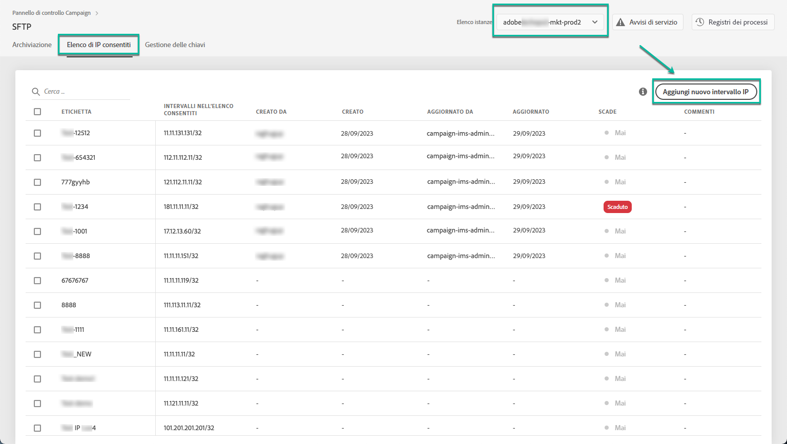
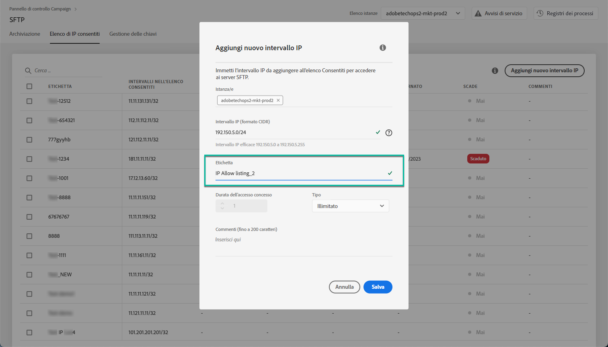
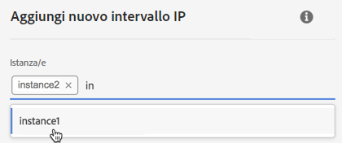
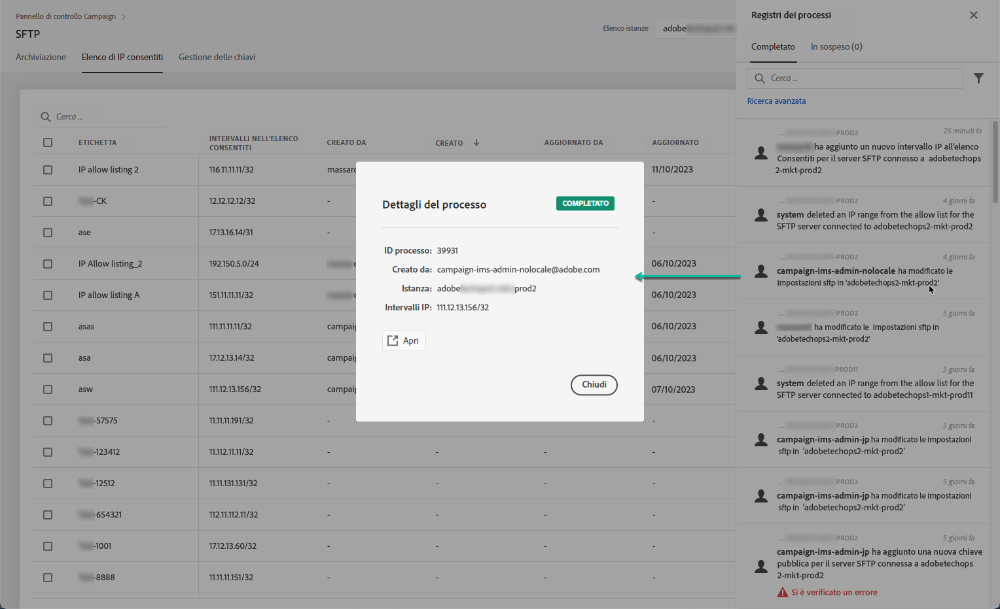

# Inserimento di intervalli IP nell’elenco Consentiti {#ip-range-allow-listing}

>[!CONTEXTUALHELP]
>id="cp_ip_whitelist"
>title="Informazioni sull’inserimento di IP nell’elenco Consentiti"
>abstract="In questa scheda puoi aggiungere intervalli IP all’elenco Consentiti per stabilire una connessione ai server SFTP. Solo i server SFTP a cui hai accesso sono visualizzati qui. Contatta l’amministratore per richiedere l’accesso ad altri server SFTP."
>additional-url="https://images-tv.adobe.com/mpcv3/8a977e03-d76c-44d3-853c-95d0b799c870_1560205338.1920x1080at3000_h264.mp4#t=98" text="Guarda il video dimostrativo"

I server SFTP sono protetti. Per potervi accedere e visualizzare i file o scriverne di nuovi, è necessario inserire nell’elenco Consentiti l’indirizzo IP pubblico del sistema o del client che accede ai server.

 Scopri questa funzione nel video utilizzando  [Campaign ](https://experienceleague.adobe.com/docs/campaign-classic-learn/control-panel/sftp-management/adding-ip-range-to-allow-list.html?lang=en#sftp-management) Classicor  [Campaign Standard](https://experienceleague.adobe.com/docs/campaign-standard-learn/control-panel/sftp-management/adding-ip-range-to-allow-list.html?lang=en#sftp-management)

## Informazioni sul formato CIDR {#about-cidr-format}

CIDR (Classless Inter-Domain Routing) è il formato supportato per l’aggiunta di intervalli IP tramite l’interfaccia del Pannello di controllo Campaign.

La sintassi è composta da un indirizzo IP seguito da un carattere “/” e da un numero decimale. Il formato e la sintassi sono descritti dettagliatamente in [questo articolo](https://whatismyipaddress.com/cidr).

Puoi cercare su Internet strumenti online gratuiti che ti aiuteranno a convertire gli intervalli IP che hai a disposizione in formato CIDR.

## Best practice {#best-practices}

Accertati di seguire le raccomandazioni e le limitazioni riportate di seguito quando inserisci gli indirizzi IP nell’elenco Consentiti dal Pannello di controllo Campaign.

* **Aggiungere intervalli IP all’elenco Consentiti** anziché indirizzi IP singoli. Per inserire un indirizzo IP singolo nell’elenco Consentiti, aggiungi “/32” per indicare che l’intervallo include un solo IP.
* **Non aggiungere intervalli eccessivamente ampi all’elenco Consentiti**, ad esempio intervalli che includono > 265 indirizzi IP. Il Pannello di controllo Campaign rifiuterà qualsiasi intervallo in formato CIDR compreso tra /0 e /23.
* Solo gli **indirizzi IP pubblici** possono essere aggiunti all’elenco Consentiti.
* Accertati di **eliminare regolarmente gli indirizzi IP** di cui non hai più bisogno dall’elenco Consentiti.

## Aggiungere indirizzi IP all’elenco Consentiti {#adding-ip-addresses-allow-list}

>[!CONTEXTUALHELP]
>id="cp_sftp_iprange_add"
>title="Aggiungere un nuovo intervallo IP"
>abstract="Definisci gli intervalli IP che desideri aggiungere all’elenco Consentiti per la connessione ai server SFTP."

Per aggiungere un intervallo IP all’elenco Consentiti, esegui questi passaggi:

1. Apri la scheda **[!UICONTROL SFTP]**, quindi seleziona la scheda **[!UICONTROL IP Allow Listing]**.
1. L’elenco degli indirizzi IP inseriti nell’elenco Consentiti viene visualizzato per ogni istanza. Seleziona l’istanza desiderata dall’elenco a sinistra, quindi fai clic sul pulsante **[!UICONTROL Add new IP range]**.

   

1. Definisci l’intervallo IP da inserire nell’elenco Consentiti, in formato CIDR, quindi definisci l’etichetta che verrà visualizzata nell’elenco.

   >[!NOTE]
   >
   >I seguenti caratteri speciali sono consentiti nel campo Etichetta:
   > `. _ - : / ( ) # , @ [ ] + = & ; { } ! $`

   

   >[!IMPORTANT]
   >
   >Un intervallo IP non può sovrapporsi a un intervallo esistente nell’elenco Consentiti. In tal caso, elimina prima l’intervallo che contiene l’IP sovrapposto.
   >
   >È possibile aggiungere un intervallo all’elenco Consentiti per più istanze. A questo scopo, premi il tasto freccia giù o digita le prime lettere dell’istanza desiderata, quindi selezionala dall’elenco dei suggerimenti.

   

1. Fai clic sul pulsante **[!UICONTROL Save]**. L’aggiunta dell’IP all’elenco Consentiti viene visualizzata come PENDING (IN SOSPESO) fino a quando la richiesta non viene completamente elaborata. Questo dovrebbe richiedere solo qualche secondo.

Per eliminare gli intervalli IP dall’elenco Consentiti, selezionali e fai clic sul pulsante **[!UICONTROL Delete IP range]**.

>[!NOTE]
>
>Al momento non è possibile modificare un intervallo nell’elenco Consentiti. Per modificare un intervallo IP, eliminalo, quindi creane uno corrispondente alle tue esigenze.

## Monitoraggio delle modifiche {#monitoring-changes}

La sezione **[!UICONTROL Job Logs]** nella home page del Pannello di controllo Campaign consente di monitorare tutte le modifiche apportate agli indirizzi IP inseriti nell’elenco Consentiti.

Per ulteriori informazioni sull’interfaccia del Pannello di controllo Campaign, consulta [questa sezione](../../discover/using/discovering-the-interface.md).

