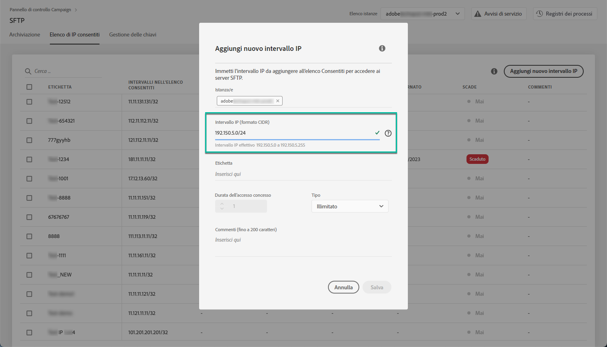
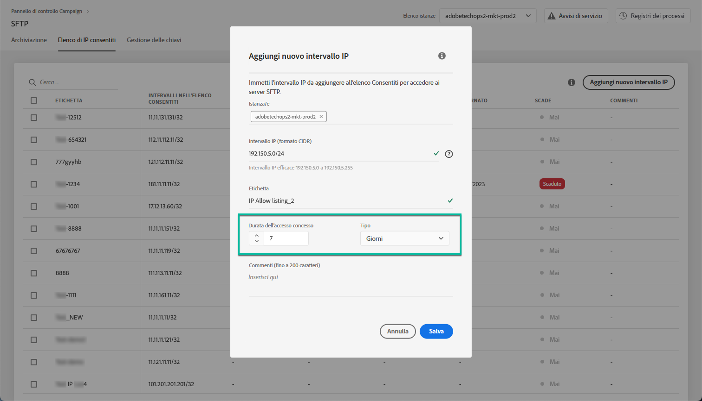
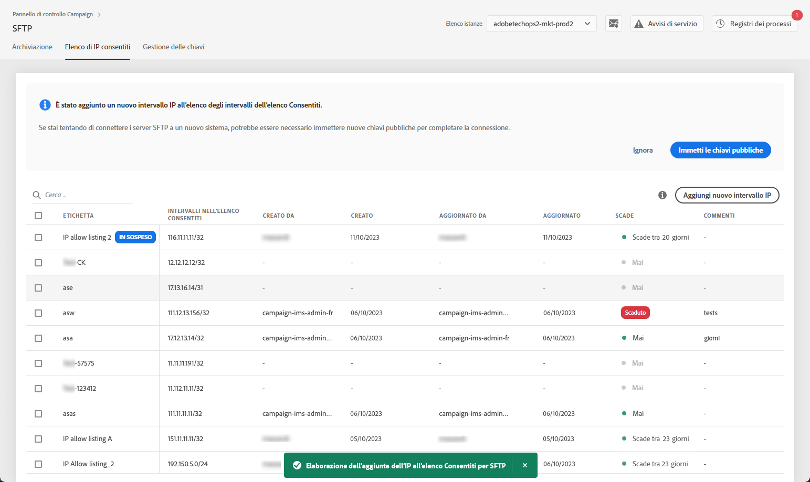
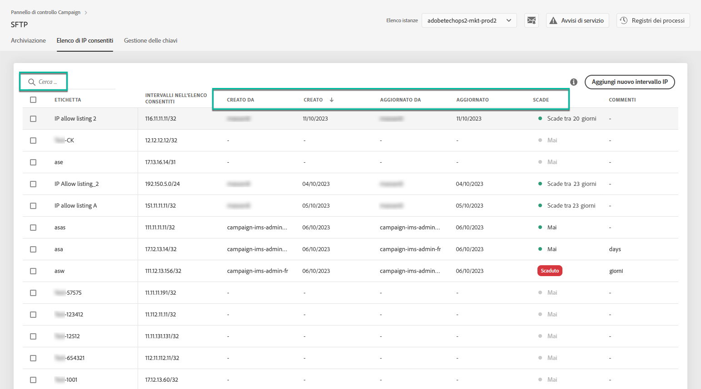
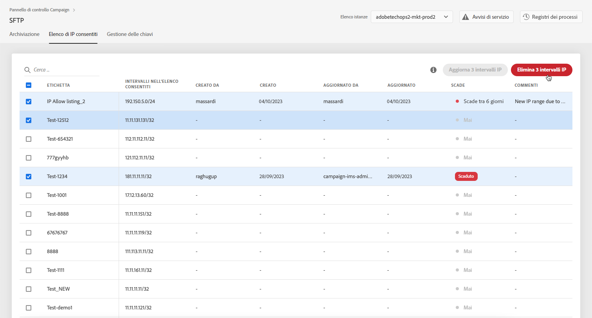
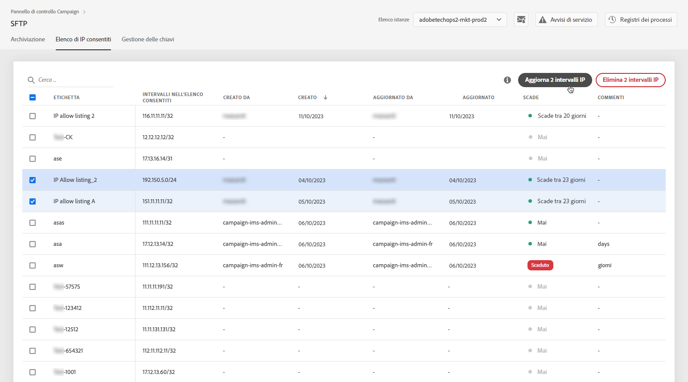
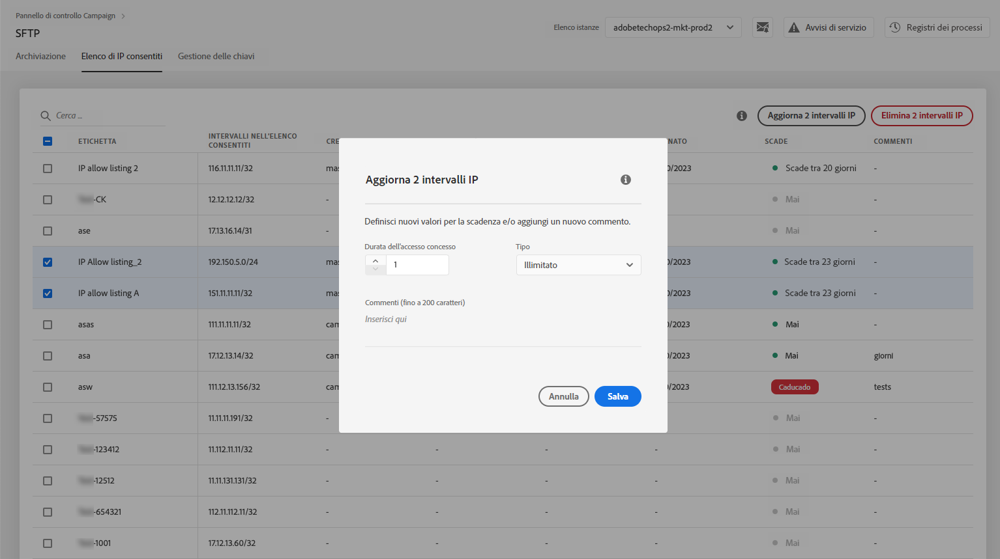

# Inserimento di intervalli IP nell’elenco Consentiti {#ip-range-allow-listing}

>[!CONTEXTUALHELP]
>id="cp_ip_whitelist"
>title="Informazioni sull’inserimento di IP nell’elenco Consentiti"
>abstract="In questa scheda puoi aggiungere intervalli IP all’elenco Consentiti per stabilire una connessione ai server SFTP. Solo i server SFTP a cui hai accesso sono visualizzati qui. Contatta l’amministratore per richiedere l’accesso ad altri server SFTP."
>additional-url="https://images-tv.adobe.com/mpcv3/8a977e03-d76c-44d3-853c-95d0b799c870_1560205338.1920x1080at3000_h264.mp4#t=98" text="Guarda il video dimostrativo"

I server SFTP sono protetti. Per potervi accedere e visualizzare i file o scriverne di nuovi, è necessario inserire nell’elenco Consentiti l’indirizzo IP pubblico del sistema o del client che accede ai server.

 Guarda il video su questa funzione per [Campaign v7/v8](https://experienceleague.adobe.com/docs/campaign-classic-learn/control-panel/sftp-management/adding-ip-range-to-allow-list.html?lang=it#sftp-management) o [Campaign Standard](https://experienceleague.adobe.com/docs/campaign-standard-learn/control-panel/sftp-management/adding-ip-range-to-allow-list.html?lang=it#sftp-management)

## Informazioni sul formato CIDR {#about-cidr-format}

CIDR (Classless Inter-Domain Routing) è il formato supportato per l’aggiunta di intervalli IP tramite l’interfaccia del Pannello di controllo.

La sintassi è composta da un indirizzo IP seguito da un carattere “/” e da un numero decimale. Il formato e la sintassi sono descritti nei dettagli in [questo articolo](https://whatismyipaddress.com/cidr){target="_blank"}.

Puoi cercare su Internet strumenti online gratuiti che ti aiuteranno a convertire gli intervalli IP che hai a disposizione in formato CIDR.

## Best practice {#best-practices}

Accertati di seguire le raccomandazioni e le limitazioni riportate di seguito quando inserisci gli indirizzi IP nell’elenco Consentiti dal Pannello di controllo.

* **Aggiungere intervalli IP all’elenco Consentiti** anziché indirizzi IP singoli. Per inserire un indirizzo IP singolo nell’elenco Consentiti, aggiungi “/32” per indicare che l’intervallo include un solo IP.
* **Non aggiungere intervalli eccessivamente ampi all’elenco Consentiti**, ad esempio intervalli che includono > 265 indirizzi IP. Il Pannello di controllo rifiuterà qualsiasi intervallo in formato CIDR compreso tra /0 e /23.
* Solo gli **indirizzi IP pubblici** possono essere aggiunti all’elenco Consentiti.
* Accertati di **eliminare regolarmente gli indirizzi IP** di cui non hai più bisogno dall’elenco Consentiti.

## Aggiungere indirizzi IP all’elenco Consentiti {#adding-ip-addresses-allow-list}

>[!CONTEXTUALHELP]
>id="cp_sftp_iprange_add"
>title="Configurazione dell’intervallo IP"
>abstract="Definisci gli intervalli IP che desideri aggiungere all’elenco Consentiti per la connessione ai server SFTP."

Per aggiungere un intervallo IP all’elenco Consentiti, esegui questi passaggi:

1. Apri la scheda **[!UICONTROL SFTP]**, quindi seleziona la scheda **[!UICONTROL Inserimento di IP nell’elenco Consentiti]**.
1. L’elenco degli indirizzi IP inseriti nell’elenco Consentiti viene visualizzato per ogni istanza. Seleziona l’istanza desiderata dall’elenco a sinistra, quindi fai clic sul pulsante **[!UICONTROL Aggiungi un nuovo intervallo IP]**.

   

1. Definisci l’intervallo IP da aggiungere all’elenco Consentiti. Questo campo accetta solo intervalli IP in formato CIDR, ad esempio *192.150.5.0/24*.

   

   >[!IMPORTANT]
   >
   >Un intervallo IP non può sovrapporsi a un intervallo esistente nell’elenco Consentiti. In tal caso, elimina prima l’intervallo che contiene l’IP sovrapposto.

1. È possibile aggiungere un intervallo all’elenco Consentiti per più istanze. A questo scopo, premi il tasto freccia giù o digita le prime lettere dell’istanza desiderata, quindi selezionala dall’elenco dei suggerimenti.

   

1. Definisci l’etichetta che verrà visualizzata per questo intervallo IP nell’elenco.

   

   >[!NOTE]
   >
   >I caratteri speciali seguenti sono consentiti nel campo **[!UICONTROL Etichetta]**:
   > `. _ - : / ( ) # , @ [ ] + = & ; { } ! $`

1. Per gestire meglio l’elenco degli IP consentiti, puoi impostare una durata per la disponibilità di ciascun intervallo IP. A tale scopo, seleziona un’unità nell’elenco a discesa **[!UICONTROL Tipo]** e definisci una durata nel campo corrispondente. Per ulteriori informazioni sulla scadenza dell’intervallo IP, consulta [questa sezione](#expiry).

   

   >[!NOTE]
   >
   >Per impostazione predefinita, il campo **[!UICONTROL Tipo]** è impostato su **[!UICONTROL Illimitato]**, il che significa che l’intervallo IP non scade mai.

1. Nel campo **[!UICONTROL Commento]**, puoi indicare un motivo per consentire questo intervallo IP (perché, per chi, ecc.).

1. Fai clic sul pulsante **[!UICONTROL Salva]**. L’aggiunta dell’intervallo IP all’elenco Consentiti viene visualizzata come **[!UICONTROL In sospeso]** fino a quando la richiesta non è completamente elaborata, operazione che dovrebbe richiedere solo alcuni secondi.

   

>[!IMPORTANT]
>
>Se stai tentando di collegare i server SFTP a un nuovo sistema e quindi di aggiungere nuovi intervalli IP all’elenco Consentiti, potrebbe essere necessario immettere nuove chiavi pubbliche per completare la connessione. Per ulteriori informazioni, consulta [questa sezione](key-management.md).

## Gestione degli intervalli IP {#managing-ip-ranges}

Gli intervalli IP creati vengono visualizzati nella scheda **[!UICONTROL Inserimento IP nell’elenco Consentiti]**.

Puoi ordinare gli elementi in base alla data di creazione o di modifica, all’utente che li ha creati o modificati e alla scadenza degli intervalli IP.

È inoltre possibile cercare un intervallo IP iniziando a digitare un’etichetta, un intervallo, un nome o un commento.

Per modificare uno o più intervalli IP, consulta [questa sezione](#editing-ip-ranges).

Per eliminare uno o più intervalli IP dall’elenco Consentiti, selezionali, quindi fai clic sul pulsante **[!UICONTROL Elimina intervallo IP]**.

### Scadenza {#expiry}

La colonna **[!UICONTROL Scade]** mostra quanti giorni rimangono prima della scadenza dell’intervallo IP.

Se ti sei iscritto a [avvisi e-mail](../../performance-monitoring/using/email-alerting.md), riceverai notifiche via e-mail 10 giorni e 5 giorni prima della scadenza di un intervallo IP e il giorno stesso della scadenza. Dopo aver ricevuto l’avviso, puoi [modificare l’intervallo IP](#editing-ip-ranges) per prorogarne, se necessario, il periodo di validità.

Un intervallo IP scaduto verrà eliminato automaticamente dopo 7 giorni. Viene visualizzato come **[!UICONTROL Scaduto]** nella colonna **[!UICONTROL Scade]**. Entro questo periodo di 7 giorni:

* Un intervallo IP scaduto non può più essere utilizzato per connettersi al server SFTP.

* Non puoi creare un altro intervallo IP che si sovrappone a un intervallo scaduto. È necessario eliminare l’intervallo IP scaduto prima di crearne uno nuovo.

* È possibile [modificare](#editing-ip-ranges) un intervallo IP scaduto e aggiornarne la durata per renderlo nuovamente disponibile.

* Puoi eliminarlo dall’elenco Consentiti.

## Modifica degli intervalli IP {#editing-ip-ranges}

>[!CONTEXTUALHELP]
>id="cp_sftp_iprange_update"
>title="Aggiornare gli intervalli IP"
>abstract="Aggiorna gli intervalli IP selezionati consentiti per la connessione al server SFTP."

Per modificare gli intervalli IP, segui la procedura indicata di seguito.

>[!NOTE]
>
>Puoi modificare solo gli intervalli IP creati a partire dal rilascio di ottobre 2021 del Pannello di controllo.

<!--Edition is not available for IP ranges that have been created before the Control Panel October 2021 release.-->

1. Seleziona uno o più intervalli IP dall’**[!UICONTROL Inserimento di IP nell’elenco Consentiti]**.

1. Fai clic sul pulsante **[!UICONTROL Aggiorna intervallo IP]**.

   

1. Puoi modificare la scadenza dell’intervallo IP e/o aggiungere un nuovo commento.

   >[!NOTE]
   >
   >Per modificare il formato CIDR, la relativa etichetta o le istanze correlate, devi prima eliminare l’intervallo IP e crearne uno nuovo che corrisponda alle tue esigenze.

   

1. Salva le modifiche.

## Monitoraggio delle modifiche {#monitoring-changes}

La sezione **[!UICONTROL Registri del processo]** nella pagina Home del Pannello di controllo consente di monitorare tutte le modifiche apportate agli indirizzi IP inseriti nell’elenco Consentiti.

Per ulteriori informazioni sull’interfaccia del Pannello di controllo, consulta [questa sezione](../../discover/using/discovering-the-interface.md).

