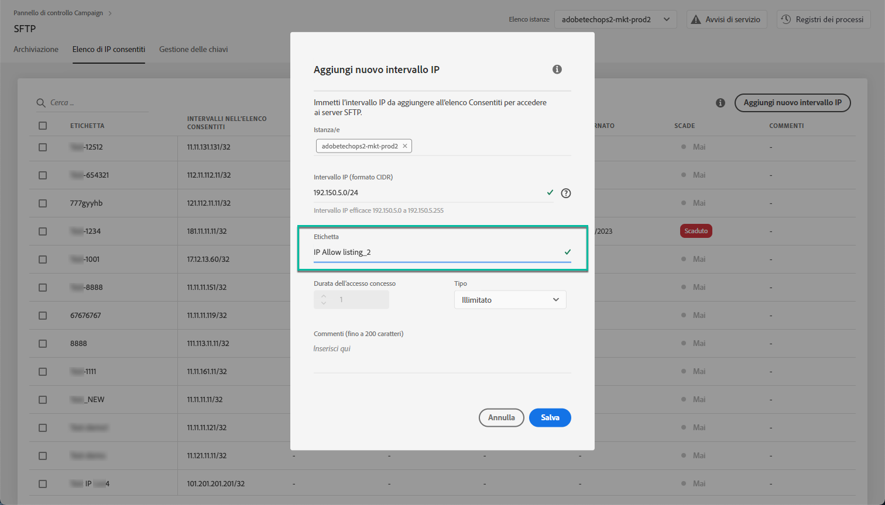

# whitelist della gamma IP {#ip-range-whitelisting}

I server SFTP sono protetti. Per potervi accedere per visualizzare i file o scriverne di nuovi, è necessario inserire in una whitelist l&#39;indirizzo IP pubblico del sistema o del client che accede ai server.

## Informazioni sul formato CIDR {#about-cidr-format}

CIDR (Classless Inter-Domain Routing) è il formato supportato quando si aggiungono intervalli IP con l&#39;interfaccia del Pannello di controllo.

La sintassi è composta da un indirizzo IP seguito da un carattere &quot;/&quot; e da un numero decimale. Il formato e la sintassi sono descritti dettagliatamente in [questo articolo](https://whatismyipaddress.com/cidr).

È possibile ricercare su Internet strumenti online gratuiti che aiuteranno a convertire la gamma IP che si ha a portata di mano in formato CIDR.

## Best practice {#best-practices}

Accertatevi di seguire le raccomandazioni e le limitazioni riportate di seguito quando inserite gli indirizzi IP nella white list del Pannello di controllo.

* **Intervalli** IP Whitelist invece di indirizzi IP singoli. Per inserire in una whitelist un indirizzo IP singolo, aggiungete un &#39;/32&#39; per indicare che l&#39;intervallo include solo un IP.
* **Non inserite intervalli** molto ampi, ad esempio > 265 indirizzi IP. Il Pannello di controllo rifiuterà qualsiasi intervallo di formato CIDR compreso tra /0 e /23.
* Solo gli indirizzi **IP** pubblici possono essere inseriti nella white list.
* Assicuratevi di eliminare **regolarmente gli indirizzi** IP elencati in bianco che non sono più necessari.

## Whitelisting degli indirizzi IP {#whitelisting-ip-addresses}

Per inserire in una whitelist un intervallo IP, effettuate le seguenti operazioni:

1. Open the **[!UICONTROL SFTP]**card, then select the**[!UICONTROL IP Whistelisting]** tab.
1. L&#39;elenco degli indirizzi IP consentiti viene visualizzato per ogni istanza. Selezionate l’istanza desiderata dall’elenco a sinistra, quindi fate clic sul **[!UICONTROL Add new IP range]**pulsante.

   

1. Definite l&#39;intervallo IP da inserire nella whitelist, in formato CIDR, quindi definite l&#39;etichetta che verrà visualizzata nell&#39;elenco.

   >[!NOTE]
   >
   >I seguenti caratteri speciali sono consentiti nel campo Etichetta:
   > `. _ - : / ( ) # , @ [ ] + = & ; { } ! $`

   

   >[!CAUTION]
   >
   >Un intervallo IP non può sovrapporsi a un intervallo esistente nella white list. In tal caso, eliminate prima l’intervallo che contiene l’IP sovrapposto.
   >
   >È possibile inserire in una whitelist un intervallo per più istanze. A questo scopo, premere il tasto freccia giù o digitare le prime lettere dell&#39;istanza desiderata, quindi selezionarla dall&#39;elenco dei suggerimenti.

   

1. Fate clic sul **[!UICONTROL Save]**pulsante. L&#39;aggiunta della whitelist IP verrà visualizzata come IN SOSPESO fino a quando la richiesta non sarà completamente elaborata. Questo dovrebbe richiedere solo qualche secondo.

Per eliminare gli intervalli IP consentiti, selezionateli e fate clic sul **[!UICONTROL Delete IP range]**pulsante .

>[!NOTE]
>
>Al momento non è possibile modificare un intervallo con autorizzazione. Per modificare un intervallo IP, eliminatelo, quindi createne uno corrispondente alle vostre esigenze.

## Modifiche al monitoraggio {#monitoring-changes}

Nella home page **[!UICONTROL Job Logs]**del Pannello di controllo è possibile monitorare tutte le modifiche apportate agli indirizzi IP consentiti.

Per ulteriori informazioni sull&#39;interfaccia del Pannello di controllo, consultare [questa sezione](../../discover/using/discovering-the-interface.md).

