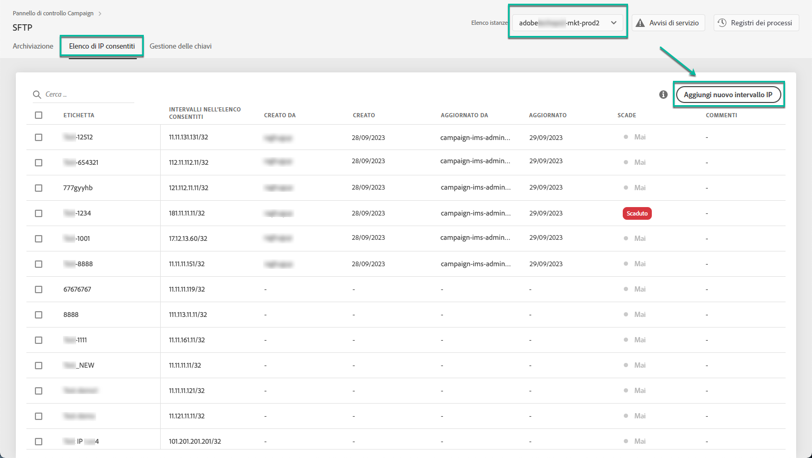
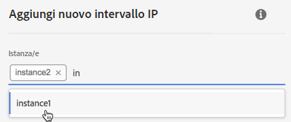

# Inserimento di intervalli IP nella whitelist {#ip-range-whitelisting}

>[!CONTEXTUALHELP]
>id="cp_ip_whitelist"
>title="Informazioni sull’inserimento di IP nella whitelist"
>abstract="In questa scheda, puoi inserire in una whitelist gli intervalli IP per stabilire una connessione ai server SFTP. Solo i server SFTP a cui hai accesso sono visualizzati qui. Contatta l’amministratore per richiedere l’accesso ad altri server SFTP."
>additional-url="https://images-tv.adobe.com/mpcv3/8a977e03-d76c-44d3-853c-95d0b799c870_1560205338.1920x1080at3000_h264.mp4#t=98" text="Guarda il video dimostrativo"

I server SFTP sono protetti. Per potervi accedere e visualizzare i file o scriverne di nuovi, è necessario inserire in una whitelist l’indirizzo IP pubblico del sistema o del client che accede ai server.

## Informazioni sul formato CIDR {#about-cidr-format}

CIDR (Classless Inter-Domain Routing) è il formato supportato per l’aggiunta di intervalli IP tramite l’interfaccia del Pannello di controllo Campaign.

La sintassi è composta da un indirizzo IP seguito da un carattere “/” e da un numero decimale. Il formato e la sintassi sono descritti dettagliatamente in [questo articolo](https://whatismyipaddress.com/cidr).

Puoi cercare su Internet strumenti online gratuiti che ti aiuteranno a convertire gli intervalli IP che hai a disposizione in formato CIDR.

## Best practice {#best-practices}

Accertati di seguire le raccomandazioni e le limitazioni riportate di seguito quando inserisci gli indirizzi IP nella whitelist dal Pannello di controllo Campaign.

* **Inserisci nella whitelist intervalli IP** invece di indirizzi IP singoli. Per inserire in una whitelist un indirizzo IP singolo, aggiungi “/32” per indicare che l’intervallo include solo un IP.
* **Non inserire intervalli molto ampi**, che includono ad esempio più di 265 indirizzi IP. Il Pannello di controllo Campaign rifiuterà qualsiasi intervallo in formato CIDR compreso tra /0 e /23.
* Solo **gli indirizzi IP pubblici** possono essere inseriti nella whitelist.
* Assicurati di **eliminare regolarmente gli indirizzi IP inseriti nella whitelist** che non sono più necessari.

## Inserimento di indirizzi IP nella whitelist {#whitelisting-ip-addresses}

>[!CONTEXTUALHELP]
>id="cp_sftp_iprange_add"
>title="Aggiungere un nuovo intervallo IP"
>abstract="Definisci gli intervalli IP da inserire nella whitelist per la connessione ai server SFTP."

Per inserire in una whitelist un intervallo IP, effettua le seguenti operazioni:

1. Apri la scheda **[!UICONTROL SFTP]**, quindi seleziona la scheda **[!UICONTROL IP Whistelisting]**.
1. L’elenco degli indirizzi IP inseriti nella whitelist viene visualizzato per ogni istanza. Seleziona l’istanza desiderata dall’elenco a sinistra, quindi fai clic sul pulsante **[!UICONTROL Add new IP range]**.

   

1. Definisci l’intervallo IP da inserire nella whitelist, in formato CIDR, quindi definisci l’etichetta che verrà visualizzata nell’elenco.

   >[!NOTE]
   >
   >I seguenti caratteri speciali sono consentiti nel campo Etichetta:
   > `. _ - : / ( ) # , @ [ ] + = & ; { } ! $`

   

   >[!IMPORTANT]
   >
   >Un intervallo IP non può sovrapporsi a un intervallo esistente nella whitelist. In tal caso, elimina prima l’intervallo che contiene l’IP sovrapposto.
   >
   >È possibile inserire in una whitelist un intervallo per più istanze. A questo scopo, premi il tasto freccia giù o digita le prime lettere dell’istanza desiderata, quindi selezionala dall’elenco dei suggerimenti.

   

1. Fai clic sul pulsante **[!UICONTROL Save]**. L’aggiunta degli IP nella whitelist verrà visualizzata come PENDING (IN SOSPESO) fino a quando la richiesta non sarà completamente elaborata. Questo dovrebbe richiedere solo qualche secondo.

Per eliminare gli intervalli IP inseriti nella whitelist, selezionali e fai clic sul pulsante **[!UICONTROL Delete IP range]**.

>[!NOTE]
>
>Al momento non è possibile modificare un intervallo inserito nella whitelist. Per modificare un intervallo IP, eliminalo, quindi creane uno corrispondente alle tue esigenze.

## Monitoraggio delle modifiche {#monitoring-changes}

Nel **[!UICONTROL Job Logs]** nella home page del Pannello di controllo Campaign è possibile monitorare tutte le modifiche apportate agli indirizzi IP inseriti nella whitelist.

Per ulteriori informazioni sull’interfaccia del Pannello di controllo Campaign, consulta [questa sezione](../../discover/using/discovering-the-interface.md).

