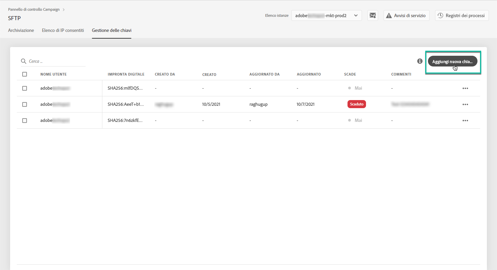
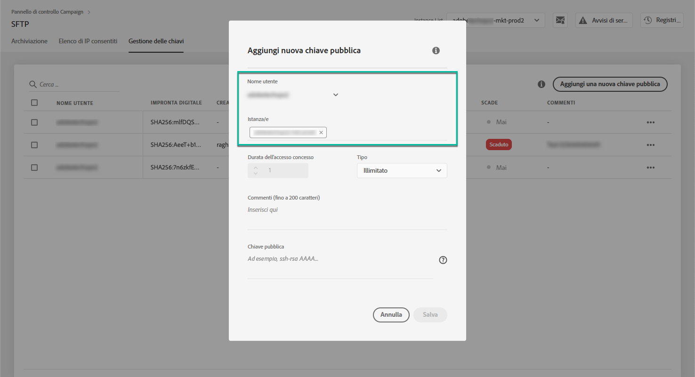
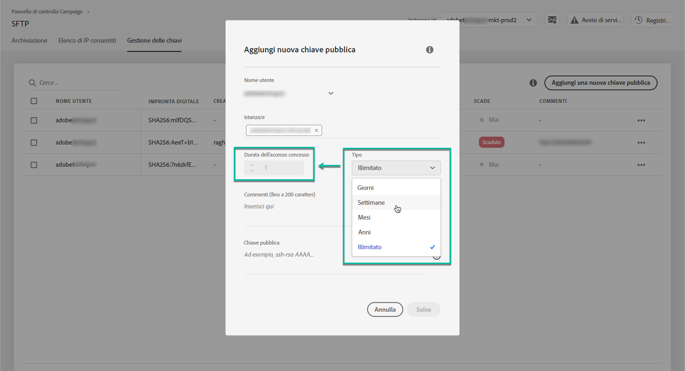
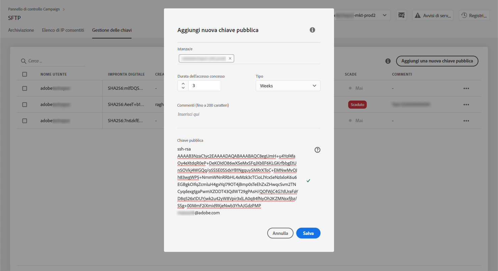
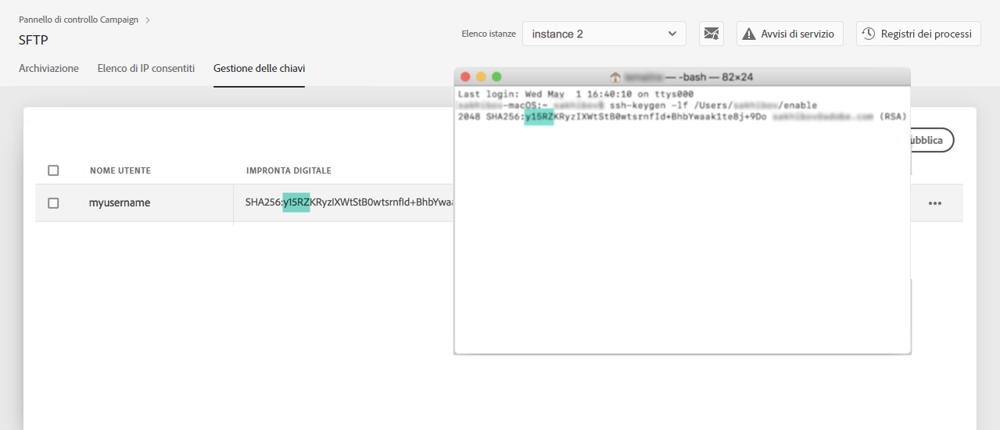
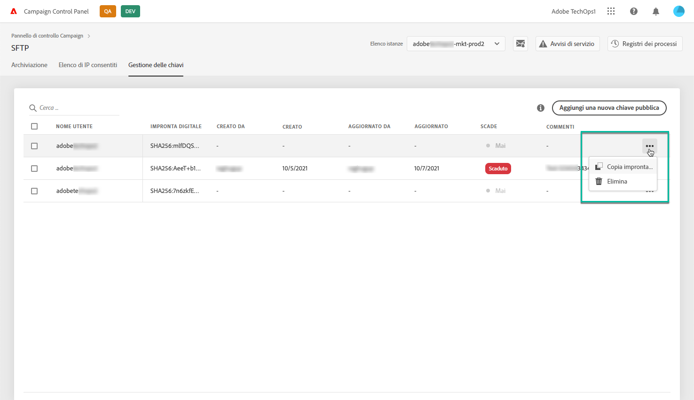
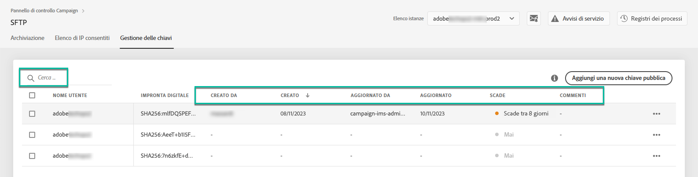
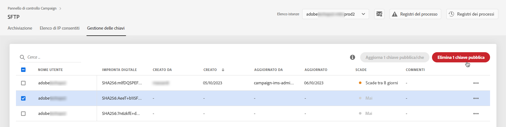
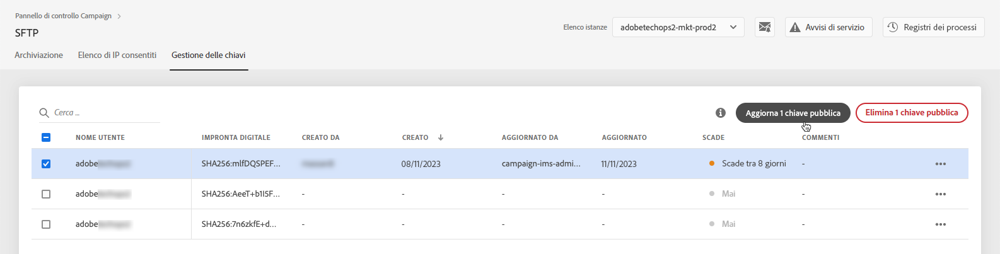

# Gestione delle chiavi {#key-management}

>[!CONTEXTUALHELP]
>id="cp_key_management"
>title="Informazioni sulla gestione delle chiavi pubbliche"
>abstract="In questa scheda, crea, gestisci e modifica le tue chiavi pubbliche."
>additional-url="https://images-tv.adobe.com/mpcv3/8a977e03-d76c-44d3-853c-95d0b799c870_1560205338.1920x1080at3000_h264.mp4#t=166" text="Guarda il video dimostrativo"

Adobe consiglia a tutti i clienti di stabilire una connessione ai propri server SFTP con una **coppia di chiavi pubblica e privata**.

Di seguito sono descritti i passaggi per generare una chiave SSH pubblica e aggiungerla per accedere al server SFTP, nonché le raccomandazioni relative all’autenticazione.

Una volta configurato l’accesso al server, ricorda di **inserire nell’elenco Consentiti gli indirizzi IP che richiederanno l’accesso al server** in modo da poterti connettere a esso. Per ulteriori informazioni al riguardo, consulta [questa sezione](../../instances-settings/using/ip-allow-listing-instance-access.md).

 Scopri questa funzione nel video per [Campaign v7/v8](https://experienceleague.adobe.com/docs/campaign-classic-learn/control-panel/sftp-management/generate-ssh-key.html#sftp-management) o [Campaign Standard](https://experienceleague.adobe.com/docs/campaign-standard-learn/control-panel/sftp-management/generate-ssh-key.html#sftp-management)

## Best practice {#best-practices}

**Informazioni sulla chiave SSH pubblica**

Assicurati di utilizzare sempre la stessa autenticazione per connetterti al server e di utilizzare un formato supportato per la chiave.

**Integrazione API con nome utente e password**

In rari casi, l’autenticazione basata su password è abilitata su alcuni server SFTP. Adobe consiglia di utilizzare l’autenticazione basata sulle chiavi, in quanto questo metodo è più efficiente e sicuro. Puoi richiedere di passare all’autenticazione basata sulle chiavi contattando l’Assistenza clienti.

>[!IMPORTANT]
>
>Se la tua password scade, anche in presenza di chiavi installate nel sistema, non potrai accedere ai tuoi account SFTP.

## Installazione della chiave SSH {#installing-ssh-key}

>[!CONTEXTUALHELP]
>id="cp_sftp_publickey_add"
>title="Aggiunta a chiave pubblica"
>abstract="Genera una chiave SSH pubblica per un’istanza e aggiungilo al Pannello di controllo Campaign per accedere al server SFTP."

>[!IMPORTANT]
>
>Devi sempre seguire le linee guida aziendali relative alle chiavi SSH. I passaggi seguenti sono solo un esempio di come è possibile creare chiavi SSH e possono fungere da utile punto di riferimento per la comunicazione dei requisiti al tuo team o gruppo di rete interno.

1. Accedi alla scheda **[!UICONTROL Key Management]**, quindi fai clic sul pulsante **[!UICONTROL Add new public key]**.

   

1. Nella finestra di dialogo visualizzata, seleziona il nome utente per il quale desideri creare la chiave pubblica e il server per il quale desideri attivare la chiave.

   

   >[!NOTE]
   >
   >Il Pannello di controllo Campaign controllerà se un determinato nome utente è attivo in una determinata istanza e ti consentirà di attivare la chiave in una o più istanze.
   >
   >Per ogni utente è possibile aggiungere una o più chiavi SSH pubbliche.

1. Per gestire meglio le chiavi pubbliche, puoi impostare una durata per la disponibilità di ogni chiave. A questo scopo, seleziona un’unità nella **[!UICONTROL Type]** elenco a discesa e definire una durata nel campo corrispondente. Per ulteriori informazioni sulla scadenza della chiave pubblica, consulta [questa sezione](#expiry).

   

   >[!NOTE]
   >
   >Per impostazione predefinita, la **[!UICONTROL Type]** campo impostato su **[!UICONTROL Unlimited]**, il che significa che la chiave pubblica non scade mai.

1. In **[!UICONTROL Comment]** è possibile indicare un motivo per aggiungere questa chiave pubblica (perché, per chi, ecc.).

1. Per riempire il **[!UICONTROL Public Key]** , devi generare una chiave SSH pubblica. Segui i passaggi riportati di seguito in base al tuo sistema operativo.

   **Linux e Mac:**

   Utilizza il terminale per generare una coppia di chiavi pubblica e privata:
   1. Inserisci questo comando: `ssh-keygen -m pem -t rsa -b 2048 -C "your_email@example.com"`.
   1. Quando richiesto, specifica un nome alla chiave. Se la directory .ssh non esiste, il sistema ne creerà una.
   1. Inserisci e reinserisci una passphrase quando richiesto. Può anche essere lasciata vuota.
   1. Il sistema crea una coppia di chiavi “name” e “name.pub”. Cerca il file “name.pub”, quindi aprilo. Deve avere una stringa alfanumerica che termina con l’indirizzo e-mail specificato.

   **Windows:**

   Potrebbe essere necessario installare uno strumento di terze parti che ti aiuterà a generare una coppia di chiavi pubblica/privata nello stesso formato &quot;name.pub&quot;.

1. Apri il file .pub, quindi copia e incolla l’intera stringa a partire da “ssh...” nel Pannello di controllo.

   

   >[!NOTE]
   >
   >La **[!UICONTROL Public Key]** accetta solo il formato OpenSSH. La dimensione della chiave SSH pubblica deve essere **2048 bit**.

1. Fai clic sul pulsante **[!UICONTROL Save]** per creare la chiave. Il Pannello di controllo Campaign salva la chiave pubblica e l&#39;impronta digitale associata, crittografate con il formato SHA256.

>[!IMPORTANT]
>
>Se la chiave creata viene utilizzata per stabilire una connessione con un sistema che non è mai stato connesso al server SFTP selezionato in precedenza, dovrai aggiungere un IP pubblico di tale sistema all’elenco consentiti prima di poter utilizzare questo sistema con il server SFTP. Vedi [questa sezione](ip-range-allow-listing.md).

È possibile utilizzare le impronte digitali per far corrispondere le chiavi private salvate sul computer con le corrispondenti chiavi pubbliche salvate nel Pannello di controllo Campaign.

Il pulsante “**...**” ti consente di eliminare una chiave esistente o di copiarne l’impronta digitale negli Appunti.

## Gestione delle chiavi pubbliche {#managing-public-keys}

Le chiavi pubbliche che crei vengono visualizzate nel **[!UICONTROL Key Management]** scheda .

Puoi ordinare gli elementi in base alla data di creazione o di modifica, all’utente che lo ha creato o modificato e alla scadenza dell’intervallo IP.

È inoltre possibile cercare una chiave pubblica iniziando a digitare un nome o un commento.

Per modificare uno o più intervalli IP, vedi [questa sezione](#editing-public-keys).

Per eliminare una o più chiavi pubbliche dall’elenco, selezionale, quindi fai clic sul pulsante **[!UICONTROL Delete public key]** pulsante .

### Scadenza {#expiry}

La **[!UICONTROL Expires]** mostra quanti giorni rimangono fino alla scadenza della chiave pubblica.

Se hai effettuato la sottoscrizione a [avvisi e-mail](../../performance-monitoring/using/email-alerting.md), riceverai notifiche tramite e-mail 10 giorni e 5 giorni prima della scadenza di una chiave pubblica e il giorno in cui scade. Dopo aver ricevuto l&#39;avviso, puoi [modifica la chiave pubblica](#editing-public-keys) di prorogare, se necessario, il periodo di validità.

Una chiave pubblica scaduta verrà eliminata automaticamente dopo 7 giorni. Viene visualizzato come **[!UICONTROL Expired]** in **[!UICONTROL Expires]** colonna. Entro questo periodo di 7 giorni:

* Impossibile più utilizzare una chiave pubblica scaduta per connettersi al server SFTP.

* È possibile [modifica](#editing-public-keys) una chiave pubblica scaduta e aggiornarne la durata per renderla nuovamente disponibile.

* È possibile eliminarlo dall’elenco.

## Modifica delle chiavi pubbliche {#editing-public-keys}

>[!CONTEXTUALHELP]
>id="cp_sftp_publickey_update"
>title="Modifica chiavi pubbliche"
>abstract="Aggiorna le chiavi pubbliche selezionate per accedere al server SFTP."

Per modificare le chiavi pubbliche, segui i passaggi seguenti.

>[!NOTE]
>
>Puoi modificare solo le chiavi pubbliche create a partire dalla versione di ottobre 2021 del Pannello di controllo Campaign.

1. Seleziona uno o più elementi dal **[!UICONTROL Key Management]** elenco.
1. Fai clic sul pulsante **[!UICONTROL Update public key]**.

   

1. È possibile modificare solo la scadenza della chiave pubblica e/o aggiungere un nuovo commento.

   >[!NOTE]
   >
   >Per modificare il nome utente, l’istanza e la chiave pubblica in formato OpenSSH, elimina la chiave pubblica e creane una nuova corrispondente alle tue esigenze.

1. Salva le modifiche.
