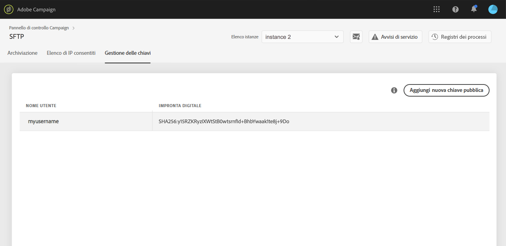

# Accesso al server SFTP {#logging-into-sft-server}

I passaggi seguenti descrivono in dettaglio come connettere il server SFTP tramite l’applicazione client SFTP.

 Guarda il [video su questa funzione](https://video.tv.adobe.com/v/27263?quality=12)

Prima di effettuare l’accesso al server, assicurati che i seguenti requisiti siano rispettati:

* Il server SFTP è **ospitato da Adobe**
* Il tuo **nome utente** è stato configurato per il server. Puoi controllare queste informazioni direttamente nel Pannello di controllo, nella scheda **Gestione delle chiavi** disponibile dalla scheda SFTP.
* Disponi di un **coppia di chiavi privata e pubblica** per accedere al server SFTP. Per informazioni su come aggiungere la chiave SSH, consulta [questa sezione](../../sftp/using/key-management.md).
* Il tuo **indirizzo IP pubblico è stato aggiunto all’elenco Consentiti** sul server SFTP. In caso contrario, consulta [questa sezione](../../sftp/using/ip-range-allow-listing.md) per informazioni su come aggiungere l’intervallo IP all’elenco Consentiti.
* Hai accesso a un **software client SFTP**. Rivolgiti al reparto IT della tua organizzazione per sapere quale applicazione client SFTP consigliano di utilizzare; oppure puoi cercarne una su Internet, se questo è consentito dalle politiche della tua azienda.

Per connetterti al server SFTP, segui questi passaggi:

1. Avvia il Pannello di controllo, quindi seleziona la scheda **[!UICONTROL Gestione delle chiavi]** disponibile dalla scheda **[!UICONTROL SFTP]**.

   

1. Avvia l’applicazione client SFTP, quindi copia e incolla l’indirizzo del server dal Pannello di controllo, seguito da “campaign.adobe.com”, quindi inserisci il nome utente.

   

1. Nel campo **[!UICONTROL Chiave privata SSH]** seleziona il file della chiave privata memorizzato nel computer. Questo corrisponde a un file di testo con lo stesso nome della chiave pubblica, senza l’estensione “.pub” (ad esempio, “enable”).

   

   Nel campo **[!UICONTROL Password]** viene automaticamente inserita la chiave privata fornita dal file.

   

   Per verificare che la chiave che stai tentando di utilizzare sia salvata nel Pannello di controllo, confronta l’impronta digitale della chiave privata o pubblica con l’impronta digitale delle chiavi visualizzata nella scheda Gestione delle chiavi, nella scheda SFTP.

   

   >[!NOTE]
   >
   >Se utilizzi un computer Mac, puoi visualizzare l’impronta digitale della chiave privata memorizzata nel computer eseguendo il comando seguente:
   >
   >`ssh-keygen -lf <path of the privatekey>`

1. Una volta inserite tutte le informazioni, fai clic su **[!UICONTROL Connetti]** per accedere al server SFTP.

   
