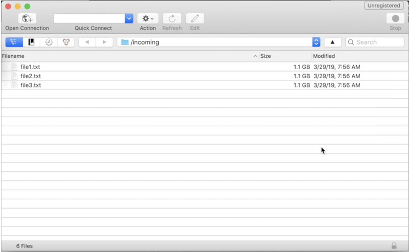

# Accesso al server SFTP {#logging-into-sft-server}

I passaggi seguenti descrivono come collegare il server SFTP tramite l’applicazione client SFTP.

[ Scopri questa funzione nel video](https://video.tv.adobe.com/v/27263?quality=12)

Prima di accedere al server, assicurati che:

* Il server SFTP è **ospitato da Adobe**.
* Il tuo **nome utente** è stato configurato per il server. Puoi controllare queste informazioni direttamente nel Pannello di controllo Campaign, nella scheda **Key management** dalla scheda SFTP.
* Hai una **coppia di chiavi privata e pubblica** per accedere al server SFTP. Per ulteriori informazioni su come aggiungere la chiave SSH, consulta [questa sezione](../../sftp/using/key-management.md) .
* Il tuo **indirizzo IP pubblico è stato aggiunto all&#39;elenco consentiti** sul server SFTP. In caso contrario, consulta [questa sezione](../../sftp/using/ip-range-allow-listing.md) per ulteriori informazioni su come aggiungere l’intervallo IP all’elenco consentiti.
* Hai accesso a un **software client SFTP**. Puoi consultare il tuo reparto IT per l’applicazione client SFTP che ti consigliano di utilizzare, oppure cercare una su Internet se è consentito dalle politiche aziendali.

Per connettersi al server SFTP, procedi come segue:

1. Avvia il Pannello di controllo Campaign, quindi seleziona la scheda **[!UICONTROL Key Management]** dalla scheda **[!UICONTROL SFTP]**.

   

1. Avvia la tua applicazione client SFTP, quindi copia-incolla l&#39;indirizzo del server dal Pannello di controllo Campaign, seguito da &quot;campaign.adobe.com&quot;, quindi compila il tuo nome utente.

   

1. Nel campo **[!UICONTROL SSH Private Key]** selezionare il file di chiave privata memorizzato nel computer. Corrisponde a un file di testo che ha lo stesso nome della chiave pubblica, senza l&#39;estensione &quot;.pub&quot; (ad esempio, &quot;enable&quot;).

   

   Il campo **[!UICONTROL Password]** viene compilato automaticamente con la chiave privata del file .

   

   Puoi verificare che la chiave che stai cercando di utilizzare sia salvata nel Pannello di controllo Campaign confrontando l&#39;impronta digitale della chiave privata o pubblica con l&#39;impronta digitale delle chiavi visualizzate nella scheda Key Management della scheda SFTP.

   

   >[!NOTE]
   >
   >Se si utilizza un computer Mac, è possibile visualizzare l&#39;impronta digitale della chiave privata memorizzata nel computer eseguendo questo comando:
   >
   >`ssh-keygen -lf <path of the privatekey>`

1. Una volta inserite tutte le informazioni, fai clic su **[!UICONTROL Connect]** per accedere al server SFTP.

   
