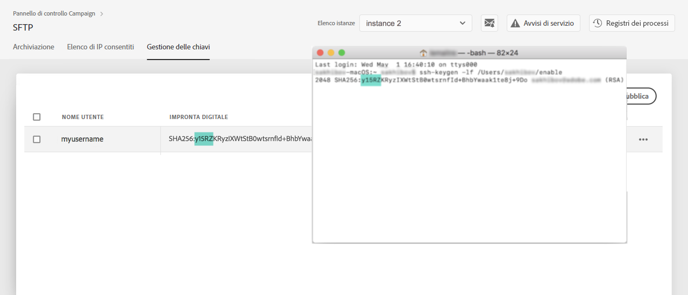

# Accesso al server SFTP {#logging-into-sft-server}

Nei passaggi seguenti viene descritto come collegare il server SFTP tramite l&#39;applicazione client SFTP.

 Scoprite questa funzione nel video con [Campaign Classic](https://experienceleague.adobe.com/docs/campaign-classic-learn/control-panel/sftp-management/connect-to-sftp-server.html?lang=en#sftp-management) o [Campaign Standard](https://experienceleague.adobe.com/docs/campaign-standard-learn/control-panel/sftp-management/connect-to-sftp-server.html?lang=en#sftp-management)

Prima di accedere al server, accertatevi che:

* Il server SFTP è **ospitato da  Adobe**.
* Il tuo **nome utente** è stato configurato per il server. You can check this information directly in the Control Panel, in the **Key management** tab from the SFTP Card.
* Hai una coppia **di chiavi pubblica e** privata per accedere al server SFTP. Per ulteriori informazioni su come aggiungere la chiave SSH, fare riferimento a [questa sezione](../../sftp/using/key-management.md) .
* Il tuo indirizzo IP **pubblico è stato aggiunto al elenco consentiti**  sul server SFTP. In caso contrario, consulta [questa sezione](../../sftp/using/ip-range-allow-listing.md) per ulteriori informazioni su come aggiungere l’intervallo IP al elenco consentiti .
* Hai accesso a un software **client** SFTP. È possibile consultare il reparto IT per l&#39;applicazione client SFTP che si consiglia di utilizzare, o cercare uno su Internet, se ciò è consentito dalle politiche aziendali.

Per connettersi al server SFTP, attenetevi alla procedura seguente:

1. Launch the Control Panel, then select the **[!UICONTROL Key Management]** tab from the **[!UICONTROL SFTP]** card.

   

1. Avviate l&#39;applicazione client SFTP, quindi copiate e incollate l&#39;indirizzo del server dal Pannello di controllo Campaign, seguito da &quot;campaign.adobe.com&quot;, quindi inserite il vostro nome utente.

   

1. Nel **[!UICONTROL SSH Private Key]** campo selezionare il file di chiave privata memorizzato nel computer. Corrisponde a un file di testo che ha lo stesso nome della chiave pubblica, senza l&#39;estensione &quot;.pub&quot; (ad esempio, &quot;enable&quot;).

   

   Il **[!UICONTROL Password]** campo viene compilato automaticamente con la chiave privata del file.

   

   È possibile verificare che la chiave che si sta tentando di utilizzare sia salvata nel Pannello di controllo Campaign confrontando l&#39;impronta digitale della chiave privata o pubblica con l&#39;impronta digitale delle chiavi visualizzate nella scheda Gestione chiavi della scheda SFTP.

   

   >[!NOTE]
   >
   >Se si utilizza un computer Mac, è possibile visualizzare l&#39;impronta digitale della chiave privata memorizzata nel computer eseguendo questo comando:
   >
   >`ssh-keygen -lf <path of the privatekey>`

1. Una volta compilate tutte le informazioni, fate clic **[!UICONTROL Connect]** per accedere al vostro server SFTP.

   
