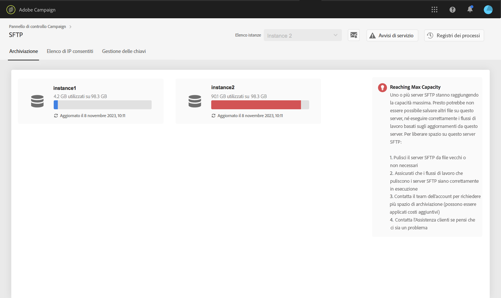
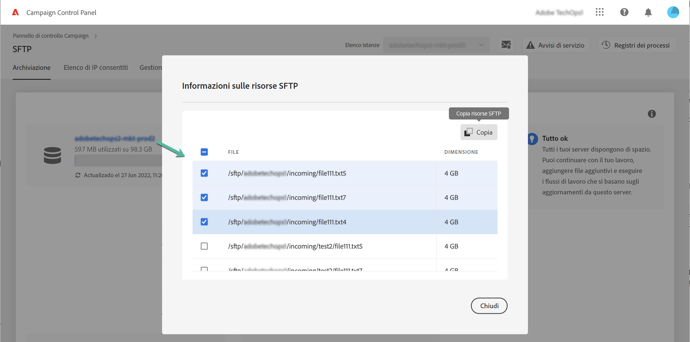

# Gestione dell’archiviazione SFTP {#sftp-storage-management}

>[!CONTEXTUALHELP]
>id="cp_storage"
>title="Informazioni sulla capacità di archiviazione"
>abstract="In questa scheda puoi visualizzare le informazioni sulla capacità di archiviazione e sull’utilizzo dei server SFTP. Puoi anche elencare i primi 10 file che occupano più spazio su un server SFTP facendo clic sul nome. Solo i server SFTP a cui hai accesso sono visualizzati qui. Contatta l’amministratore per richiedere l’accesso ad altri server SFTP."
>additional-url="https://images-tv.adobe.com/mpcv3/8a977e03-d76c-44d3-853c-95d0b799c870_1560205338.1920x1080at3000_h264.mp4" text="Guarda il video dimostrativo"

È possibile che sul tuo server SFTP sia stato effettuato il provisioning di una capacità di archiviazione diversa, a seconda dei termini contrattuali.

È fondamentale monitorare regolarmente lo spazio disponibile per ciascuno dei server SFTP. In caso contrario, potresti non essere più in grado di salvare ulteriori file sul server o eseguire con successo flussi di lavoro che si basano sugli aggiornamenti provenienti da questo server.

Se ti sei iscritto agli [avvisi e-mail](../../performance-monitoring/using/email-alerting.md), riceverai notifiche via e-mail quando uno dei tuoi server SFTP raggiunge l’80% o più della capacità. Consulta [Gestione dell’archiviazione SFTP](../../sftp/using/sftp-storage-management.md).

 Scopri questa funzione nel video per [Campaign v7/v8](https://experienceleague.adobe.com/docs/campaign-classic-learn/control-panel/sftp-management/monitoring-server-capacity.html?lang=it#sftp-management) o [Campaign Standard](https://experienceleague.adobe.com/docs/campaign-standard-learn/control-panel/sftp-management/monitoring-server-capacity.html?lang=it#sftp-management)

## Accesso alle informazioni sulla capacità di archiviazione {#accessing-storage-capacity-information}

Le informazioni sullo spazio utilizzato da tutte le istanze a cui hai accesso sono disponibili nella scheda **[!UICONTROL Storage]** della scheda SFTP. Vengono aggiornate a ogni aggiornamento di pagina.

Per ogni istanza, un avviso visivo ti consente di sapere quando l’archiviazione supera la capacità:

* **Arancione**: l’istanza ha superato l’80% della sua capacità,
* **Rosso**: l’istanza supera il 90% della sua capacità.

Puoi inoltre identificare i primi 10 file che occupano più spazio su un server SFTP facendo clic sul nome.

Sono inoltre disponibili ulteriori suggerimenti su come procedere quando il tuo server si avvicina all’esaurimento della capacità.

## Best practice in caso di esaurimento della capacità di archiviazione {#best-practices-when-capacity-runs-out}

1. **Rimuovi dal server SFTP file vecchi o non necessari**. Per ulteriori informazioni su come accedere alla cartella del server SFTP, consulta [questa sezione](../../sftp/using/logging-into-sftp-server.md).
1. Assicurati che i **flussi di lavoro** che puliscono i server SFTP siano eseguiti correttamente. Per ulteriori informazioni sui flussi di lavoro tecnici in Adobe Campaign, consulta la documentazioni dedicata di [Campaign v7/v8](https://experienceleague.adobe.com/docs/campaign-classic/using/automating-with-workflows/advanced-management/about-technical-workflows.html?lang=it) e [Campaign Standard](https://experienceleague.adobe.com/docs/campaign-standard/using/administrating/application-settings/technical-workflows.html?lang=it).
1. Rivolgiti al team del tuo account per **richiedere più spazio di archiviazione** (potrebbero essere applicati costi aggiuntivi).
1. Se ritieni che ci possa essere un problema, contatta l’**Assistenza clienti**.
