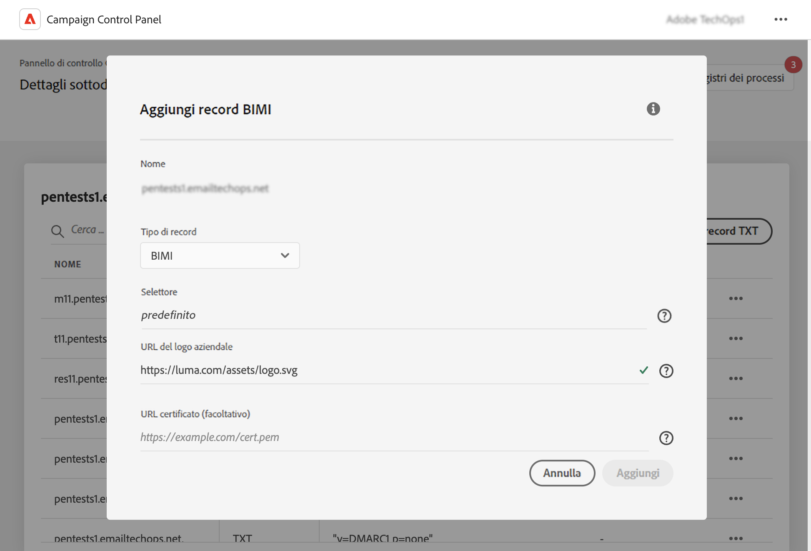

# Aggiungere record BIMI {#dmarc}

## Informazioni sui record BIMI {#about}

Brand Indicators for Message Identification (BIMI) è uno standard di settore che consente la visualizzazione di un logo approvato accanto all’e-mail di un mittente nelle caselle in entrata dei provider di cassette postali per migliorare il riconoscimento e l’affidabilità del brand. Aiuta a prevenire lo spoofing e il phishing delle e-mail verificando l’identità del mittente tramite l’autenticazione DMARC, rendendo più difficile ai malintenzionati di impersonare brand legittimi nelle e-mail.

Informazioni dettagliate sull’attuazione di BIMI sono disponibili nella [Guida alle best practice per la recapitabilità di Adobe](https://experienceleague.adobe.com/docs/deliverability-learn/deliverability-best-practice-guide/additional-resources/technotes/implement-bimi.html?lang=it)

{width="70%" align="center"}

## Limitazioni e prerequisiti {#limitations}

* I record SPF, DKIM e DMARC sono prerequisiti per la creazione di un record BIMI.
* I record BIMI possono essere aggiunti solo per i sottodomini che utilizzano la delega completa dei sottodomini. [Ulteriori informazioni sui metodi di configurazione dei sottodomini](subdomains-branding.md#subdomain-delegation-methods)
* Prerequisiti per i record DMARC:

   * Il tipo di criterio del record per il sottodominio deve essere impostato su “Quarantena” o “Rifiuta”. La creazione di record BIMI non è disponibile con un tipo di criterio DMARC impostato su “Nessuno”.
   * La percentuale di e-mail a cui viene applicato il criterio DMARC deve essere 100%. BIMI non supporta i criteri DMARC con questa percentuale impostata su un valore inferiore al 100%.

[Scopri come configurare i record DMARC](dmarc.md)

## Aggiungere un record BIMI per un sottodominio {#add}

Per aggiungere un record BIMI per un sottodominio, segui questi passaggi:

1. Dall’elenco dei sottodomini, fai clic sul pulsante con i puntini di sospensione accanto al sottodominio desiderato e seleziona **[!UICONTROL Subdomain details]**.

1. Fai clic sul pulsante **[!UICONTROL Add TXT record]**, quindi scegli **[!UICONTROL BIMI]** dall’elenco a discesa **[!UICONTROL Record type]**.

   

1. Nel **[!UICONTROL Company Logo URL]**, specifica l’URL del file SVG che contiene il logo.

1. Anche se **[!UICONTROL Certificate URL]** è facoltativo, è necessario per alcuni provider come Gmail e Apple che coprono l’80% del mercato delle cassette postali. Pertanto, è consigliabile ottenere un certificato VMC (Verified Mark Certificate) per sfruttare al meglio BIMI.

   +++In che modo si ottiene un VMC?

   I passaggi principali per ottenere un VMC sono i seguenti:

   1. Registra il logo del tuo brand come marchio registratio presso un ufficio per la proprietà intellettuale riconosciuto dagli emittenti VMC. Se disponi di un team legale, ti consigliamo di collaborare con loro per ottenere il marchio registrato del tuo logo o per verificare che sia già registrato.

   1. Dopo aver verificato che il logo è stato registrato, contatta DigiCert o un’autorità di certificazione (CA) incaricata per richiedere un VMC.

   1. Una volta approvato il VMC, riceverai un certificato di entità PEM (Privacy Enhanced Mail). Aggiungi al file PEM tutti gli altri certificati intermedi ricevuti dall’autorità di certificazione. Carica il file PEM (insieme ai file aggiunti) sul server web pubblico e annotane l’URL. Tale URL verrà utilizzato nel record TXT di BIMI.

   1. Una volta che il record BIMI è visibile nella pagina dei dettagli del sottodominio per un determinato sottodominio, puoi utilizzare lo strumento Bimi Inspector disponibile [qui](https://bimigroup.org/bimi-generator/) per verificare il corretto funzionamento del record BIMI.

   Informazioni dettagliate sull’implementazione di BIMI sono disponibili nella [Documentazione standard di BIMI](https://bimigroup.org/implementation-guide/)
+++

1. Fai clic su **[!UICONTROL Add]** per confermare la creazione del record BIMI.

Una volta elaborata la creazione del record BIMI (circa 5 minuti), questo viene mostrato nella schermata dei dettagli dei sottodomini. [Scopri come monitorare i record TXT per i sottodomini](gs-txt-records.md#monitor)
