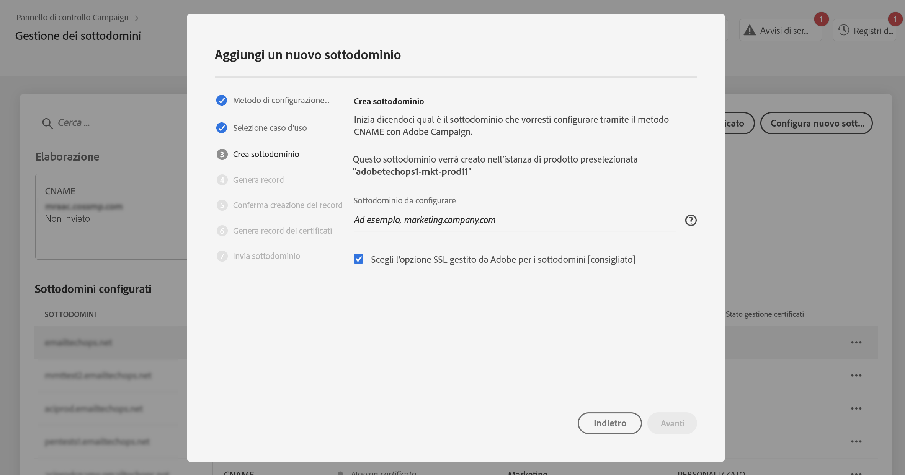

# Delegare i certificati SSL dei sottodomini ad Adobe {#delegate-ssl-certificates}

>[!CONTEXTUALHELP]
>id="cp_managed_ssl"
>title="Delegare i certificati SSL dei sottodomini ad Adobe"
>abstract="Il Pannello di controllo ti consente di gestire i certificati SSL dei sottodomini gestiti da Adobe. Se utilizzi i CNAME per configurare il sottodominio, i record dei certificati verranno generati e forniti automaticamente per generare un certificato nella soluzione di hosting del dominio."

Si consiglia vivamente di delegare la gestione dei certificati SSL dei sottodomini ad Adobe, in quanto Adobe creerà automaticamente il certificato e lo rinnoverà ogni anno prima della scadenza.

Se utilizzi i CNAME per impostare una delega di sottodominio, Adobe fornirà i record del certificato da utilizzare nella soluzione di hosting del dominio per generare il certificato.

La delega dei certificati SSL ad Adobe può essere eseguita durante la configurazione di un nuovo sottodominio o per i sottodomini già delegati.

>[!NOTE]
>
>L’SSL gestito da Adobe è una funzione gratuita disponibile per gli utenti. La delega del certificato di un sottodominio ad Adobe è trasparente e non ha alcun impatto sulle campagne e sulla recapitabilità. [Ulteriori informazioni sulla gestione dei certificati SSL](monitoring-ssl-certificates.md#management)

## Delegare i certificati SSL dei nuovi sottodomini {#new}

Per delegare i certificati SSL durante la configurazione di un nuovo sottodominio, abilita **[!UICONTROL Scegli l’opzione SSL gestito da Adobe per i sottodominii]** nella configurazione guidata del sottodominio. I record dei certificati da copiare nella soluzione di hosting verranno forniti più avanti nella procedura guidata di configurazione. I passaggi dettagliati sono documentati in [questa sezione](setting-up-new-subdomain.md).

{width="70%" align="left"}

## Delegare i certificati SSL per i sottodomini già delegati {#delegated}

Per delegare i certificati SSL per un sottodominio già delegato, fai clic sul pulsante con i puntini di sospensione accanto al sottodominio desiderato e fai clic su **[!UICONTROL Passa a SSL gestito]**.

{width="70%" align="left"}

Viene visualizzata una finestra di dialogo con i record del certificato generati automaticamente da Adobe. Copia questi record, uno per uno, oppure scaricando un file CSV, quindi accedi alla soluzione di hosting del tuo dominio per generare i certificati corrispondenti.

Assicurati che tutti i record del certificato siano stati generati nella soluzione di hosting del tuo dominio. Se tutto è configurato correttamente, conferma la creazione dei record, quindi fai clic su **[!UICONTROL Invia]**.

{width="70%" align="left"}
