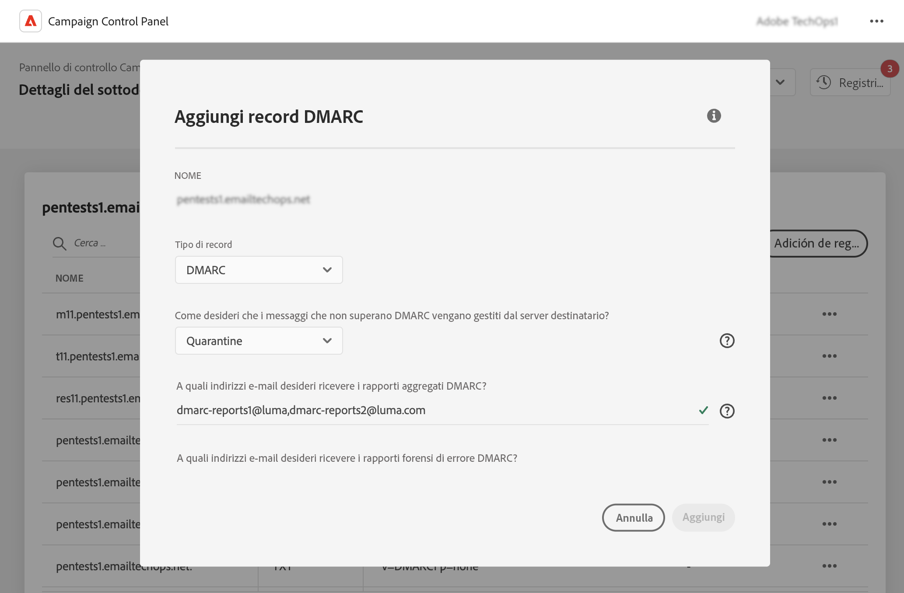
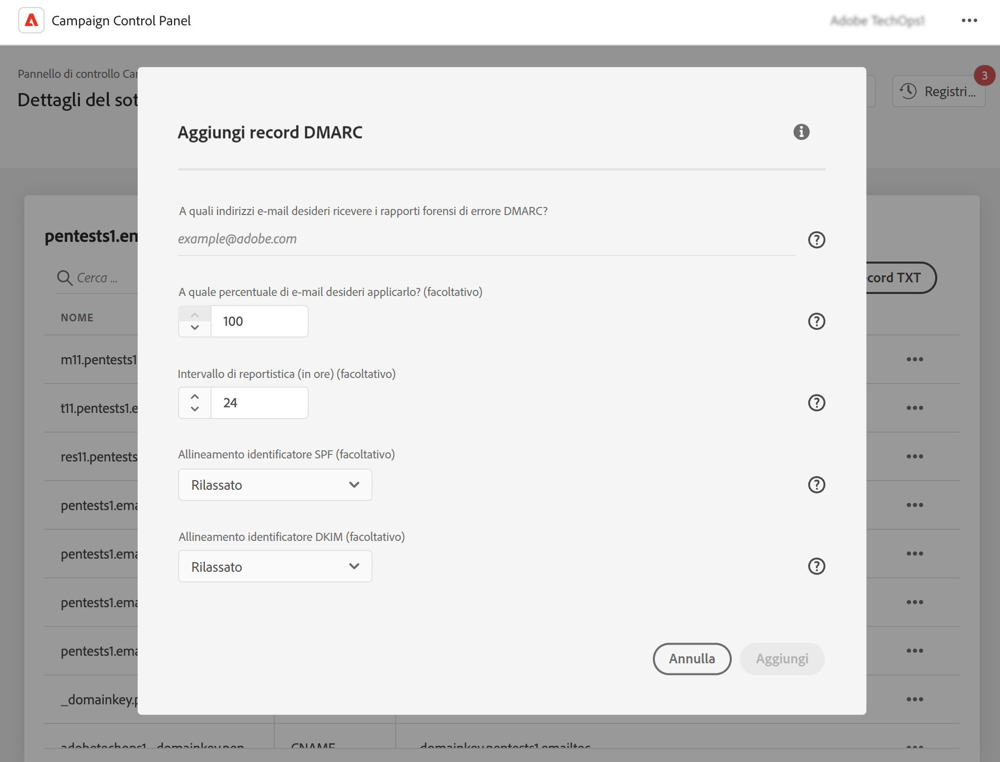

# Aggiungi record DMARC {#dmarc}

## Informazioni sui record DMARC {#about}

DMARC (Domain Based Message Authentication, Reporting and Conformance) è uno standard del protocollo di autenticazione e-mail che aiuta le organizzazioni a proteggere i domini e-mail dagli attacchi di phishing e spoofing. Consente di decidere in che modo un provider di caselle di posta deve gestire le e-mail che non superano i controlli SPF e DKIM, fornendo un modo per autenticare il dominio del mittente e impedire l’uso non autorizzato del dominio per scopi dannosi.

<!--Detailed information on DMARC implementation is available in [Adobe Deliverability Best Practice Guide](https://experienceleague.adobe.com/docs/deliverability-learn/deliverability-best-practice-guide/additional-resources/technotes/implement-bimi.html)-->

## Limitazioni e prerequisiti {#limitations}

* I record SPF e DKIM sono prerequisiti per la creazione di un record DMARC.
* I record DMARC possono essere aggiunti solo per i sottodomini che utilizzano la delega completa dei sottodomini. [Ulteriori informazioni sui metodi di configurazione dei sottodomini](subdomains-branding.md#subdomain-delegation-methods)

## Aggiungere un record DMARC per un sottodominio {#add}

Per aggiungere un record DMARC per un sottodominio, effettua le seguenti operazioni:

1. Dall’elenco dei sottodomini, fai clic sul pulsante con i puntini di sospensione accanto al sottodominio desiderato e seleziona **[!UICONTROL Subdomain details]**.

1. Fai clic su **[!UICONTROL Add TXT record]** , quindi scegliere **[!UICONTROL DMARC]** dal **[!UICONTROL Record Type]** elenco a discesa.

   

1. Scegli la **[!UICONTROL Policy Type]** che il server del destinatario deve seguire quando una delle e-mail non riesce. I tipi di criteri disponibili sono:

   * **[!UICONTROL None]**,
   * **[!UICONTROL Quarantine]** (inserimento di cartelle di posta indesiderata),
   * **[!UICONTROL Reject]** (blocca l’e-mail).

   Come best practice, si consiglia di implementare lentamente l’implementazione di DMARC aumentando il livello dei criteri DMARC da p=none a p=quarantena, fino a p=rifiuta man mano che acquisisci una comprensione DMARC del potenziale impatto di DMARC.

   * **Passaggio 1:** Analizza il feedback ricevuto e utilizza (p=none), che indica al destinatario di non eseguire azioni contro i messaggi che non superano l’autenticazione, ma inviano comunque i rapporti e-mail al mittente. Inoltre, se l&#39;autenticazione dei messaggi legittimi non riesce, esaminare e risolvere i problemi relativi a SPF/DKIM.

   * **Passaggio 2:** Determina se SPF e DKIM sono allineati e trasmettono l’autenticazione per tutte le e-mail legittime, quindi sposta il criterio in (p=quarantena), che indica al server e-mail ricevente di mettere in quarantena le e-mail che non riescono a eseguire l’autenticazione (in genere significa inserire tali messaggi nella cartella di posta indesiderata). Se il criterio è impostato per la quarantena, si consiglia di iniziare con una piccola percentuale delle e-mail.

   * **Passaggio 3:** Imposta criterio su (p=rifiuta). NOTA: utilizza questo criterio con cautela e determina se è appropriato per la tua organizzazione. Il criterio p= rifiuta indica al destinatario di rifiutare completamente (non recapitare) qualsiasi e-mail per il dominio che non supera l’autenticazione. Con questo criterio abilitato, solo i messaggi e-mail verificati come autenticati al 100% dal dominio avranno anche la possibilità di inserire la casella in entrata.

   >[!NOTE]
   >
   > La creazione di record BIMI non è disponibile con un tipo di criterio di record DMARC impostato su &quot;None&quot;.

1. Inserisci gli indirizzi e-mail che devono ricevere i rapporti DMARC. Quando una delle e-mail non riesce, i rapporti DMARC vengono inviati automaticamente all’indirizzo e-mail scelto:

   * I rapporti Aggregate-DMARC forniscono informazioni di alto livello come, ad esempio, il numero di e-mail non riuscite per un determinato periodo.
   * I rapporti forensi sugli errori DMARC forniscono informazioni dettagliate, ad esempio l’indirizzo IP da cui proviene l’e-mail non riuscita.

1. Se il criterio DMARC è impostato su &quot;None&quot;, immettere una percentuale valida per il 100% delle e-mail.

   Se il criterio è impostato su &quot;Rifiuta&quot; o &quot;Quarantena&quot;, si consiglia di iniziare con una piccola percentuale delle e-mail. Man mano che più e-mail dal dominio passano l’autenticazione con i server riceventi, aggiorna il record lentamente con una percentuale più alta.

   >[!NOTE]
   >
   >Se il dominio utilizza BIMI, il criterio DMARC deve avere un valore percentuale del 100%. BIMI non supporta i criteri DMARC con questo valore impostato su un valore inferiore al 100%.

   

1. I rapporti DMARC vengono inviati ogni 24 ore. Puoi modificare la frequenza di invio dei rapporti in **[!UICONTROL Reporting Interval]** campo. L’intervallo minimo autorizzato è di 1 ora, mentre il valore massimo autorizzato è di 2190 ore (ovvero 3 mesi).

1. In **SPF** e **[!UICONTROL DKIM Identifier Alignment]** specificare il livello di rigidità dei server dei destinatari durante la verifica delle autenticazioni SPF e DKIM per un messaggio e-mail.

   * **[!UICONTROL Relaxed]** modalità: il server accetta l’autenticazione anche se l’e-mail viene inviata da un sottodominio,
   * **[!UICONTROL Strict]** La modalità accetta l&#39;autenticazione solo quando il dominio del mittente corrisponde esattamente a un dominio SPF e DKIM.

   Supponiamo di lavorare con `http://www.luma.com` dominio. In modalità &quot;Relax&quot;, le e-mail provenienti dal `marketing.luma.com` Il sottodominio verrà autorizzato dal server, mentre verrà rifiutato in modalità &quot;Strict&quot; (Rigoroso).

1. Clic **[!UICONTROL Add]** per confermare la creazione del record DMARC.

Una volta elaborata la creazione del record DMARC (circa 5 minuti), questa viene visualizzata nella schermata dei dettagli dei sottodomini. [Scopri come monitorare i record TXT per i sottodomini](gs-txt-records.md#monitor)