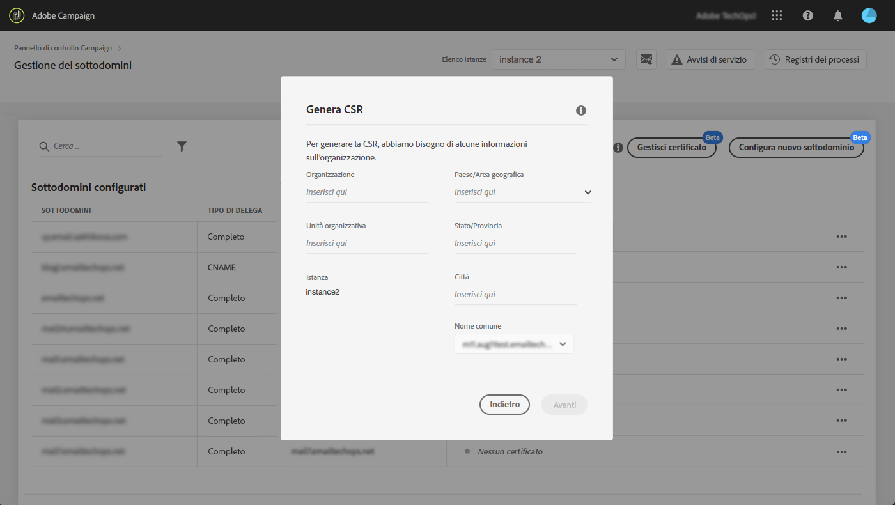

# Genera una CSR {#generating-csr}

>[!CONTEXTUALHELP]
>id="cp_generate_csr"
>title="Generazione di CSR"
>abstract="La richiesta di firma del certificato (CSR, Certificate Signing Request) deve essere generata per l’istanza e i sottodomini che intendi proteggere prima di acquistare un certificato."

>[!CONTEXTUALHELP]
>id="cp_select_subdomains"
>title="Seleziona i sottodomini per la tua CSR"
>abstract="Puoi scegliere di includere tutti i sottodomini o solo alcuni specifici nella richiesta di firma del certificato. Solo i sottodomini selezionati saranno certificati tramite il certificato SSL acquistato."
>additional-url="https://experienceleague.adobe.com/docs/control-panel/using/subdomains-and-certificates/subdomains-branding.html?lang=it" text="Informazioni sul branding dei sottodomini"

## Generare la CSR {#generate}

Per generare una richiesta di firma del certificato (CSR, Certificate Signing Request), procedi come segue:

1. Nella scheda **[!UICONTROL Subdomains & Certificates]**, seleziona l’istanza desiderata, quindi fai clic sul pulsante **[!UICONTROL Manage Certificate]**.

   

1. Seleziona **[!UICONTROL 1 - Generate a CSR]**, quindi fai clic su **[!UICONTROL Next]** per avviare la procedura guidata che ti guiderà attraverso il processo di generazione della CSR.

   

1. Viene visualizzato un modulo con tutti i dettagli necessari per generare la CSR.

   Assicurati di inserire le informazioni richieste in modo completo e accurato, altrimenti il certificato potrebbe non essere rinnovato (se necessario, contatta il team interno e i team di sicurezza e IT), quindi fai clic su **[!UICONTROL Next]**.

   * **[!UICONTROL Organization]**: nome ufficiale dell’organizzazione.
   * **[!UICONTROL Organization Unit]**: unità collegata al sottodominio (esempio: Marketing, IT).
   * **[!UICONTROL Instance]** (precompilato): URL dell’istanza Campaign associata al sottodominio.
   * **[!UICONTROL Common name]**: il nome comune è selezionato per impostazione predefinita, se necessario puoi selezionare uno dei sottodomini.

   

1. Seleziona i sottodomini da includere nella CSR, quindi fai clic su **[!UICONTROL OK]**.

   

1. I sottodomini selezionati vengono visualizzati nell’elenco. Per ciascuno di essi, seleziona i sottodomini da includere, quindi fai clic su **[!UICONTROL Next]**.

   

1. Viene visualizzato un riepilogo dei sottodomini da includere nella CSR. Fai clic su **[!UICONTROL Submit]** per confermare la richiesta.

   

   >[!NOTE]
   >
   >Il **[!UICONTROL Copy CSR content]** consente di copiare tutte le informazioni relative alla CSR (ID organizzazione, istanza, nome organizzazione, nome comune, sottodomini inclusi, ecc.)

1. Il file .csr corrispondente alla selezione viene generato e scaricato automaticamente. Ora puoi usarlo per acquistare il certificato SSL dall’autorità di certificazione approvata dalla tua azienda. Se devi scaricare nuovamente la CSR, segui i passaggi descritti in [questa sezione](#download).

Una volta generata e scaricata la CSR, puoi utilizzarla per acquistare un certificato SSL da un’autorità di certificazione approvata dalla tua organizzazione.

Una volta acquistato il certificato SSL, potrai installarlo nell’istanza per proteggere il sottodominio. [Ulteriori informazioni](install-ssl-certificate.md)

## Scaricare la CSR {#download}

Per acquistare un certificato SSL, devi innanzitutto scaricare la richiesta di firma del certificato. La CSR viene scaricata automaticamente dopo la generazione. Puoi scaricarlo nuovamente in qualsiasi momento dai Registri di lavoro:

1. In **[!UICONTROL Job Logs]**, seleziona la **[!UICONTROL Finished]** , quindi filtra l’elenco per visualizzare i processi relativi alla gestione dei sottodomini.

   

1. Apri il processo corrispondente alla generazione della CSR, quindi fai clic su **[!UICONTROL Downbload]** per ottenere il file .csr.

   
