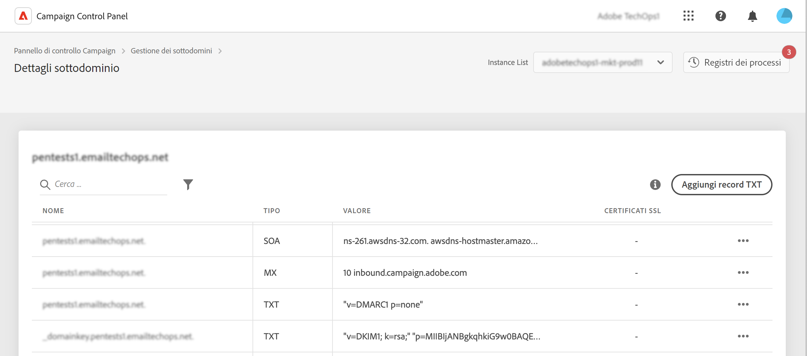

# Introduzione ai record TXT {#managing-txt-records}

>[!CONTEXTUALHELP]
>id="cp_siteverification_add"
>title="Gestione dei record TXT"
>abstract="I record TXT sono un tipo di record DNS utilizzati per fornire informazioni testuali su un dominio, leggibili da origini esterne. Il Pannello di controllo consente di aggiungere tre tipi di record ai sottodomini: Google Site Verification, DMARC e BIMI."

## Informazioni sui record TXT {#about}

I record TXT sono un tipo di record DNS utilizzati per fornire informazioni testuali su un dominio, leggibili da origini esterne. Il Pannello di controllo consente di aggiungere tre tipi di record ai sottodomini:

* I **record TXT di Google** ti consentono di attestare di essere il proprietario del dominio, garantendo elevate percentuali di posta in arrivo e basse percentuali di posta indesiderata per le e-mail. [Scopri come aggiungere record TXT di Google](managing-txt-records.md)
* I **record DMARC** forniscono un modo per autenticare il dominio del mittente e impedire l’uso non autorizzato del dominio per scopi dannosi. [Scopri come aggiungere record DMARC](dmarc.md)
* I **record BIMI** ti consentono di visualizzare un logo approvato accanto alle e-mail nelle caselle in entrata dei provider di casette postali per migliorare il riconoscimento e l’affidabilità del brand. [Scopri come aggiungere record BIMI](bimi.md)

## Monitorare i record dei sottodomini {#monitor}

Puoi monitorare tutti i record TXT aggiunti per ciascun sottodominio accedendo ai dettagli dei sottodomini.

In questa schermata vengono visualizzati tutti i record di tipo TXT per il sottodominio selezionato, con le informazioni sulla relativa configurazione nella colonna “Valore”. Per eliminare un record TXT, DMARC o BIMI di Google, fai clic sul pulsante con i puntini di sospensione e seleziona Elimina. Se necessario, puoi anche modificare i record DMARC e BIMI.

