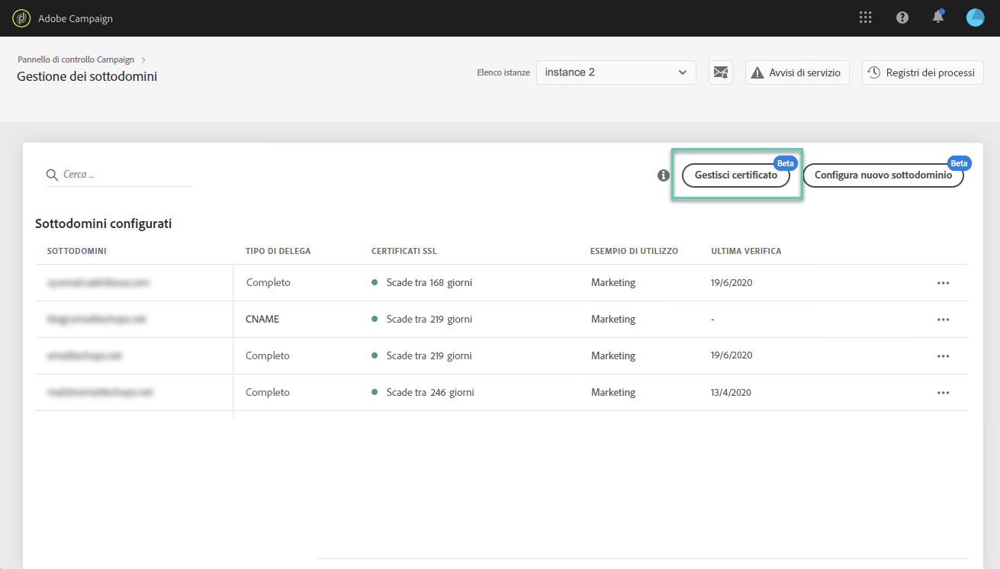

# Gestione dei certificati SSL dei sottodomini {#managing-subdomains-ssl-certificates}

La **[!UICONTROL Subdomains and Certificates]** scheda consente di vedere quali dei vostri sottodomini e sottodomini associati ospitano le pagine di destinazione e le risorse con certificati SSL installati su di essi. È inoltre possibile vedere facilmente quali sottodomini dispongono di certificati in scadenza per anticiparne la scadenza.

Se un certificato sta per scadere, puoi quindi avviare una richiesta di assistenza clienti con tutte le informazioni necessarie per rinnovare il certificato e garantire il corretto funzionamento dell'istanza.

>[!NOTE]
>
>Adobe consiglia di rinnovare il certificato SSL dei sottodomini associati **in prossimità della data di scadenza**. Poiché il rinnovo del certificato può richiedere alcuni giorni, a seconda dell’organizzazione, consigliamo di iniziare per tempo questo processo.

## Monitoraggio dei certificati SSL {#monitoring-ssl-certificates}

L'elenco dei sottodomini per ciascuna istanza è accessibile direttamente quando si seleziona la **[!UICONTROL Subdomains & Certificates]** scheda.

I sottodomini sono organizzati in base alla data di scadenza più vicina del certificato SSL, con informazioni visive sulla scadenza, espressa in giorni:

* **Verde**: il sottodominio non ha certificato che scade entro i successivi 60 giorni.
* **Arancia**: uno o più sottodomini dispongono di un certificato che scade entro i successivi 60 giorni.
* **Rosso**: uno o più sottodomini dispongono di un certificato che scade entro i prossimi 30 giorni.

To get more details on a subdomain's certificates, click the **[!UICONTROL Certificate Details]** button.

L'elenco di tutti i sottodomini correlati verrà visualizzato sui relativi certificati. In genere include sottodomini di pagine di destinazione, pagine di risorse e così via.

Se necessario, potete avviare una richiesta di rinnovo del certificato da questa finestra. Per ulteriori informazioni, consulta la sezione seguente.

## Avvio del rinnovo dei certificati SSL {#initiating-ssl-certificate-renewal}

>[!NOTE]
>
>Il Pannello di controllo non gestisce automaticamente il rinnovo dei certificati. Consente solo di **avviare il processo** di rinnovo preparando la richiesta da inviare all'Assistenza clienti di Adobe Campaign.

Il processo di rinnovo del certificato SSL comprende 3 passaggi:

1. **La generazione della richiesta di firma dei certificati (Certificate Signing Request, CSR)** Adobe Customer Care genera un CSR per voi, su richiesta del portale dell'Assistenza clienti. Per generare il CSR è necessario fornire alcune informazioni (ad esempio Nome comune, Nome organizzazione e indirizzo, ecc.). Nel Pannello di controllo è possibile visualizzare l'elenco degli elementi richiesti all'avvio del processo di rinnovo. Per ulteriori informazioni, consulta la sezione seguente.
1. **Acquisto del certificato** SSL Una volta che l'Assistenza clienti genera il CSR, è possibile scaricarlo e acquistare il certificato SSL insieme a esso dall'Autorità di certificazione approvata dalla società.
1. **Installazione del certificato** SSL Una volta acquistato il certificato SSL, è necessario fornire il certificato all’Assistenza clienti Adobe. Il certificato verrà installato e nel Pannello di controllo verranno visualizzate le date di scadenza aggiornate dei certificati.

Per avviare il rinnovo dei certificati SSL nel Pannello di controllo, procedere come segue:

1. Open the **[!UICONTROL Subdomains & Certificates]** card, then click the **[!UICONTROL Certificate details]** icon of the subdomain with expiring certificates.

   

1. Viene visualizzato l’elenco dei sottodomini correlati. In genere sono inclusi i sottodomini delle pagine di destinazione, pagine di risorse e così via.
Fai clic sul pulsante **[!UICONTROL Ticket Details]** (Dettagli ticket) per avviare il processo di rinnovo dei certificati.

   

1. Viene visualizzato un modulo con tutti i dettagli necessari per rinnovare il certificato SSL. Assicuratevi di compilare le informazioni richieste in modo completo e accurato (se necessario, contattate il team interno, i team di sicurezza e IT). In caso contrario, non è possibile generare una richiesta di firma certificato e non sarà possibile rinnovare il certificato.

   * **[!UICONTROL IMS Org]**: ID della tua organizzazione.
   * **[!UICONTROL Instance]**: URL dell'istanza Campaign associata al sottodominio.
   * **[!UICONTROL Common name]**: Si tratta in genere di un URL del sottodominio di tracciamento associato al sottodominio con il certificato in scadenza.
   * **[!UICONTROL Subdomains]**: Sottodomini collegati al sottodominio con un certificato in scadenza. Se desiderate applicare un singolo certificato SSL ad altri sottodomini, potete aggiungerlo a questo elenco. In tal caso, accertatevi che tali sottodomini siano associati allo stesso URL di istanza e organizzazione IMS.
   >[!CAUTION]
   >
   >The **[!UICONTROL IMS Org]** and **[!UICONTROL Instance]** fields are filled in automatically by the Control Panel and should not be modified.

   

1. Una volta completato il modulo, fare clic sul **[!UICONTROL Copy Details]** pulsante per salvare le informazioni negli Appunti.

   >[!NOTE]
   >
   >Se non cancellate la cronologia del browser, le informazioni immesse verranno salvate e potrai utilizzarle per rinnovare il certificato in un secondo momento.

1. Fate clic sul **[!UICONTROL Log new ticket]** pulsante. Verrai reindirizzato automaticamente alla pagina di accesso all'Assistenza clienti di Adobe Campaign.

   

1. Effettuate l'accesso, quindi create un nuovo ticket di assistenza con l'oggetto "Richiesta CSR certificato SSL".
Incollate tutte le informazioni precedentemente copiate nel corpo del ticket, quindi fate clic su Invia.

   >[!NOTE]
   >
   >Se non disponete dei privilegi per archiviare i casi di supporto per la vostra organizzazione, trasmettete tutte le informazioni che avete copiato negli Appunti al contatto di assistenza e chiedete loro di aprire un nuovo ticket di assistenza clienti.

**Argomenti correlati:**

* [Video sull'esercitazione Campaign Standard](https://docs.adobe.com/content/help/en/campaign-learn/campaign-standard-tutorials/administrating/control-panel/managing-ssl-certificates.html)
* [Video sull'esercitazione Campaign Classic](https://docs.adobe.com/content/help/en/campaign-learn/campaign-classic-tutorials/administrating/control-panel-acc/managing-ssl-certificates.html)
