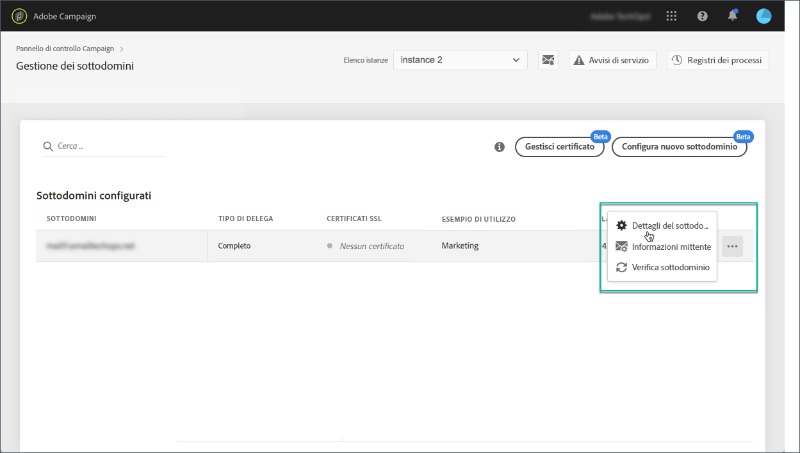
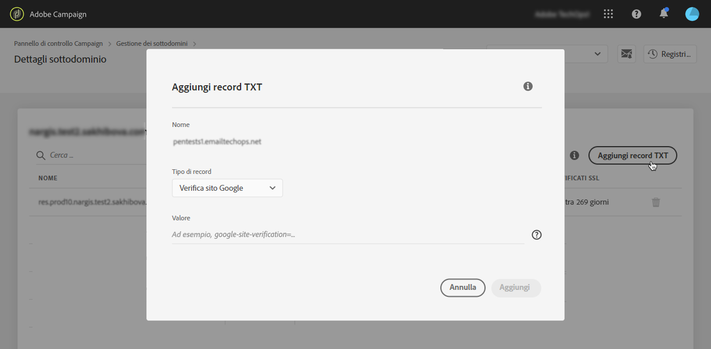
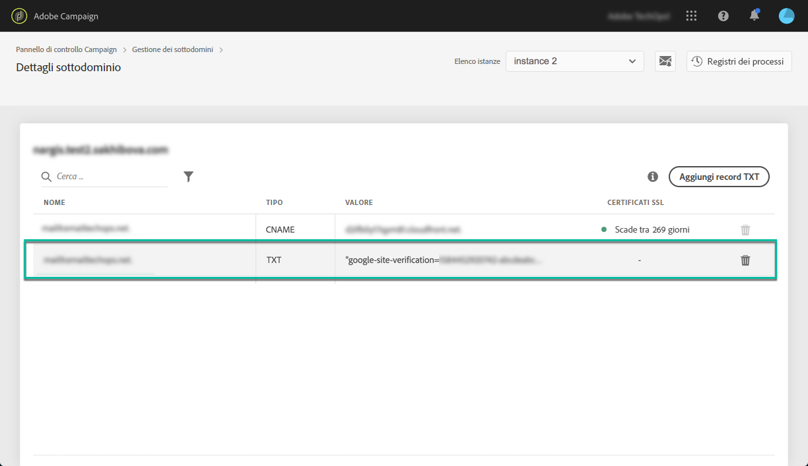

# Gestione dei record TXT {#managing-txt-records}

>[!CONTEXTUALHELP]
>id="cp_siteverification_add"
>title="Gestione dei record TXT"
>abstract="Alcuni servizi, come Google, richiedono l’aggiunta di un record TXT alle impostazioni del dominio per verificare che tu sia il proprietario del dominio."

## Informazioni sui record TXT {#about-txt-records}

I record TXT sono un tipo di record DNS utilizzati per fornire informazioni testuali su un dominio, leggibili da sorgenti esterne.

Al fine di garantire elevate percentuali di posta in arrivo e basse percentuali di posta indesiderata, alcuni servizi, come Google, richiedono l’aggiunta di un record TXT alle impostazioni del dominio per verificare che tu sia il proprietario del dominio.

Attualmente, Gmail è uno dei provider di indirizzi e-mail più popolari. Al fine di garantire un buon recapito dei messaggi e la corretta consegna delle e-mail agli indirizzi Gmail, Adobe Campaign ti consente di aggiungere ai sottodomini record TXT di Google specifici per la verifica del sito, in modo da verificarne la validità.

 Scopri questa funzione nel video utilizzando  [Campaign ](https://experienceleague.adobe.com/docs/campaign-classic-learn/control-panel/subdomains-and-certificates/google-txt-record-management.html?lang=en#subdomains-and-certificates) Classicor  [Campaign Standard](https://experienceleague.adobe.com/docs/campaign-standard-learn/control-panel/subdomains-and-certificates/google-txt-record-management.html?lang=en#subdomains-and-certificates)

## Aggiunta di un record TXT di Google a un sottodominio {#adding-a-google-txt-record}

Per aggiungere un record TXT di Google al tuo sottodominio utilizzato per inviare e-mail a indirizzi Gmail, procedi come segue:

1. Accedi alla scheda **[!UICONTROL Subdomain and Certificates]**.

1. Seleziona l’istanza, quindi apri i dettagli del sottodominio a cui desideri aggiungere un record DNS.

   

1. Fai clic sul pulsante **[!UICONTROL Add TXT record]**, quindi inserisci il valore generato negli strumenti di Amministratore di G Suite. Per ulteriori informazioni, consulta la [Guida di Amministratore di G Suite](https://support.google.com/a/answer/183895?hl=it).

   

1. Fai clic sul pulsante **[!UICONTROL Add]** per confermare.

   

Una volta aggiunto il record TXT, è necessario che sia verificato da Google. A tal fine, accedi agli strumenti di amministrazione di G Suite e avvia il passaggio di verifica (consulta la [Guida di Amministratore di G Suite](https://support.google.com/a/answer/183895)).

Per eliminare un record, selezionalo dall’elenco dei record, quindi fai clic sul pulsante di rimozione.

>[!NOTE]
>
>L’unico record che puoi eliminare dall’elenco dei record DNS è quello che hai aggiunto in precedenza (nel nostro caso il record TXT di Google).
