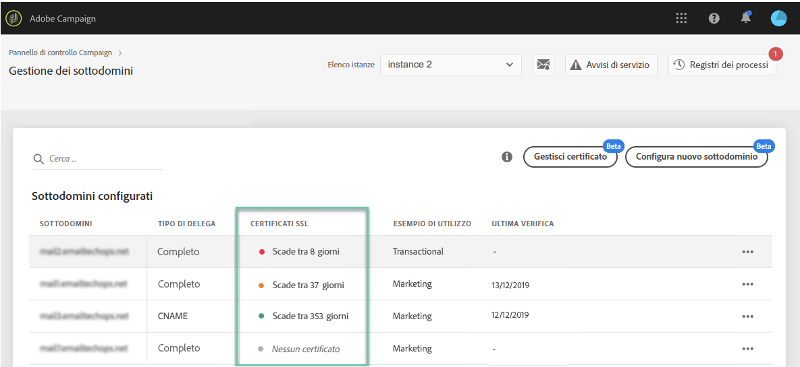

# Monitoraggio dei certificati SSL dei sottodomini {#monitoring-ssl-certificates}

## Informazioni sui certificati SSL {#about-ssl-certificates}

Adobe Campaign consiglia di proteggere i sottodomini che ospitano le pagine di destinazione, in particolare quelli che raccolgono informazioni riservate dei clienti.

**La cifratura** SSL (Secure Socket Layer) garantisce che i sottodomini delegati ad Adobe siano protetti. Quando il cliente compila un modulo Web o visita una pagina di destinazione ospitata da Adobe Campaign, per impostazione predefinita le informazioni vengono inviate tramite un protocollo non protetto (HTTP). Per garantire ulteriore sicurezza, è necessario proteggere le informazioni inviate con un protocollo HTTPS. Ad esempio, l&#39;indirizzo del sottodominio &quot;http://info.mywebsite.com/&quot; sarà &quot;https://info.mywebsite.com/&quot;.

**I certificati SSL non sono installati nei sottodomini delegati stessi**. Sono installati nei sottodomini associati, principalmente quelli che ospitano pagine di destinazione, pagine di risorse e altri.

**I certificati SSL vengono forniti per un periodo di tempo** specifico (1 anno, 60 giorni, ecc.). Una volta scaduto il certificato, potrebbero verificarsi dei problemi durante l&#39;accesso alle pagine di destinazione o l&#39;utilizzo delle risorse del sottodominio. Per evitare questo problema, il Pannello di controllo consente di monitorare i certificati SSL dei sottodomini e di avviare il processo di rinnovo.

## Monitoraggio dei certificati SSL {#monitoring-certificates}

Lo stato dei certificati SSL dei sottodomini è disponibile direttamente dall&#39;elenco dei sottodomini quando si seleziona la **[!UICONTROL Subdomains & Certificates]**scheda.

I sottodomini sono organizzati in base alla data di scadenza più vicina del certificato SSL, con informazioni visive sulla scadenza, espressa in giorni:

* **Verde**: il sottodominio non ha certificato che scade entro i successivi 60 giorni.
* **Arancia**: uno o più sottodomini dispongono di un certificato che scade entro i successivi 60 giorni.
* **Rosso**: uno o più sottodomini dispongono di un certificato che scade entro i prossimi 30 giorni.
* **Grigio**: nessun certificato installato per il sottodominio.

Per visualizzare ulteriori dettagli su un sottodominio, fare clic sul **[!UICONTROL Subdomain Details]**pulsante .
Viene visualizzato l&#39;elenco di tutti i sottodomini correlati. In genere include sottodomini di pagine di destinazione, pagine di risorse e così via.

La **[!UICONTROL Sender info]**scheda fornisce informazioni sulle inbox configurate (Mittente, Rispondi a, E-mail di errore).

Se uno dei certificati SSL del sottodominio sta per scadere, puoi rinnovarlo direttamente dal Pannello di controllo. Per ulteriori informazioni, consulta questa sezione: Rinnovo [del certificato](../../subdomains-certificates/using/renewing-subdomain-certificate.md)SSL di un sottodominio.

>[!IMPORTANT]
>
>Il rinnovo del certificato dal Pannello di controllo sarà disponibile in versione beta entro la fine di gennaio, e soggetto a frequenti aggiornamenti e modifiche senza preavviso.
