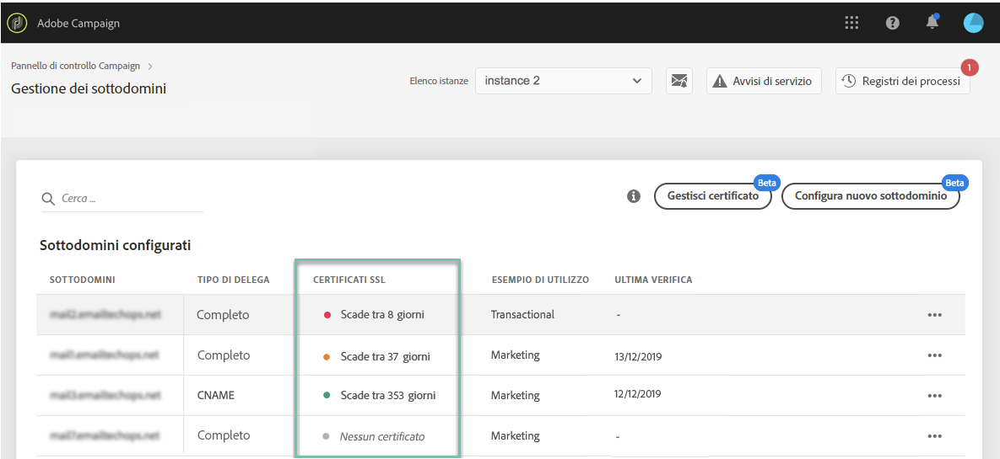
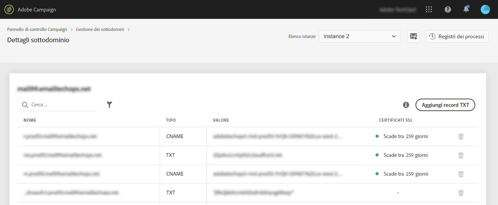

# Monitoraggio dei certificati SSL dei sottodomini {#monitoring-ssl-certificates}

## Informazioni sui certificati SSL {#about-ssl-certificates}

Adobe Campaign consiglia di proteggere i sottodomini che ospitano le pagine di destinazione, in particolare quelli che raccolgono informazioni riservate dei clienti.

La **crittografia SSL (Secure Socket Layer)** garantisce che i sottodomini configurati per utilizzare Adobe siano protetti. Quando il cliente compila un modulo web o visita una pagina di destinazione ospitata da Adobe Campaign, per impostazione predefinita le informazioni vengono inviate tramite un protocollo non sicuro (HTTP). Per garantire ulteriore sicurezza, proteggi le informazioni inviate con un protocollo HTTPS. Ad esempio, l’indirizzo del sottodominio “http://info.mywebsite.com/” sarà “https://info.mywebsite.com/”.

**I certificati SSL non sono installati nei sottodomini configurati stessi**. Sono installati nei sottodomini associati, principalmente quelli che ospitano pagine di destinazione, pagine di risorse e altri.

**I certificati SSL vengono forniti per un periodo di tempo specifico** (1 anno, 60 giorni, ecc.). Una volta scaduto il certificato, potrebbero verificarsi dei problemi durante l’accesso alle pagine di destinazione o l’utilizzo delle risorse del sottodominio. Per evitare questo problema, il Pannello di controllo ti consente di monitorare i certificati SSL dei sottodomini e di avviare il processo di rinnovo.

## Gestione dei certificati SSL {#management}

Il monitoraggio dei certificati SSL è fondamentale per garantire la sicurezza dei sottodomini. Con il Pannello di controllo, puoi installare e rinnovare direttamente i certificati SSL dei sottodomini, oppure delegarli ad Adobe in modo che questo venga eseguito automaticamente senza alcun intervento da parte tua.

Si consiglia vivamente di delegare la gestione dei certificati SSL dei sottodomini ad Adobe, in quanto Adobe creerà automaticamente il certificato e lo rinnoverà ogni anno prima della scadenza. In questo modo si riduce il rischio che possono verificarsi errori durante la gestione manuale dei certificati. [Scopri come delegare i certificati SSL dei sottodomini ad Adobe](delegate-ssl.md)

Di seguito è riportato un elenco completo degli impatti associati alla gestione manuale dei certificati, rispetto alla delega ad Adobe:

|       | Certificato gestito dal cliente | Certificato gestito da Adobe |
|  ---  |  ---  |  ---  |
| Fornitore di certificati | Autorità di Certificazione di terze parti | Adobe tramite AWS Certificate Manager |
| Passaggi manuali | Generazione della CSR, acquisto e installazione del certificato | Nessuno |
| Processo di rinnovo | Responsabilità del cliente | Gestito in automatico da Adobe |
| Sicurezza dei sottodomini | Il dominio può avere dei sottodomini non protetti (tracciamento, mirror e res) a meno che non installi e rinnovi i certificati. | Ogni nuovo dominio (se si opta per la gestione da parte di Adobe) avrà per impostazione predefinita tutti i sottodomini protetti. |
| Costo del certificato | Il cliente sostiene il costo dei certificati | Gratuito |

## Monitoraggio dei certificati SSL {#monitoring-certificates}

>[!CONTEXTUALHELP]
>id="cp_subdomain_details"
>title="Dettagli del sottodominio"
>abstract="Recupera informazioni sui certificati SSL dei sottodomini."

Lo stato dei certificati SSL dei sottodomini è disponibile direttamente nell’elenco dei sottodomini selezionando la scheda **[!UICONTROL Sottodomini e certificati]**.

I sottodomini sono organizzati in base alla data di scadenza più vicina del certificato SSL, con informazioni visive sulla scadenza, espressa in giorni:

* **Verde**: il sottodominio non dispone di un certificato che scade nei successivi 60 giorni.
* **Arancione**: uno o più sottodomini dispongono di un certificato che scade nei successivi 60 giorni.
* **Rosso**: uno o più sottodomini dispongono di un certificato che scade nei successivi 30 giorni.
* **Grigio**: nessun certificato installato per il sottodominio.

Per visualizzare ulteriori dettagli su un sottodominio, fai clic sul pulsante **[!UICONTROL Dettagli sottodominio]**.
Viene visualizzato l’elenco di tutti i relativi sottodomini. In genere include i sottodomini di pagine di destinazione, pagine di risorse, ecc..

La scheda **[!UICONTROL Informazioni mittente]** fornisce informazioni sulle caselle in entrata configurate (Mittente, Rispondi a, E-mail per errore).

Se uno dei certificati SSL del sottodominio sta per scadere, puoi rinnovarlo direttamente dal Pannello di controllo. Per ulteriori informazioni, consulta questa sezione: [Rinnovo del certificato SSL di un sottodominio](../../subdomains-certificates/using/renewing-subdomain-certificate.md).

**Argomenti correlati:**

* [Rinnovo del certificato SSL di un sottodominio](../../subdomains-certificates/using/renewing-subdomain-certificate.md)
* [Branding dei sottodomini](../../subdomains-certificates/using/subdomains-branding.md)
